# Phase 1: Foundation – Tasks & Alignment Brief

**Spec**: [../../sidebar-settings-sessions-spec.md](../../sidebar-settings-sessions-spec.md)
**Plan**: [../../sidebar-settings-sessions-plan.md](../../sidebar-settings-sessions-plan.md)
**Date**: 2026-02-04
**Phase Slug**: `phase-1-foundation`

---

## Table of Contents

1. [Executive Briefing](#executive-briefing)
2. [Objectives & Scope](#objectives--scope)
3. [Architecture Map](#architecture-map)
4. [Tasks](#tasks)
5. [Alignment Brief](#alignment-brief)
6. [Phase Footnote Stubs](#phase-footnote-stubs)
7. [Evidence Artifacts](#evidence-artifacts)
8. [Discoveries & Learnings](#discoveries--learnings)
9. [Directory Layout](#directory-layout)

---

## Executive Briefing

### Purpose

This phase establishes the architectural foundations required for multi-session terminal support. Without these foundations, the sidebar and settings features cannot be implemented. Phase 1 delivers state management (Zustand), WebSocket protocol extensions (sessionId + shellType), frontend test infrastructure (vitest), UI component library setup (Tailwind + shadcn/ui), and a critical bug fix in Terminal.tsx that blocks multi-instance rendering.

### What We're Building

1. **Protocol Extension**: Add `sessionId` and `shellType` fields to ClientMessage/ServerMessage for multi-session routing and session naming
2. **Zustand State Stores**: Three isolated stores (UI, Settings, Sessions) with selector pattern for fine-grained re-render control
3. **Frontend Test Infrastructure**: vitest + @testing-library/react setup with FakeWebSocket and FakeStorage test utilities
4. **UI Foundation**: Tailwind CSS + shadcn/ui initialization with TypeScript path aliases
5. **Terminal.tsx Fix**: Move module-level `resizeTimeout` to `useRef` for multi-instance isolation

### User Value

- **For developers**: Protocol extension enables backend to route messages to correct sessions
- **For end users**: Settings can persist across browser refresh; sidebar can show meaningful session names ("bash-1", "zsh-1")
- **For maintainability**: Test infrastructure ensures quality as features are added

### Example

**Before Phase 1**:
```typescript
// Protocol has no session routing
{ type: "input", data: "hello" }
// Terminal.tsx shares resizeTimeout across all instances
let resizeTimeout: ReturnType<typeof setTimeout> | null = null
```

**After Phase 1**:
```typescript
// Protocol supports multi-session routing
{ sessionId: "session-123", shellType: "zsh", type: "input", data: "hello" }
// Each Terminal instance has its own timeout ref
const resizeTimeoutRef = useRef<ReturnType<typeof setTimeout> | null>(null)
```

---

## Objectives & Scope

### Objective

Establish architectural foundations for multi-session support as specified in Plan Phase 1. Complete all prerequisite work that subsequent phases depend upon.

### Goals

- ✅ Extend WebSocket protocol with sessionId and shellType fields (backwards compatible)
- ✅ Fix Terminal.tsx resizeTimeout to enable multi-instance rendering
- ✅ Setup vitest + @testing-library/react for frontend TDD/TAD
- ✅ Create FakeWebSocket and FakeStorage test utilities (per ADR-0004)
- ✅ Implement 3 Zustand stores: useUIStore, useSettingsStore, useSessionStore
- ✅ Install and configure Tailwind CSS
- ✅ Initialize shadcn/ui with neutral theme and CSS variables
- ✅ Configure TypeScript path aliases (@/*)
- ✅ Verify all existing backend tests pass (regression check)

### Non-Goals (Scope Boundaries)

- ❌ Session registry implementation (Phase 2)
- ❌ REST API endpoints for sessions (Phase 2)
- ❌ Sidebar UI components (Phase 3)
- ❌ Settings panel UI components (Phase 4)
- ❌ Multi-session WebSocket message routing logic (Phase 2)
- ❌ Theme definitions or font bundling (Phase 4)
- ❌ Terminal pause/resume or renderer management (Phase 5)
- ❌ Documentation updates (Phase 6)
- ❌ Performance optimization beyond fixing the resizeTimeout bug

---

## Architecture Map

### Component Diagram

```mermaid
flowchart TD
    classDef pending fill:#9E9E9E,stroke:#757575,color:#fff
    classDef inprogress fill:#FF9800,stroke:#F57C00,color:#fff
    classDef completed fill:#4CAF50,stroke:#388E3C,color:#fff
    classDef blocked fill:#F44336,stroke:#D32F2F,color:#fff

    subgraph Backend["Backend (Go)"]
        T001["T001: Write protocol tests ✓"]:::completed
        T002["T002: Extend messages.go ✓"]:::completed
        T016["T016: Verify backend tests"]:::pending

        T001 --> T002
    end

    subgraph FrontendTypes["Frontend Types"]
        T003["T003: Update terminal.ts ✓"]:::completed

        T002 --> T003
    end

    subgraph TerminalFix["Terminal Fix"]
        T004["T004: Fix resizeTimeout ✓"]:::completed
    end

    subgraph TestInfra["Test Infrastructure"]
        T005["T005: Setup vitest"]:::pending
        T006["T006: Create FakeWebSocket"]:::pending
        T007["T007: Create FakeStorage"]:::pending

        T005 --> T006
        T005 --> T007
    end

    subgraph Stores["Zustand Stores"]
        T008["T008: TAD scratch exploration"]:::pending
        T009["T009: Implement useUIStore"]:::pending
        T010["T010: Implement useSettingsStore"]:::pending
        T011["T011: Implement useSessionStore"]:::pending
        T012["T012: Promote tests"]:::pending

        T006 --> T008
        T007 --> T008
        T008 --> T009
        T008 --> T010
        T008 --> T011
        T009 --> T012
        T010 --> T012
        T011 --> T012
    end

    subgraph UISetup["UI Setup"]
        T013["T013: Install Tailwind"]:::pending
        T014["T014: Configure TS paths"]:::pending
        T015["T015: Initialize shadcn/ui"]:::pending

        T013 --> T015
        T014 --> T015
    end

    subgraph Files["Files Modified"]
        F1["/backend/internal/terminal/messages.go ✓"]:::completed
        F2["/backend/internal/terminal/messages_test.go ✓"]:::completed
        F3["/frontend/src/types/terminal.ts ✓"]:::completed
        F4["/frontend/src/components/Terminal.tsx ✓"]:::completed
        F5["/frontend/vitest.config.ts"]:::pending
        F6["/frontend/src/test/fakeWebSocket.ts"]:::pending
        F7["/frontend/src/test/fakeStorage.ts"]:::pending
        F8["/frontend/src/stores/ui.ts"]:::pending
        F9["/frontend/src/stores/settings.ts"]:::pending
        F10["/frontend/src/stores/sessions.ts"]:::pending
        F11["/frontend/tailwind.config.ts"]:::pending
        F12["/frontend/tsconfig.json"]:::pending
    end

    T001 -.-> F2
    T002 -.-> F1
    T003 -.-> F3
    T004 -.-> F4
    T005 -.-> F5
    T006 -.-> F6
    T007 -.-> F7
    T009 -.-> F8
    T010 -.-> F9
    T011 -.-> F10
    T013 -.-> F11
    T014 -.-> F12
```

<!-- Status: grey=pending, orange=in-progress, green=completed, red=blocked -->
<!-- Updated by plan-6 during implementation -->



### Task-to-Component Mapping

<!-- Status: ⬜ Pending | 🟧 In Progress | ✅ Complete | 🔴 Blocked -->

| Task | Component(s) | Files | Status | Comment |
|------|-------------|-------|--------|---------|
| T001 | Protocol Tests | messages_test.go | ✅ Complete | TDD: write failing tests first for sessionId/shellType |
| T002 | Protocol Extension | messages.go | ✅ Complete | Add sessionId + shellType fields (backwards compatible) |
| T003 | TypeScript Types | terminal.ts | ✅ Complete | Mirror Go struct changes in TypeScript |
| T004 | Terminal Component | Terminal.tsx | ✅ Complete | BLOCKER: fix module-level resizeTimeout |
| T005 | Test Infrastructure | vitest.config.ts, package.json | ⬜ Pending | Setup vitest + @testing-library/react |
| T006 | Test Utility | fakeWebSocket.ts | ⬜ Pending | Deterministic WebSocket fake for tests |
| T007 | Test Utility | fakeStorage.ts | ⬜ Pending | Deterministic localStorage fake for tests |
| T008 | TAD Exploration | stores/__tests__/scratch/ | ⬜ Pending | Explore Zustand patterns via scratch tests |
| T009 | UI Store | ui.ts | ⬜ Pending | activeSessionId, sidebarCollapsed (persisted), etc. |
| T010 | Settings Store | settings.ts | ⬜ Pending | theme, fontSize, fontFamily, autoOpenTerminal |
| T011 | Sessions Store | sessions.ts | ⬜ Pending | sessions map with addSession/removeSession/updateStatus |
| T012 | Test Promotion | stores/__tests__/ | ⬜ Pending | Promote 2-3 valuable tests with Test Doc blocks |
| T013 | Tailwind CSS | tailwind.config.ts, index.css | ⬜ Pending | Install and configure Tailwind |
| T014 | TypeScript Paths | tsconfig.json, vite.config.ts | ⬜ Pending | Configure @/* path aliases |
| T015 | shadcn/ui | components.json, lib/utils.ts | ⬜ Pending | Initialize shadcn/ui with neutral theme |
| T016 | Regression Check | - | ⬜ Pending | Verify all existing backend tests pass |

---

## Tasks

| Status | ID | Task | CS | Type | Dependencies | Absolute Path(s) | Validation | Subtasks | Notes |
|--------|-----|------|-----|------|--------------|------------------|------------|----------|-------|
| [x] | T001 | Write tests for sessionId and shellType in ClientMessage/ServerMessage | 2 | Test | – | /Users/vaughanknight/GitHub/trex/backend/internal/terminal/messages_test.go | Tests verify: marshal/unmarshal with sessionId+shellType, backwards compat without them; `go test -v ./internal/terminal/... -run TestClientMessage` shows RED then GREEN | – | TDD: tests before implementation; per plan 1.1 |
| [x] | T002 | Extend protocol: add sessionId and shellType to messages.go | 1 | Core | T001 | /Users/vaughanknight/GitHub/trex/backend/internal/terminal/messages.go | Tests from T001 pass; existing 18 tests still pass; shellType extracted from shell path | – | Add optional fields with omitempty; per plan 1.2 |
| [x] | T003 | Update types/terminal.ts with sessionId and shellType | 1 | Core | T002 | /Users/vaughanknight/GitHub/trex/frontend/src/types/terminal.ts | TypeScript types match Go structs; `npm run build` succeeds | – | Mirror Go struct changes; per plan 1.3 |
| [x] | T004 | Fix Terminal.tsx: move resizeTimeout to useRef | 2 | Core | – | /Users/vaughanknight/GitHub/trex/frontend/src/components/Terminal.tsx | Module-level variable removed; line 9 `let resizeTimeout` replaced with useRef; `npm run build` succeeds | – | BLOCKER for Phase 2+; per plan 1.4, Critical Finding 03 |
| [ ] | T005 | Setup vitest + @testing-library/react | 2 | Setup | – | /Users/vaughanknight/GitHub/trex/frontend/vitest.config.ts, /Users/vaughanknight/GitHub/trex/frontend/package.json, /Users/vaughanknight/GitHub/trex/frontend/src/test/setup.ts | `npm run test` executes and passes (even if 0 tests initially); vitest.config.ts exists | – | Per plan 1.5; per High Finding 05 |
| [ ] | T006 | Create FakeWebSocket for frontend tests | 2 | Setup | T005 | /Users/vaughanknight/GitHub/trex/frontend/src/test/fakeWebSocket.ts | FakeWebSocket can send/receive messages deterministically; used in store tests | – | Per plan 1.6; per ADR-0004 fakes-only |
| [ ] | T007 | Create FakeStorage for localStorage tests | 1 | Setup | T005 | /Users/vaughanknight/GitHub/trex/frontend/src/test/fakeStorage.ts | FakeStorage implements Storage interface; can be injected into Zustand persist | – | Per plan 1.7; per ADR-0004 fakes-only |
| [ ] | T008 | TAD scratch: Zustand store exploration | 2 | Test | T006, T007 | /Users/vaughanknight/GitHub/trex/frontend/src/stores/__tests__/scratch/ | 10+ scratch tests created; verify via `ls frontend/src/stores/__tests__/scratch/*.test.ts \| wc -l` >= 10; RED→GREEN cycles documented | – | TAD workflow; per plan 1.8 |
| [ ] | T009 | Implement useUIStore with partial persist | 2 | Core | T008 | /Users/vaughanknight/GitHub/trex/frontend/src/stores/ui.ts | Store has: activeSessionId (not persisted), sidebarCollapsed (persisted), sidebarPinned (persisted), settingsPanelOpen (not persisted); uses partialize | – | Per plan 1.9; per Insight 6 decision |
| [ ] | T010 | Implement useSettingsStore with persist | 2 | Core | T008 | /Users/vaughanknight/GitHub/trex/frontend/src/stores/settings.ts | Store has: theme, fontSize, fontFamily, autoOpenTerminal (default: false); persists to localStorage 'trex-settings' | – | Per plan 1.10; per Insight 1 decision |
| [ ] | T011 | Implement useSessionStore | 3 | Core | T008 | /Users/vaughanknight/GitHub/trex/frontend/src/stores/sessions.ts | Store has: sessions map, addSession, removeSession, updateStatus, updateName; selector pattern for isolation | – | Per plan 1.11; per High Finding 07 |
| [ ] | T012 | Promote valuable store tests to frontend/src/stores/__tests__/ | 2 | Test | T009, T010, T011 | /Users/vaughanknight/GitHub/trex/frontend/src/stores/__tests__/ | 2-3 promoted tests with Test Doc blocks; ~5-10% promotion rate from scratch | – | TAD promotion; per plan 1.12 |
| [ ] | T013 | Install Tailwind CSS | 2 | Setup | – | /Users/vaughanknight/GitHub/trex/frontend/tailwind.config.ts, /Users/vaughanknight/GitHub/trex/frontend/postcss.config.js, /Users/vaughanknight/GitHub/trex/frontend/src/index.css | Tailwind directives in index.css; `npm run build` succeeds; dark mode class-based | – | Per plan 1.13 |
| [ ] | T014 | Configure TypeScript path aliases | 1 | Setup | – | /Users/vaughanknight/GitHub/trex/frontend/tsconfig.json, /Users/vaughanknight/GitHub/trex/frontend/tsconfig.app.json, /Users/vaughanknight/GitHub/trex/frontend/vite.config.ts | @/* imports resolve correctly; `npm run build` succeeds | – | Per plan 1.14; required for shadcn |
| [ ] | T015 | Initialize shadcn/ui | 2 | Setup | T013, T014 | /Users/vaughanknight/GitHub/trex/frontend/components.json, /Users/vaughanknight/GitHub/trex/frontend/src/lib/utils.ts, /Users/vaughanknight/GitHub/trex/frontend/src/components/ui/ | `npx shadcn@latest init` complete; components folder exists; build succeeds | – | Per plan 1.15; select Neutral base, CSS variables |
| [ ] | T016 | Verify all existing backend tests pass | 1 | Test | T002 | – | `go test ./...` shows 18+ tests pass; no regressions | – | Regression check; per plan 1.16 |

---

## Alignment Brief

### Prior Phases Review

**N/A** - This is Phase 1 (foundational phase). No prior phases to review.

### Critical Findings Affecting This Phase

| Finding | Impact | Constraint | Addressed By |
|---------|--------|------------|--------------|
| **Critical Finding 03**: Module-level resizeTimeout | BLOCKER | resizeTimeout at line 9 of Terminal.tsx shared across all instances; breaks multi-terminal | T004 |
| **High Finding 04**: Protocol missing sessionId | High | ClientMessage/ServerMessage lack routing info; backwards compatibility required | T001, T002, T003 |
| **High Finding 05**: No frontend test infrastructure | High | Zero tests, no vitest setup; blocks TAD workflow | T005, T006, T007 |
| **High Finding 07**: Cascading re-renders | High | Context API causes 350ms re-render; Zustand with selectors required | T009, T010, T011 |

### ADR Decision Constraints

| ADR | Decision | Constraint | Addressed By |
|-----|----------|------------|--------------|
| ADR-0004 | Fakes-only testing | No mocking frameworks; use FakeWebSocket, FakeStorage | T006, T007, T008 |
| ADR-0007 | Agent-navigable docs | docs/how/_index.yaml required for new docs | Phase 6 (not this phase) |

### Invariants & Guardrails

- **Backwards compatibility**: Protocol changes must not break existing tests (sessionId/shellType optional via `omitempty`)
- **Performance**: No new performance requirements in this phase; existing <50ms latency maintained
- **Memory**: No new memory constraints; Zustand adds ~1.1KB to bundle
- **Security**: No security-sensitive operations in this phase

### Inputs to Read

| File | Purpose |
|------|---------|
| `/Users/vaughanknight/GitHub/trex/backend/internal/terminal/messages.go` | Current protocol structs to extend |
| `/Users/vaughanknight/GitHub/trex/backend/internal/terminal/messages_test.go` | Existing test patterns (currently none for messages) |
| `/Users/vaughanknight/GitHub/trex/frontend/src/types/terminal.ts` | Current TypeScript types to extend |
| `/Users/vaughanknight/GitHub/trex/frontend/src/components/Terminal.tsx` | Contains resizeTimeout bug to fix |
| `/Users/vaughanknight/GitHub/trex/frontend/package.json` | Current dependencies (no test framework) |
| `/Users/vaughanknight/GitHub/trex/frontend/vite.config.ts` | Vite config to extend for path aliases |

### Visual Alignment Aids

#### System Flow Diagram


#### Protocol Message Sequence


### Test Plan (TDD + TAD per spec)

#### Backend Tests (TDD)

| Test Name | Purpose | Fixture | Expected Output |
|-----------|---------|---------|-----------------|
| `TestClientMessage_WithSessionId` | Verify sessionId marshals/unmarshals | `ClientMessage{SessionId: "s1", Type: "input"}` | JSON contains `"sessionId":"s1"`, parses back correctly |
| `TestServerMessage_WithShellType` | Verify shellType marshals/unmarshals | `ServerMessage{ShellType: "zsh", Type: "output"}` | JSON contains `"shellType":"zsh"`, parses back correctly |
| `TestClientMessage_BackwardsCompatible` | Verify old format still works | `{"type":"input","data":"hello"}` (no sessionId) | Parses without error, SessionId = "" |

#### Frontend Tests (TAD)

| Test Name | Purpose | Fixture | Expected Output |
|-----------|---------|---------|-----------------|
| `should persist settings to localStorage` | Settings store persists theme changes | FakeStorage, setTheme('dracula') | localStorage contains theme: 'dracula' |
| `should isolate session updates with selector` | Sessions store uses selector pattern | 2 sessions, update one | Only one component re-renders |
| `should persist sidebarCollapsed but not activeSessionId` | UI store partial persistence | sidebarCollapsed: true, activeSessionId: 's1' | Only sidebarCollapsed in localStorage |

### Step-by-Step Implementation Outline

1. **T001**: Write protocol tests (TDD RED phase)
   - Create `TestClientMessage_WithSessionId`, `TestServerMessage_WithShellType`, `TestClientMessage_BackwardsCompatible`
   - Tests fail initially (fields don't exist)

2. **T002**: Implement protocol extension (TDD GREEN phase)
   - Add `SessionId string \`json:"sessionId,omitempty"\`` to ClientMessage
   - Add `SessionId string \`json:"sessionId,omitempty"\`` and `ShellType string \`json:"shellType,omitempty"\`` to ServerMessage
   - Tests pass

3. **T003**: Update TypeScript types
   - Add sessionId and shellType to ClientMessage and ServerMessage interfaces
   - Verify build passes

4. **T004**: Fix Terminal.tsx resizeTimeout
   - Replace line 9 module-level variable with useRef inside component
   - Update all references to use `.current`
   - Verify build passes

5. **T005**: Setup vitest
   - Install vitest, @testing-library/react, @testing-library/user-event, jsdom
   - Create vitest.config.ts with jsdom environment
   - Add test script to package.json
   - Create src/test/setup.ts

6. **T006**: Create FakeWebSocket
   - Implement class with send(), addEventListener(), readyState
   - Allow injecting received messages
   - Support deterministic testing

7. **T007**: Create FakeStorage
   - Implement Storage interface (getItem, setItem, removeItem, clear, length, key)
   - In-memory implementation for tests

8. **T008**: TAD scratch exploration
   - Create scratch tests exploring Zustand patterns
   - Test selector behavior, persist middleware, partial persist
   - Iterate through RED→GREEN cycles
   - Create 10+ scratch tests

9. **T009-T011**: Implement Zustand stores
   - Create useUIStore with partial persist (sidebarCollapsed, sidebarPinned persisted; activeSessionId, settingsPanelOpen not persisted)
   - Create useSettingsStore with full persist
   - Create useSessionStore with selector pattern

10. **T012**: Promote valuable tests
    - Select 2-3 tests that demonstrate key contracts
    - Add Test Doc blocks
    - Move to __tests__/ directory

11. **T013-T015**: UI setup
    - Install Tailwind CSS with dark mode
    - Configure TypeScript path aliases
    - Initialize shadcn/ui

12. **T016**: Regression check
    - Run full backend test suite
    - Verify no regressions

### Commands to Run

```bash
# Backend protocol tests
cd /Users/vaughanknight/GitHub/trex/backend && go test -v ./internal/terminal/... -run TestClientMessage
cd /Users/vaughanknight/GitHub/trex/backend && go test -v ./internal/terminal/... -run TestServerMessage
cd /Users/vaughanknight/GitHub/trex/backend && go test -v ./...

# Frontend test setup
cd /Users/vaughanknight/GitHub/trex/frontend
npm install -D vitest @testing-library/react @testing-library/user-event @testing-library/jest-dom jsdom
npm run test

# Frontend build verification
cd /Users/vaughanknight/GitHub/trex/frontend && npm run build

# Tailwind installation
cd /Users/vaughanknight/GitHub/trex/frontend
npm install -D tailwindcss postcss autoprefixer
npx tailwindcss init -p

# shadcn/ui initialization
cd /Users/vaughanknight/GitHub/trex/frontend
npx shadcn@latest init

# TypeScript type checking
cd /Users/vaughanknight/GitHub/trex/frontend && npx tsc --noEmit

# Zustand installation
cd /Users/vaughanknight/GitHub/trex/frontend && npm install zustand

# Verify scratch test count
ls /Users/vaughanknight/GitHub/trex/frontend/src/stores/__tests__/scratch/*.test.ts | wc -l
```

### Risks/Unknowns

| Risk | Severity | Likelihood | Mitigation |
|------|----------|------------|------------|
| Protocol breaking existing tests | Medium | Low | Use `omitempty` for backwards compatibility; run full test suite |
| Tailwind conflicts with existing CSS | Low | Low | CSS reset; scoped styles; verify build after installation |
| vitest setup friction | Low | Medium | Use Vite-native configuration; follow official docs |
| shadcn/ui initialization errors | Low | Medium | Follow exact installation steps; verify prerequisites (Tailwind, TS paths) |
| Zustand persist hydration timing | Low | Low | Phase 1 only sets up stores; hydration issues deferred to Phase 4 |

### Ready Check

- [ ] Plan document read and understood
- [ ] Spec document read and understood
- [ ] Critical findings affecting this phase identified (03, 04, 05, 07)
- [ ] ADR constraints mapped to tasks (ADR-0004 → T006, T007, T008)
- [ ] All absolute file paths verified to exist or will be created
- [ ] Backend test patterns reviewed (existing 18 tests)
- [ ] Frontend package.json reviewed (no test framework)
- [ ] Terminal.tsx bug location confirmed (line 9)
- [ ] Protocol structs reviewed (messages.go)

**Ready for implementation?** Await explicit **GO** from user.

---

## Phase Footnote Stubs

**NOTE**: This section will be populated during implementation by plan-6a-update-progress.

| Footnote | Task | Description | Date Added |
|----------|------|-------------|------------|
| | | | |

---

## Evidence Artifacts

**Execution Log**: `./execution.log.md` (created by /plan-6-implement-phase)

**Supporting Files** (created during implementation):
- Backend test output logs
- Frontend test output logs
- Build verification logs
- TAD scratch test inventory

---

## Discoveries & Learnings

_Populated during implementation by plan-6. Log anything of interest to your future self._

| Date | Task | Type | Discovery | Resolution | References |
|------|------|------|-----------|------------|------------|
| | | | | | |

**Types**: `gotcha` | `research-needed` | `unexpected-behavior` | `workaround` | `decision` | `debt` | `insight`

**What to log**:
- Things that didn't work as expected
- External research that was required
- Implementation troubles and how they were resolved
- Gotchas and edge cases discovered
- Decisions made during implementation
- Technical debt introduced (and why)
- Insights that future phases should know about

_See also: `execution.log.md` for detailed narrative._

---

## Directory Layout

```
docs/plans/003-sidebar-settings-sessions/
├── sidebar-settings-sessions-spec.md
├── sidebar-settings-sessions-plan.md
├── external-research/
│   ├── state-management-comparison.md
│   ├── shadcn-sidebar-implementation.md
│   └── xterm-multiinstance-performance.md
└── tasks/
    └── phase-1-foundation/
        ├── tasks.md              # This file
        └── execution.log.md      # Created by /plan-6
```

---

**Phase 1 Status**: NOT STARTED
**Tasks**: 16 total (0 complete)
**Blocking for**: Phase 2 (Backend Multi-Session), Phase 3 (Sidebar UI), Phase 4 (Settings)

---

*Generated by `/plan-5-phase-tasks-and-brief`. Next step: Run `/plan-6-implement-phase --phase "Phase 1: Foundation" --plan "/Users/vaughanknight/GitHub/trex/docs/plans/003-sidebar-settings-sessions/sidebar-settings-sessions-plan.md"`*
