# Phase 2: Backend Multi-Session – Tasks & Alignment Brief

**Spec**: [../../sidebar-settings-sessions-spec.md](../../sidebar-settings-sessions-spec.md)
**Plan**: [../../sidebar-settings-sessions-plan.md](../../sidebar-settings-sessions-plan.md)
**Date**: 2026-02-04
**Phase Slug**: `phase-2-backend-multi-session`

---

## Table of Contents

1. [Executive Briefing](#executive-briefing)
2. [Objectives & Scope](#objectives--scope)
3. [Architecture Map](#architecture-map)
4. [Tasks](#tasks)
5. [Alignment Brief](#alignment-brief)
6. [Phase Footnote Stubs](#phase-footnote-stubs)
7. [Evidence Artifacts](#evidence-artifacts)
8. [Discoveries & Learnings](#discoveries--learnings)
9. [Directory Layout](#directory-layout)

---

## Executive Briefing

### Purpose

This phase transforms the trex backend from a single-session terminal into a multi-session terminal manager. Currently, each WebSocket connection creates exactly one PTY session with no registry, no routing, and no REST API for session management. Phase 2 delivers the backend infrastructure that enables frontend to create, list, switch between, and close multiple terminal sessions.

### What We're Building

1. **SessionRegistry**: A thread-safe registry (`sync.RWMutex`) tracking all active sessions with atomic ID generation
2. **Session State Machine**: Atomic session lifecycle states (Running → Closing → Closed) to prevent deadlock (Critical Finding 01)
3. **REST API Endpoints**: `GET /api/sessions` (list sessions) and `DELETE /api/sessions/:id` (close session)
4. **Multi-Session WebSocket Routing**: Route incoming messages to correct session by `sessionId` field
5. **Session Metadata**: Track name, shellType, status, createdAt for each session

### User Value

- **Frontend can list sessions**: Sidebar needs session list from `GET /api/sessions`
- **Frontend can close sessions**: X button in sidebar calls `DELETE /api/sessions/:id`
- **Frontend can identify sessions**: Each session has unique ID and shell type for naming ("bash-1", "zsh-2")
- **Multiple terminals work**: Input/output correctly routed to intended session

### Example

**Before Phase 2**:
```
WebSocket connects → creates single PTY → no registry
No way to list, close, or route to specific sessions
```

**After Phase 2**:
```
GET /api/sessions
→ [
    { "id": "s1", "name": "bash-1", "shellType": "bash", "status": "active", "createdAt": "..." },
    { "id": "s2", "name": "zsh-1", "shellType": "zsh", "status": "active", "createdAt": "..." }
  ]

DELETE /api/sessions/s1
→ Session closed, PTY terminated, removed from registry

WebSocket message with sessionId: "s2"
→ Routed to correct session's PTY
```

---

## Objectives & Scope

### Objective

Implement backend session registry, REST API endpoints, and multi-session WebSocket routing as specified in Plan Phase 2. Enable frontend to manage multiple concurrent terminal sessions.

### Goals

- ✅ Implement SessionRegistry with mutex protection (`sync.RWMutex`)
- ✅ Implement atomic session ID generation (sequential, collision-free)
- ✅ Implement session lifecycle state machine (addresses Critical Finding 01)
- ✅ Implement `GET /api/sessions` endpoint returning session metadata
- ✅ Implement `DELETE /api/sessions/:id` endpoint with clean PTY/WebSocket cleanup
- ✅ Implement sessionId routing in WebSocket handler
- ✅ Refactor handleTerminal error cleanup (addresses High Finding 08)
- ✅ Write integration test for 10 concurrent sessions
- ✅ Pass race detection: `go test -race ./...`

### Non-Goals (Scope Boundaries)

- ❌ Frontend integration with REST API (Phase 3)
- ❌ Sidebar UI components (Phase 3)
- ❌ Session persistence across server restart (not in baseline)
- ❌ Session groups/organization (deferred)
- ❌ Authentication/authorization (localhost-only per spec)
- ❌ WebSocket pooling/connection management (single WebSocket per client sufficient)
- ❌ Session timeout/idle detection (deferred to Phase 5)
- ❌ POST /api/sessions endpoint (sessions created via WebSocket message)

---

## Architecture Map

### Component Diagram

<!-- Status: grey=pending, orange=in-progress, green=completed, red=blocked -->
<!-- Updated by plan-6 during implementation -->


### Task-to-Component Mapping

<!-- Status: ⬜ Pending | 🟧 In Progress | ✅ Complete | 🔴 Blocked -->

| Task | Component(s) | Files | Status | Comment |
|------|-------------|-------|--------|---------|
| T001 | SessionRegistry Tests | registry_test.go | ⬜ Pending | TDD: tests for Add, Get, Delete, List, concurrent ops |
| T002 | SessionRegistry | registry.go | ⬜ Pending | Thread-safe map with RWMutex |
| T003 | ID Generation Tests | registry_test.go | ⬜ Pending | TDD: atomic counter uniqueness |
| T004 | State Machine Tests | session_test.go | ⬜ Pending | TDD: lifecycle transitions |
| T005 | State Machine | session.go | ⬜ Pending | Atomic state with sync/atomic |
| T006 | GET Endpoint Tests | sessions_test.go | ⬜ Pending | TDD: response format, metadata |
| T007 | GET Endpoint | sessions.go | ⬜ Pending | List sessions with metadata |
| T008 | DELETE Endpoint Tests | sessions_test.go | ⬜ Pending | TDD: cleanup verification |
| T009 | DELETE Endpoint | sessions.go | ⬜ Pending | Close session, cleanup |
| T010 | Routing Tests | terminal_test.go | ⬜ Pending | TDD: sessionId message routing |
| T011 | Routing Implementation | terminal.go | ⬜ Pending | Route messages by sessionId |
| T012 | Error Cleanup Refactor | terminal.go | ⬜ Pending | Addresses High Finding 08 |
| T013 | Integration Test | integration_test.go | ⬜ Pending | 10 concurrent sessions test |
| T014 | Race Detection | - | ⬜ Pending | Safety gate: -race flag |

---

## Tasks

| Status | ID | Task | CS | Type | Dependencies | Absolute Path(s) | Validation | Subtasks | Notes |
|--------|-----|------|-----|------|--------------|------------------|------------|----------|-------|
| [ ] | T001 | Write tests for SessionRegistry (Add, Get, Delete, List, concurrent ops) | 3 | Test | – | /Users/vaughanknight/GitHub/trex/backend/internal/terminal/registry_test.go | Tests verify: Add returns session, Get retrieves, Delete removes, List returns all, concurrent ops don't race; `go test -v ./internal/terminal/... -run TestSessionRegistry` shows RED then GREEN | – | TDD first; per plan 2.1; per High Finding 06 |
| [ ] | T002 | Implement SessionRegistry with RWMutex | 3 | Core | T001 | /Users/vaughanknight/GitHub/trex/backend/internal/terminal/registry.go | Tests from T001 pass; `-race` clean; registry has: Add, Get, Delete, List, Count methods | – | Per plan 2.2; use sync.RWMutex pattern |
| [ ] | T003 | Write tests for atomic session ID generation | 1 | Test | – | /Users/vaughanknight/GitHub/trex/backend/internal/terminal/registry_test.go | Tests verify: IDs unique across 100 concurrent calls | – | Per plan 2.3 |
| [ ] | T004 | Write tests for session lifecycle states | 2 | Test | – | /Users/vaughanknight/GitHub/trex/backend/internal/terminal/session_test.go | Tests verify: StateRunning → StateClosing → StateClosed; no double-close | – | TDD; per plan 2.4; per Critical Finding 01 |
| [ ] | T005 | Implement session state machine with atomic state | 2 | Core | T002, T004 | /Users/vaughanknight/GitHub/trex/backend/internal/terminal/session.go | Tests from T004 pass; Session has State() method; transitions atomic | – | Per plan 2.5; addresses Critical Finding 01 |
| [ ] | T006 | Write tests for GET /api/sessions endpoint | 2 | Test | – | /Users/vaughanknight/GitHub/trex/backend/internal/server/sessions_test.go | Tests verify: returns JSON array, includes id/name/shellType/status/createdAt | – | TDD; per plan 2.6 |
| [ ] | T007 | Implement GET /api/sessions endpoint | 2 | Core | T005, T006 | /Users/vaughanknight/GitHub/trex/backend/internal/server/sessions.go, /Users/vaughanknight/GitHub/trex/backend/internal/server/server.go | Tests from T006 pass; endpoint registered; returns session metadata | – | Per plan 2.7 |
| [ ] | T008 | Write tests for DELETE /api/sessions/:id endpoint | 2 | Test | – | /Users/vaughanknight/GitHub/trex/backend/internal/server/sessions_test.go | Tests verify: session closed, removed from registry, 404 for unknown | – | TDD; per plan 2.8 |
| [ ] | T009 | Implement DELETE /api/sessions/:id endpoint | 2 | Core | T007, T008 | /Users/vaughanknight/GitHub/trex/backend/internal/server/sessions.go | Tests from T008 pass; PTY and WebSocket closed cleanly | – | Per plan 2.9 |
| [ ] | T010 | Write tests for sessionId message routing | 3 | Test | – | /Users/vaughanknight/GitHub/trex/backend/internal/server/terminal_test.go | Tests verify: messages routed to correct session by sessionId; unknown sessionId returns error | – | TDD; per plan 2.10 |
| [ ] | T011 | Implement sessionId routing in WebSocket handler | 3 | Core | T009, T010 | /Users/vaughanknight/GitHub/trex/backend/internal/server/terminal.go | Tests from T010 pass; handleTerminal routes by sessionId | – | Per plan 2.11 |
| [ ] | T012 | Refactor handleTerminal error cleanup | 2 | Core | T011 | /Users/vaughanknight/GitHub/trex/backend/internal/server/terminal.go | Deferred cleanup at handler entry; no PTY leaks on error | – | Per plan 2.12; addresses High Finding 08 |
| [ ] | T013 | Write integration test: create/switch/close 10 sessions | 3 | Integration | T012 | /Users/vaughanknight/GitHub/trex/backend/internal/server/integration_test.go | Test creates 10 sessions, verifies all work, closes all, no leaks | – | Per plan 2.13 |
| [ ] | T014 | Run `go test -race ./...` | 1 | Test | T013 | – | Zero race conditions detected | – | Safety gate; per plan 2.14 |

---

## Alignment Brief

### Prior Phases Review

#### Phase 1: Foundation (Complete)

**A. Deliverables Created**:
| Deliverable | Files | Purpose |
|-------------|-------|---------|
| Protocol extension | `/backend/internal/terminal/messages.go` | Added sessionId, shellType fields |
| Protocol tests | `/backend/internal/terminal/messages_test.go` | 6 tests for protocol marshaling |
| TypeScript types | `/frontend/src/types/terminal.ts` | Mirrored Go protocol types |
| Terminal fix | `/frontend/src/components/Terminal.tsx` | resizeTimeout → useRef |
| Test infrastructure | `/frontend/vitest.config.ts`, `src/test/` | vitest + FakeWebSocket + FakeStorage |
| Zustand stores | `/frontend/src/stores/` | UI, Settings, Sessions stores |
| UI foundation | Tailwind, shadcn/ui, path aliases | Component library setup |

**B. Lessons Learned**:
- Zustand v5 changed subscribe API - requires manual comparison pattern for selector-based subscriptions
- shadcn/ui init requires both root tsconfig.json and tsconfig.app.json to have baseUrl/paths
- Tailwind v4 uses `@import "tailwindcss"` instead of @tailwind directives

**C. Technical Discoveries**:
- FakeStorage needs `getItemParsed<T>()` helper for typed JSON retrieval
- FakeWebSocket needs message capture for verification (`getSentMessages()`)
- Zustand persist middleware uses async hydration - need `setTimeout(r, 0)` in tests

**D. Dependencies Exported for Phase 2**:
| Export | Type | Location | Usage in Phase 2 |
|--------|------|----------|------------------|
| `SessionId` field | Protocol | messages.go | Route messages to correct session |
| `ShellType` field | Protocol | messages.go | Name sessions ("bash-1", "zsh-1") |
| `Session` type | Frontend | sessions.ts | Frontend knows session shape |
| `SessionStatus` type | Frontend | sessions.ts | Status enum: connecting, active, exited |

**E. Critical Findings Applied in Phase 1**:
- Critical Finding 03 (resizeTimeout): Fixed in T004 - moved to useRef
- High Finding 04 (sessionId): Implemented in T001-T003 - protocol extended
- High Finding 05 (no tests): Addressed in T005-T008 - vitest infrastructure

**F. Incomplete/Blocked Items**: None - all 16 tasks complete

**G. Test Infrastructure**:
- Backend: 24 tests (18 original + 6 new protocol tests)
- Frontend: 71 tests (vitest + @testing-library)
- FakeWebSocket, FakeStorage utilities created

**H. Technical Debt**: None introduced

**I. Architectural Decisions**:
- Separate Zustand stores for UI, Settings, Sessions (per High Finding 07)
- Partial persist for UI store (sidebar state persisted, activeSessionId not)
- Map-based session storage with selector pattern

**J. Scope Changes**: None

**K. Key Log References**:
- `phase-1-foundation/execution.log.md` - Full task execution details

### Critical Findings Affecting This Phase

| Finding | Title | Impact | Constraint | Addressed By |
|---------|-------|--------|------------|--------------|
| **Critical Finding 01** | Session.Run() Goroutine Deadlock Risk | Critical | Dual defer cancel creates timing vulnerability; need state machine | T004, T005 |
| **High Finding 06** | Session Registry Race Conditions | High | Go maps not safe for concurrent reads+writes | T001, T002 |
| **High Finding 08** | WebSocket Upgrade Error Path Cleanup | High | PTY can leak if conn.WriteMessage panics | T012 |

### ADR Decision Constraints

| ADR | Decision | Constraint | Addressed By |
|-----|----------|------------|--------------|
| ADR-0004 | Fakes-only testing | Use FakePTY, FakeConn patterns; no mocking frameworks | All test tasks |
| ADR-0005 | OpenTelemetry logging | Add sessionId to log messages | T007, T009, T011 |

### Invariants & Guardrails

- **Thread safety**: All registry operations must use RWMutex; `-race` must pass
- **No leaks**: Every session close must terminate PTY and WebSocket
- **Backwards compatibility**: Single-session (no sessionId) still works
- **Performance**: Session operations < 1ms (registry is in-memory)

### Inputs to Read

| File | Purpose |
|------|---------|
| `/Users/vaughanknight/GitHub/trex/backend/internal/terminal/session.go` | Current session implementation to extend |
| `/Users/vaughanknight/GitHub/trex/backend/internal/terminal/messages.go` | Protocol with sessionId (from Phase 1) |
| `/Users/vaughanknight/GitHub/trex/backend/internal/server/terminal.go` | WebSocket handler to refactor |
| `/Users/vaughanknight/GitHub/trex/backend/internal/server/server.go` | Server routes to extend |
| `/Users/vaughanknight/GitHub/trex/backend/internal/terminal/pty.go` | PTY interface for fakes |
| `/Users/vaughanknight/GitHub/trex/backend/internal/terminal/fake_test.go` | Existing FakePTY, FakeConn patterns |

### Visual Alignment Aids

#### System Flow Diagram


#### Session Lifecycle Sequence

```mermaid
sequenceDiagram
    participant Browser
    participant Handler as handleTerminal
    participant Registry as SessionRegistry
    participant Session
    participant PTY

    Note over Browser,PTY: Session Creation
    Browser->>Handler: WebSocket connect
    Handler->>Registry: NextID()
    Registry-->>Handler: "s1"
    Handler->>PTY: NewRealPTY()
    PTY-->>Handler: pty
    Handler->>Session: NewSession(id, pty, conn)
    Handler->>Registry: Add(id, session)
    Session->>Browser: ServerMessage{sessionId: "s1", shellType: "bash"}

    Note over Browser,PTY: Multi-Session Routing
    Browser->>Handler: ClientMessage{sessionId: "s1", type: "input"}
    Handler->>Registry: Get("s1")
    Registry-->>Handler: session
    Handler->>Session: HandleInput(data)
    Session->>PTY: Write(data)
    PTY->>Session: Read() → output
    Session->>Browser: ServerMessage{sessionId: "s1", type: "output"}

    Note over Browser,PTY: Session Close
    Browser->>Handler: DELETE /api/sessions/s1
    Handler->>Registry: Get("s1")
    Registry-->>Handler: session
    Handler->>Session: Stop()
    Session->>PTY: Close()
    Handler->>Registry: Delete("s1")
    Handler->>Browser: 204 No Content
```



### Test Plan (TDD per spec)

#### SessionRegistry Tests (T001)

| Test Name | Purpose | Fixture | Expected Output |
|-----------|---------|---------|-----------------|
| `TestSessionRegistry_Add` | Verify Add stores session | Create session, add to registry | Get returns same session |
| `TestSessionRegistry_Get` | Verify Get retrieves by ID | Add 2 sessions | Get correct one |
| `TestSessionRegistry_Delete` | Verify Delete removes | Add then delete | Get returns nil |
| `TestSessionRegistry_List` | Verify List returns all | Add 3 sessions | List has length 3 |
| `TestSessionRegistry_ConcurrentOps` | Verify thread safety | 10 goroutines × 100 ops | No races |

#### Session State Machine Tests (T004)

| Test Name | Purpose | Fixture | Expected Output |
|-----------|---------|---------|-----------------|
| `TestSession_InitialState` | Verify initial state | NewSession() | State() == StateRunning |
| `TestSession_StateTransition` | Verify Running → Closing | session.Close() | State() == StateClosed |
| `TestSession_DoubleClose` | Verify idempotent close | session.Close() twice | No panic, still Closed |

#### REST API Tests (T006, T008)

| Test Name | Purpose | Fixture | Expected Output |
|-----------|---------|---------|-----------------|
| `TestGetSessions_Empty` | Empty registry | No sessions | `[]` |
| `TestGetSessions_WithSessions` | Multiple sessions | Add 2 sessions | JSON array with metadata |
| `TestDeleteSession_Success` | Close existing | Add session, delete | 204, session gone |
| `TestDeleteSession_NotFound` | Unknown ID | Delete "unknown" | 404 |

### Step-by-Step Implementation Outline

1. **T001**: Write SessionRegistry tests (TDD RED)
   - Test Add, Get, Delete, List operations
   - Test concurrent operations with goroutines
   - Tests fail (registry doesn't exist)

2. **T002**: Implement SessionRegistry (TDD GREEN)
   - Create registry.go with RWMutex-protected map
   - Implement Add, Get, Delete, List, Count
   - Tests pass

3. **T003**: Add atomic ID generation tests
   - Test NextID() returns unique sequential IDs
   - Test concurrent NextID() calls don't collide

4. **T004**: Write session state machine tests (TDD RED)
   - Test initial state is Running
   - Test Close() transitions to Closed
   - Test double-close is safe

5. **T005**: Implement session state machine (TDD GREEN)
   - Add `state atomic.Int32` field to Session
   - Add State(), Close() methods with atomic transitions
   - Refactor Run() to check state

6. **T006**: Write GET /api/sessions tests (TDD RED)
   - Test empty response
   - Test response shape with sessions

7. **T007**: Implement GET /api/sessions (TDD GREEN)
   - Create sessions.go handler
   - Register route in server.go
   - Return JSON array of session metadata

8. **T008**: Write DELETE /api/sessions/:id tests (TDD RED)
   - Test successful deletion
   - Test 404 for unknown

9. **T009**: Implement DELETE endpoint (TDD GREEN)
   - Parse session ID from URL path
   - Close session, remove from registry
   - Return 204 or 404

10. **T010**: Write sessionId routing tests (TDD RED)
    - Test message routed to correct session
    - Test error for unknown sessionId

11. **T011**: Implement routing in handleTerminal (TDD GREEN)
    - Lookup session by sessionId
    - Route input/resize to session's PTY
    - Handle create vs route

12. **T012**: Refactor error cleanup
    - Move cleanup to deferred function at handler entry
    - Ensure PTY closed on any error path

13. **T013**: Integration test
    - Create 10 sessions
    - Send input to each
    - Close all
    - Verify no leaks

14. **T014**: Race detection gate
    - Run `go test -race ./...`
    - Must pass with zero races

### Commands to Run

```bash
# Run registry tests
cd /Users/vaughanknight/GitHub/trex/backend && go test -v ./internal/terminal/... -run TestSessionRegistry

# Run session state tests
cd /Users/vaughanknight/GitHub/trex/backend && go test -v ./internal/terminal/... -run TestSession_State

# Run API endpoint tests
cd /Users/vaughanknight/GitHub/trex/backend && go test -v ./internal/server/... -run TestSessions

# Run routing tests
cd /Users/vaughanknight/GitHub/trex/backend && go test -v ./internal/server/... -run TestTerminal_Routing

# Run all tests with race detection
cd /Users/vaughanknight/GitHub/trex/backend && go test -race -v ./...

# Run integration test
cd /Users/vaughanknight/GitHub/trex/backend && go test -v ./internal/server/... -run TestIntegration_ConcurrentSessions

# Check test coverage
cd /Users/vaughanknight/GitHub/trex/backend && go test -coverprofile=coverage.out ./... && go tool cover -html=coverage.out
```

### Risks/Unknowns

| Risk | Severity | Likelihood | Mitigation |
|------|----------|------------|------------|
| Goroutine deadlock in session lifecycle | Critical | Medium | State machine pattern with atomic ops (T005) |
| Race conditions in registry | High | Medium | RWMutex + `-race` testing (T002, T014) |
| PTY leak on error paths | High | Medium | Deferred cleanup at handler entry (T012) |
| URL path parsing for session ID | Low | Low | Use standard library path parsing |
| Session message ordering | Low | Low | WebSocket messages are ordered per connection |

### Ready Check

- [x] Plan document read and understood
- [x] Spec document read and understood
- [x] Phase 1 execution log reviewed
- [x] Critical findings affecting this phase identified (01, 06, 08)
- [x] ADR constraints mapped to tasks (ADR-0004 → fakes-only testing)
- [x] All absolute file paths verified
- [x] Existing session.go implementation reviewed
- [x] Existing terminal.go handler reviewed
- [x] FakePTY/FakeConn patterns reviewed
- [x] Protocol extension from Phase 1 verified (sessionId, shellType)

**Ready for implementation?** Await explicit **GO** from user.

---

## Phase Footnote Stubs

**NOTE**: This section will be populated during implementation by plan-6a-update-progress.

| Footnote | Task | Description | Date Added |
|----------|------|-------------|------------|
| | | | |

---

## Evidence Artifacts

**Execution Log**: `./execution.log.md` (created by /plan-6-implement-phase)

**Supporting Files** (created during implementation):
- Backend test output logs
- Race detection output
- Coverage reports
- Integration test logs

---

## Discoveries & Learnings

_Populated during implementation by plan-6. Log anything of interest to your future self._

| Date | Task | Type | Discovery | Resolution | References |
|------|------|------|-----------|------------|------------|
| | | | | | |

**Types**: `gotcha` | `research-needed` | `unexpected-behavior` | `workaround` | `decision` | `debt` | `insight`

**What to log**:
- Things that didn't work as expected
- External research that was required
- Implementation troubles and how they were resolved
- Gotchas and edge cases discovered
- Decisions made during implementation
- Technical debt introduced (and why)
- Insights that future phases should know about

_See also: `execution.log.md` for detailed narrative._

---

## Directory Layout

```
docs/plans/003-sidebar-settings-sessions/
├── sidebar-settings-sessions-spec.md
├── sidebar-settings-sessions-plan.md
├── external-research/
│   ├── state-management-comparison.md
│   ├── shadcn-sidebar-implementation.md
│   └── xterm-multiinstance-performance.md
└── tasks/
    ├── phase-1-foundation/
    │   ├── tasks.md
    │   └── execution.log.md
    └── phase-2-backend-multi-session/
        ├── tasks.md              # This file
        └── execution.log.md      # Created by /plan-6
```

---

**Phase 2 Status**: NOT STARTED
**Tasks**: 14 total (0 complete)
**Blocking for**: Phase 3 (Sidebar UI), Phase 5 (Integration)
**Depends on**: Phase 1 (Complete)

---

*Generated by `/plan-5-phase-tasks-and-brief`. Next step: Run `/plan-6-implement-phase --phase "Phase 2: Backend Multi-Session" --plan "/Users/vaughanknight/GitHub/trex/docs/plans/003-sidebar-settings-sessions/sidebar-settings-sessions-plan.md"`*
