# Phase 3: Sidebar UI – Tasks & Alignment Brief

**Spec**: [../../sidebar-settings-sessions-spec.md](../../sidebar-settings-sessions-spec.md)
**Plan**: [../../sidebar-settings-sessions-plan.md](../../sidebar-settings-sessions-plan.md)
**Date**: 2026-02-04
**Phase Slug**: `phase-3-sidebar-ui`

---

## Table of Contents

1. [Executive Briefing](#executive-briefing)
2. [Objectives & Scope](#objectives--scope)
3. [Architecture Map](#architecture-map)
4. [Tasks](#tasks)
5. [Alignment Brief](#alignment-brief)
6. [Phase Footnote Stubs](#phase-footnote-stubs)
7. [Evidence Artifacts](#evidence-artifacts)
8. [Discoveries & Learnings](#discoveries--learnings)
9. [Directory Layout](#directory-layout)

---

## Executive Briefing

### Purpose

This phase transforms trex from a single terminal view into a visual multi-session manager. Phase 3 delivers the collapsible sidebar component with session list, session management controls (create, rename, close), and context menu. The sidebar is the primary navigation interface enabling users to visually manage and switch between terminal sessions.

### What We're Building

1. **SessionSidebar Component**: Collapsible sidebar using shadcn/ui with floating variant that overlays terminal content
2. **SessionList Component**: Maps sessions from Zustand store, shows name and status indicators with selector pattern for performance
3. **SessionItem Component**: Individual session row with name, status dot, hover X button, and click-to-select behavior
4. **SessionContextMenu**: Right-click menu with "Rename" and "Close" options
5. **NewSessionButton**: Creates new terminal session via WebSocket `create` message
6. **Sidebar Hover/Pin Behavior**: Hover expands temporarily (300ms collapse delay), click pins expanded state
7. **App.tsx Layout**: SidebarProvider integration with main terminal content area

### User Value

- **Visual navigation**: Users can see all sessions at a glance instead of memorizing IDs or commands
- **Quick switching**: Single click to switch between sessions
- **Session management**: Create, rename, and close sessions without keyboard commands
- **Minimal footprint**: Collapsed sidebar shows only icons, preserving terminal real estate

### Example

**Before Phase 3**:
```
[Single terminal - full width]
No visual indication of sessions
No way to switch or manage sessions visually
```

**After Phase 3**:
```
[Sidebar]          [Terminal Content Area]
├── + New Session
├── bash-1 ●
├── zsh-1 ●
├── bash-2 ○
└── ⚙ Settings

- Sidebar collapses to ~48px on mouse leave
- Right-click any session for context menu (Rename, Close)
- Click session to switch active terminal
```

---

## Objectives & Scope

### Objective

Implement the collapsible sidebar with session list, session management, and context menu as specified in Plan Phase 3. Enable users to visually navigate and manage multiple terminal sessions.

### Goals

- ✅ Install shadcn sidebar and supporting components
- ✅ Implement SessionSidebar with floating variant and icon collapse mode
- ✅ Implement SessionList displaying sessions from useSessionStore
- ✅ Implement SessionItem with status indicator and hover close button
- ✅ Implement SessionContextMenu with Rename and Close options
- ✅ Implement inline rename editing for sessions
- ✅ Implement NewSessionButton that creates session via WebSocket
- ✅ Implement sidebar hover/pin toggle behavior (AC-06)
- ✅ Wire sidebar to useUIStore (activeSessionId, sidebarCollapsed, sidebarPinned)
- ✅ Wire sidebar to useSessionStore with selector pattern
- ✅ Update App.tsx with SidebarProvider layout

### Non-Goals (Scope Boundaries)

- ❌ Settings panel UI (Phase 4)
- ❌ Theme/font controls (Phase 4)
- ❌ useCentralWebSocket hook (Phase 5)
- ❌ Terminal pause/resume (Phase 5)
- ❌ Session switching terminal visibility logic (Phase 5)
- ❌ WebGL renderer management (Phase 5)
- ❌ Live terminal preview thumbnails (out of scope - WebGL limits)
- ❌ Session drag-and-drop reordering (deferred)
- ❌ Session groups/folders (deferred)
- ❌ Keyboard shortcuts for sidebar (deferred)

---

## Architecture Map

### Component Diagram

```mermaid
flowchart TD
    classDef pending fill:#9E9E9E,stroke:#757575,color:#fff
    classDef inprogress fill:#FF9800,stroke:#F57C00,color:#fff
    classDef completed fill:#4CAF50,stroke:#388E3C,color:#fff
    classDef blocked fill:#F44336,stroke:#D32F2F,color:#fff

    subgraph Setup["Component Setup"]
        T001["T001: Install sidebar component ✓"]:::completed
        T002["T002: Install supporting components ✓"]:::completed
        T003["T003: Install context-menu ✓"]:::completed
    end

    subgraph TAD["TAD Exploration"]
        T004["T004: TAD scratch tests ✓"]:::completed
    end

    subgraph Core["Core Components"]
        T005["T005: SessionSidebar ✓"]:::completed
        T006["T006: SessionList ✓"]:::completed
        T007["T007: SessionItem ✓"]:::completed
        T008["T008: SessionContextMenu ✓"]:::completed
        T009["T009: Inline rename ✓"]:::completed
        T010["T010: NewSessionButton ✓"]:::completed
        T011["T011: Hover/pin toggle ✓"]:::completed
    end

    subgraph Wiring["Store Integration"]
        T012["T012: Wire to useUIStore ✓"]:::completed
        T013["T013: Wire to useSessionStore ✓"]:::completed
    end

    subgraph Finalize["Finalize"]
        T014["T014: Promote tests ✓"]:::completed
        T015["T015: Update App.tsx ✓"]:::completed
    end

    T001 --> T005
    T002 --> T005
    T003 --> T008
    T002 --> T007
    T004 --> T005
    T004 --> T006
    T005 --> T006
    T006 --> T007
    T007 --> T008
    T007 --> T009
    T005 --> T010
    T005 --> T011
    T007 --> T012
    T006 --> T013
    T012 --> T014
    T013 --> T014
    T011 --> T015
    T014 --> T015

    subgraph Files["Files"]
        F1["/frontend/src/components/ui/sidebar.tsx ✓"]:::completed
        F2["/frontend/src/components/ui/tooltip.tsx ✓"]:::completed
        F3["/frontend/src/components/ui/button.tsx ✓"]:::completed
        F4["/frontend/src/components/ui/badge.tsx ✓"]:::completed
        F5["/frontend/src/components/ui/context-menu.tsx ✓"]:::completed
        F6["/frontend/src/components/SessionSidebar.tsx ✓"]:::completed
        F7["/frontend/src/components/SessionList.tsx ✓"]:::completed
        F8["/frontend/src/components/SessionItem.tsx ✓"]:::completed
        F9["/frontend/src/App.tsx ✓"]:::completed
    end

    T001 -.-> F1
    T002 -.-> F2
    T002 -.-> F3
    T002 -.-> F4
    T003 -.-> F5
    T005 -.-> F6
    T006 -.-> F7
    T007 -.-> F8
    T015 -.-> F9
```

<!-- Status: grey=pending, orange=in-progress, green=completed, red=blocked -->
<!-- Updated by plan-6 during implementation -->



### Task-to-Component Mapping

<!-- Status: ⬜ Pending | 🟧 In Progress | ✅ Complete | 🔴 Blocked -->

| Task | Component(s) | Files | Status | Comment |
|------|-------------|-------|--------|---------|
| T001 | shadcn Sidebar | sidebar.tsx | ✅ Complete | Base sidebar component from shadcn/ui |
| T002 | Supporting Components | tooltip.tsx, button.tsx, badge.tsx, collapsible.tsx, sheet.tsx | ✅ Complete | Required for session items + settings panel |
| T003 | Context Menu | context-menu.tsx | ✅ Complete | For right-click session menu |
| T004 | TAD Scratch | scratch/*.test.tsx | ✅ Complete | 5 scratch tests with useShallow discovery |
| T005 | SessionSidebar | SessionSidebar.tsx | ✅ Complete | Main sidebar container with floating variant |
| T006 | SessionList | SessionList.tsx | ✅ Complete | Maps sessions from store to UI |
| T007 | SessionItem | SessionItem.tsx | ✅ Complete | Individual session row with controls |
| T008 | SessionContextMenu | SessionContextMenu.tsx | ✅ Complete | Right-click menu component |
| T009 | Inline Rename | SessionItem.tsx | ✅ Complete | Editable input for renaming |
| T010 | NewSessionButton | NewSessionButton.tsx | ✅ Complete | Creates new session (mock for Phase 3) |
| T011 | Hover/Pin Toggle | SessionSidebar.tsx | ✅ Complete | Hover expand with 300ms collapse delay |
| T012 | UI Store Wiring | SessionSidebar.tsx, SessionItem.tsx | ✅ Complete | activeSessionId, sidebarPinned |
| T013 | Session Store Wiring | SessionList.tsx | ✅ Complete | useShallow for sessions array |
| T014 | Test Promotion | __tests__/*.test.tsx | ✅ Complete | 2 promoted tests with Test Doc |
| T015 | App Layout | App.tsx | ✅ Complete | SidebarProvider integration |

---

## Tasks

| Status | ID | Task | CS | Type | Dependencies | Absolute Path(s) | Validation | Subtasks | Notes |
|--------|-----|------|-----|------|--------------|------------------|------------|----------|-------|
| [x] | T001 | Install shadcn sidebar component | 1 | Setup | – | /Users/vaughanknight/GitHub/trex/frontend/src/components/ui/sidebar.tsx | `npx shadcn@latest add sidebar` succeeds; sidebar.tsx exists; build passes | – | Per plan 3.1 |
| [x] | T002 | Install shadcn supporting components (tooltip, button, badge, collapsible, sheet) | 1 | Setup | – | /Users/vaughanknight/GitHub/trex/frontend/src/components/ui/ | `npx shadcn@latest add tooltip button badge collapsible sheet` succeeds; all files exist | – | Per plan 3.2; sheet for settings panel in Phase 4 |
| [x] | T003 | Install shadcn context-menu | 1 | Setup | – | /Users/vaughanknight/GitHub/trex/frontend/src/components/ui/context-menu.tsx | `npx shadcn@latest add context-menu` succeeds; context-menu.tsx exists | – | Per plan 3.3 |
| [x] | T004 | TAD scratch: Sidebar layout exploration | 2 | Test | T001, T002 | /Users/vaughanknight/GitHub/trex/frontend/src/components/__tests__/scratch/ | 5+ scratch tests with RED→GREEN evidence; `ls frontend/src/components/__tests__/scratch/*.test.tsx \| wc -l` >= 5 | – | Per plan 3.4; TAD workflow |
| [x] | T005 | Implement SessionSidebar component | 3 | Core | T001, T002, T004 | /Users/vaughanknight/GitHub/trex/frontend/src/components/SessionSidebar.tsx | Sidebar renders with floating variant; icon collapsible mode works; uses SidebarProvider context | – | Per plan 3.5; AC-05, AC-07 |
| [x] | T006 | Implement SessionList component | 3 | Core | T005 | /Users/vaughanknight/GitHub/trex/frontend/src/components/SessionList.tsx | Maps sessions from useSessionStore; shows name and status; uses selectSessionList selector | – | Per plan 3.6; AC-04 |
| [x] | T007 | Implement SessionItem component | 2 | Core | T006 | /Users/vaughanknight/GitHub/trex/frontend/src/components/SessionItem.tsx | Shows session name, status indicator (● connected, ○ disconnected), X button on hover | – | Per plan 3.7; AC-04 |
| [x] | T008 | Implement SessionContextMenu | 2 | Core | T003, T007 | /Users/vaughanknight/GitHub/trex/frontend/src/components/SessionContextMenu.tsx | Right-click shows menu with "Rename" and "Close" options; uses shadcn context-menu | – | Per plan 3.8; AC-04b |
| [x] | T009 | Implement inline rename editing | 2 | Core | T007 | /Users/vaughanknight/GitHub/trex/frontend/src/components/SessionItem.tsx | Click Rename → input appears → Enter confirms, Escape cancels; calls updateName | – | Per plan 3.9; AC-04a |
| [x] | T010 | Implement NewSessionButton | 2 | Core | T005 | /Users/vaughanknight/GitHub/trex/frontend/src/components/NewSessionButton.tsx | Button in sidebar header; sends create message via WebSocket; adds session to store on response | – | Per plan 3.10; AC-01 |
| [x] | T011 | Implement sidebar hover/pin toggle | 2 | Core | T005 | /Users/vaughanknight/GitHub/trex/frontend/src/components/SessionSidebar.tsx | Hover expands (300ms collapse delay); click pins; uses sidebarPinned from useUIStore | – | Per plan 3.11; AC-06 |
| [x] | T012 | Wire sidebar to useUIStore | 2 | Core | T005, T007 | /Users/vaughanknight/GitHub/trex/frontend/src/components/SessionSidebar.tsx, /Users/vaughanknight/GitHub/trex/frontend/src/components/SessionItem.tsx | activeSessionId highlights selected; sidebarCollapsed controls width; sidebarPinned controls hover behavior | – | Per plan 3.12 |
| [x] | T013 | Wire sidebar to useSessionStore | 2 | Core | T006 | /Users/vaughanknight/GitHub/trex/frontend/src/components/SessionList.tsx | Uses selectSessionList selector; click session calls setActiveSession | – | Per plan 3.13; AC-02 |
| [x] | T014 | Promote valuable sidebar tests | 2 | Test | T012, T013 | /Users/vaughanknight/GitHub/trex/frontend/src/components/__tests__/ | 2-3 tests with Test Doc blocks; ~5-10% promotion rate | – | Per plan 3.14; TAD promotion |
| [x] | T015 | Update App.tsx with SidebarProvider layout | 2 | Core | T005, T011, T014 | /Users/vaughanknight/GitHub/trex/frontend/src/App.tsx | App uses SidebarProvider; sidebar + main content layout; terminal shows in main area | – | Per plan 3.15 |

---

## Alignment Brief

### Prior Phases Review

#### Phase 1: Foundation (Complete)

**A. Deliverables Created**:

| Deliverable | Files | Purpose |
|-------------|-------|---------|
| Protocol extension | `/backend/internal/terminal/messages.go` | Added sessionId, shellType fields |
| Protocol tests | `/backend/internal/terminal/messages_test.go` | 6 tests for protocol marshaling |
| TypeScript types | `/frontend/src/types/terminal.ts` | Mirrored Go protocol types with sessionId, shellType |
| Terminal fix | `/frontend/src/components/Terminal.tsx` | resizeTimeout → useRef (Critical Finding 03) |
| Test infrastructure | `/frontend/vitest.config.ts`, `src/test/` | vitest + FakeWebSocket + FakeStorage |
| Zustand stores | `/frontend/src/stores/` | UI, Settings, Sessions stores |
| UI foundation | Tailwind, shadcn/ui init, path aliases | Component library setup |

**B. Lessons Learned**:
- Zustand v5 changed subscribe API - requires manual comparison pattern for selector-based subscriptions
- shadcn/ui init requires both root tsconfig.json and tsconfig.app.json to have baseUrl/paths
- Tailwind v4 uses `@import "tailwindcss"` instead of @tailwind directives

**C. Technical Discoveries**:
- FakeStorage needs `getItemParsed<T>()` helper for typed JSON retrieval
- FakeWebSocket needs message capture for verification (`getSentMessages()`)
- Zustand persist middleware uses async hydration - need `setTimeout(r, 0)` in tests

**D. Dependencies Exported for Phase 3**:

| Export | Type | Location | Usage in Phase 3 |
|--------|------|----------|------------------|
| `useSessionStore` | Store | stores/sessions.ts | Display sessions in sidebar |
| `selectSessionList` | Selector | stores/sessions.ts | Get sorted session array |
| `useUIStore` | Store | stores/ui.ts | activeSessionId, sidebarCollapsed, sidebarPinned |
| `Session` type | Interface | stores/sessions.ts | Session data shape |
| `SessionStatus` type | Type | stores/sessions.ts | Status enum: connecting, active, paused, exited |
| `cn()` utility | Function | lib/utils.ts | Class name merging for shadcn |
| shadcn/ui base | Config | components.json | Component installation target |

**E. Critical Findings Applied in Phase 1**:
- Critical Finding 03 (resizeTimeout): Fixed in T004 - moved to useRef
- High Finding 04 (sessionId): Implemented in T001-T003 - protocol extended
- High Finding 05 (no tests): Addressed in T005-T008 - vitest infrastructure

**F. Incomplete/Blocked Items**: None - all 16 tasks complete

**G. Test Infrastructure**:
- Backend: 24 tests (18 original + 6 new protocol tests)
- Frontend: 71 tests (vitest + @testing-library)
- FakeWebSocket, FakeStorage utilities for fakes-only testing

**H. Technical Debt**: None introduced

**I. Architectural Decisions**:
- Separate Zustand stores for UI, Settings, Sessions (per High Finding 07)
- Partial persist for UI store (sidebar state persisted, activeSessionId not)
- Map-based session storage with selector pattern

**J. Scope Changes**: None

**K. Key Log References**:
- `phase-1-foundation/execution.log.md` - Full task execution details

---

#### Phase 2: Backend Multi-Session (Complete)

**A. Deliverables Created**:

| Deliverable | Files | Purpose |
|-------------|-------|---------|
| SessionRegistry | `/backend/internal/terminal/registry.go` | Thread-safe session storage with sync.RWMutex |
| Registry tests | `/backend/internal/terminal/registry_test.go` | 10 tests including concurrent ops |
| Session state machine | `/backend/internal/terminal/session.go` | Atomic state: Running → Closing → Closed |
| State tests | `/backend/internal/terminal/session_state_test.go` | State transition tests |
| REST API | `/backend/internal/server/sessions.go` | GET /api/sessions, DELETE /api/sessions/:id |
| API tests | `/backend/internal/server/sessions_test.go` | 7 endpoint tests |
| Multi-session routing | `/backend/internal/server/terminal.go` | connectionHandler with sessionId routing |
| Integration tests | `/backend/internal/server/integration_test.go` | 10 concurrent sessions test |

**B. Lessons Learned**:
- PTY cleanup requires SIGKILL before Wait() to prevent blocking on zombie processes
- Integration tests must verify session count BEFORE closing connections (otherwise cleanup races)
- connectionHandler pattern cleanly separates connection from session lifecycle

**C. Technical Discoveries**:
- `RealPTY.Close()` was blocking because `cmd.Wait()` waited for PTY read which was stuck in syscall
- Solution: Kill process explicitly before waiting
- Session cleanup must be done per-connection, not globally

**D. Dependencies Exported for Phase 3**:

| Export | Type | Location | Usage in Phase 3 |
|--------|------|----------|------------------|
| `GET /api/sessions` | REST API | server/sessions.go | List sessions for initial load |
| `DELETE /api/sessions/:id` | REST API | server/sessions.go | Close session from sidebar X button |
| `session_created` message | WebSocket | terminal.go | Response to create message with sessionId, shellType |
| `MsgTypeCreate` | Message type | messages.go | Create new session via WebSocket |
| SessionRegistry | Backend | registry.go | Backend session tracking |

**E. Critical Findings Applied in Phase 2**:
- Critical Finding 01 (goroutine deadlock): Addressed via session state machine
- High Finding 06 (race conditions): Addressed via sync.RWMutex + race detection
- High Finding 08 (PTY leak): Addressed via deferred cleanup in connectionHandler

**F. Incomplete/Blocked Items**: None - all 14 tasks complete (58 tests pass with race detection)

**G. Test Infrastructure**:
- Backend: 58 tests (24 from Phase 1 + 34 new)
- All pass with `-race` flag

**H. Technical Debt**: None introduced

**I. Architectural Decisions**:
- connectionHandler owns session lifecycle for its WebSocket connection
- Atomic session ID generation via sync/atomic.Uint64
- Session state machine prevents double-close and cleanup races

**J. Scope Changes**: None

**K. Key Log References**:
- `phase-2-backend-multi-session/execution.log.md` - Full task execution details
- Commit `f3e9c75`: "feat(backend): implement multi-session support with registry and REST API"

---

### Cross-Phase Synthesis

**Cumulative Deliverables Available**:

| Phase | Component | Location | Available For |
|-------|-----------|----------|---------------|
| 1 | useSessionStore | frontend/src/stores/sessions.ts | Session display in sidebar |
| 1 | useUIStore | frontend/src/stores/ui.ts | Sidebar state (collapsed, pinned, activeSessionId) |
| 1 | useSettingsStore | frontend/src/stores/settings.ts | Future settings panel (Phase 4) |
| 1 | shadcn/ui base | components.json | Installing sidebar components |
| 1 | Tailwind CSS | tailwind.config.ts | Styling sidebar |
| 1 | FakeWebSocket | frontend/src/test/fakeWebSocket.ts | Testing WebSocket interactions |
| 2 | GET /api/sessions | backend | Fetch session list on app load |
| 2 | DELETE /api/sessions/:id | backend | Close session from UI |
| 2 | Session create via WS | backend | Create new session |
| 2 | sessionId routing | backend | Multi-session message routing |

**Pattern Evolution**:
- Phase 1: Established Zustand store pattern with selectors for performance isolation
- Phase 2: Established fakes-only testing with real PTYs for integration tests
- Phase 3: Will apply both patterns to UI components

**Reusable Infrastructure**:
- FakeWebSocket for simulating WebSocket in component tests
- FakeStorage for localStorage testing
- vitest + @testing-library for component testing

### Critical Findings Affecting This Phase

| Finding | Title | Impact | Constraint | Addressed By |
|---------|-------|--------|------------|--------------|
| **Critical Finding 02** | WebGL Context Exhaustion | Critical | Browser limits WebGL to 8-16 contexts | Phase 5 (not this phase) - defer live previews |
| **High Finding 07** | Cascading Re-Renders | High | Context API causes 350ms re-render; need selectors | T006, T013 (selector pattern) |

### ADR Decision Constraints

| ADR | Decision | Constraint | Addressed By |
|-----|----------|------------|--------------|
| ADR-0004 | Fakes-only testing | Use FakeWebSocket for component tests; no mocking frameworks | T004, T014 |

### Invariants & Guardrails

- **Performance**: Use selector pattern for session list to prevent cascading re-renders
- **Accessibility**: shadcn/ui components have built-in ARIA support
- **Consistency**: Follow shadcn/ui patterns for all new components
- **Memory**: Don't render terminal previews in sidebar (WebGL limit)

### Inputs to Read

| File | Purpose |
|------|---------|
| `/Users/vaughanknight/GitHub/trex/frontend/src/stores/sessions.ts` | Session store with selectors |
| `/Users/vaughanknight/GitHub/trex/frontend/src/stores/ui.ts` | UI store with sidebar state |
| `/Users/vaughanknight/GitHub/trex/frontend/src/lib/utils.ts` | cn() utility for class merging |
| `/Users/vaughanknight/GitHub/trex/frontend/src/App.tsx` | Current app structure to modify |
| `/Users/vaughanknight/GitHub/trex/frontend/components.json` | shadcn/ui configuration |
| `/Users/vaughanknight/GitHub/trex/frontend/src/hooks/useTerminalSocket.ts` | Current WebSocket hook (will be replaced in Phase 5) |

### Visual Alignment Aids

#### Component Hierarchy


#### Sidebar State Flow


### Test Plan (TAD per spec)

#### Scratch Tests (T004)

| Test Name | Purpose | Fixture | Expected Output |
|-----------|---------|---------|-----------------|
| `sidebar-renders-collapsed` | Verify collapsed state | sidebarCollapsed: true | Width ~48px, icons only |
| `sidebar-renders-expanded` | Verify expanded state | sidebarCollapsed: false | Full width, names visible |
| `session-list-maps-sessions` | Verify session rendering | 3 sessions in store | 3 SessionItem components |
| `session-item-shows-status` | Verify status indicator | status: 'active' | Green dot displayed |
| `context-menu-opens` | Verify right-click | Right-click SessionItem | Menu with Rename, Close |

#### Promoted Tests (T014)

| Test Name | Purpose | Fixture | Expected Output |
|-----------|---------|---------|-----------------|
| `should set active session on click` | Click selects session | 2 sessions, click first | activeSessionId === "s1" |
| `should remove session on close` | Close removes from store | 1 session, click X | sessions.size === 0 |
| `should update name on rename` | Rename changes name | Session "bash-1", rename to "dev" | session.name === "dev" |

### Step-by-Step Implementation Outline

1. **T001-T003**: Install shadcn components
   - Run `npx shadcn@latest add sidebar`
   - Run `npx shadcn@latest add tooltip button badge collapsible sheet`
   - Run `npx shadcn@latest add context-menu`
   - Verify all components in src/components/ui/

2. **T004**: TAD scratch exploration
   - Create scratch test files exploring sidebar patterns
   - Test collapsed/expanded states
   - Test session list rendering with mocked store
   - Iterate through RED→GREEN cycles

3. **T005**: Implement SessionSidebar
   - Use Sidebar component from shadcn/ui
   - Configure floating variant for overlay behavior
   - Setup icon collapsible mode
   - Include SidebarHeader, SidebarContent, SidebarFooter structure

4. **T006**: Implement SessionList
   - Use selectSessionList selector from sessions store
   - Map sessions to SessionItem components
   - Handle empty state

5. **T007**: Implement SessionItem
   - Display session name and status indicator (● / ○)
   - Show X button on hover
   - Handle click to select session

6. **T008**: Implement SessionContextMenu
   - Wrap SessionItem with ContextMenu
   - Add "Rename" and "Close" menu items
   - Connect to appropriate handlers

7. **T009**: Implement inline rename
   - Add isEditing state to SessionItem
   - Show input when isEditing is true
   - Handle Enter (confirm) and Escape (cancel)
   - Call updateName on confirm

8. **T010**: Implement NewSessionButton
   - Button in SidebarHeader
   - On click, send create message via WebSocket
   - Handle session_created response to add to store

9. **T011**: Implement hover/pin toggle
   - Track hover state with timeout (300ms delay)
   - Use sidebarPinned from useUIStore
   - When pinned, ignore hover behavior

10. **T012**: Wire to useUIStore
    - Connect sidebarCollapsed, sidebarPinned
    - Connect activeSessionId for highlighting
    - Connect setActiveSession for click handling

11. **T013**: Wire to useSessionStore
    - Use selectSessionList selector
    - Connect addSession, removeSession, updateName

12. **T014**: Promote valuable tests
    - Select 2-3 tests demonstrating key contracts
    - Add Test Doc blocks
    - Move to __tests__/ directory

13. **T015**: Update App.tsx
    - Wrap with SidebarProvider
    - Add SessionSidebar component
    - Terminal renders in main content area

### Commands to Run

```bash
# Install shadcn components
cd /Users/vaughanknight/GitHub/trex/frontend
npx shadcn@latest add sidebar
npx shadcn@latest add tooltip button badge collapsible sheet
npx shadcn@latest add context-menu

# Run frontend tests
npm run test

# Run specific sidebar tests
npx vitest run src/components/__tests__/SessionList.test.tsx
npx vitest run src/components/__tests__/SessionSidebar.test.tsx

# Build verification
npm run build

# Type checking
npx tsc --noEmit

# Verify scratch test count
ls /Users/vaughanknight/GitHub/trex/frontend/src/components/__tests__/scratch/*.test.tsx | wc -l
```

### Risks/Unknowns

| Risk | Severity | Likelihood | Mitigation |
|------|----------|------------|------------|
| shadcn sidebar doesn't match design needs | Medium | Low | Review shadcn docs; customize if needed |
| Hover/collapse timing issues | Low | Medium | Use CSS transitions; test extensively |
| WebSocket not connected when creating session | Medium | Medium | Phase 5 handles connection lifecycle |
| Context menu positioning issues | Low | Low | shadcn uses Radix; trust positioning |
| Store hydration timing | Low | Low | Use FakeStorage in tests |

### Ready Check

- [x] Plan document read and understood
- [x] Spec document read and understood
- [x] Phase 1 execution log reviewed
- [x] Phase 2 execution log reviewed
- [x] Critical findings affecting this phase identified (02, 07)
- [x] ADR constraints mapped to tasks (ADR-0004 → T004, T014)
- [x] All absolute file paths verified
- [x] useSessionStore reviewed (sessions.ts)
- [x] useUIStore reviewed (ui.ts)
- [x] Current App.tsx structure reviewed
- [x] shadcn/ui components.json verified

**Ready for implementation?** Await explicit **GO** from user.

---

## Phase Footnote Stubs

**NOTE**: This section will be populated during implementation by plan-6a-update-progress.

| Footnote | Task | Description | Date Added |
|----------|------|-------------|------------|
| | | | |

---

## Evidence Artifacts

**Execution Log**: `./execution.log.md` (created by /plan-6-implement-phase)

**Supporting Files** (created during implementation):
- Frontend test output logs
- TAD scratch test inventory
- Build verification logs
- Component screenshots

---

## Discoveries & Learnings

_Populated during implementation by plan-6. Log anything of interest to your future self._

| Date | Task | Type | Discovery | Resolution | References |
|------|------|------|-----------|------------|------------|
| 2026-02-04 | T004 | gotcha | `selectSessionList` creates new array each call, causing infinite re-render | Use `useShallow` from `zustand/shallow` for array selectors, or use primitive selectors like `selectSessionCount` | scratch/02-session-store-integration.test.tsx |

**Types**: `gotcha` | `research-needed` | `unexpected-behavior` | `workaround` | `decision` | `debt` | `insight`

**What to log**:
- Things that didn't work as expected
- External research that was required
- Implementation troubles and how they were resolved
- Gotchas and edge cases discovered
- Decisions made during implementation
- Technical debt introduced (and why)
- Insights that future phases should know about

_See also: `execution.log.md` for detailed narrative._

---

## Directory Layout

```
docs/plans/003-sidebar-settings-sessions/
├── sidebar-settings-sessions-spec.md
├── sidebar-settings-sessions-plan.md
├── external-research/
│   ├── state-management-comparison.md
│   ├── shadcn-sidebar-implementation.md
│   └── xterm-multiinstance-performance.md
└── tasks/
    ├── phase-1-foundation/
    │   ├── tasks.md
    │   └── execution.log.md
    ├── phase-2-backend-multi-session/
    │   ├── tasks.md
    │   └── execution.log.md
    └── phase-3-sidebar-ui/
        ├── tasks.md              # This file
        └── execution.log.md      # Created by /plan-6
```

---

**Phase 3 Status**: ✅ COMPLETE
**Tasks**: 15 total (15 complete)
**Blocking for**: Phase 4 (Settings), Phase 5 (Integration)
**Depends on**: Phase 1 (Complete), Phase 2 (Complete)

---

*Generated by `/plan-5-phase-tasks-and-brief`. Next step: Run `/plan-6-implement-phase --phase "Phase 3: Sidebar UI" --plan "/Users/vaughanknight/GitHub/trex/docs/plans/003-sidebar-settings-sessions/sidebar-settings-sessions-plan.md"`*
