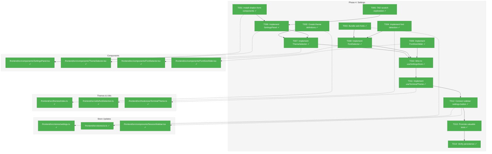
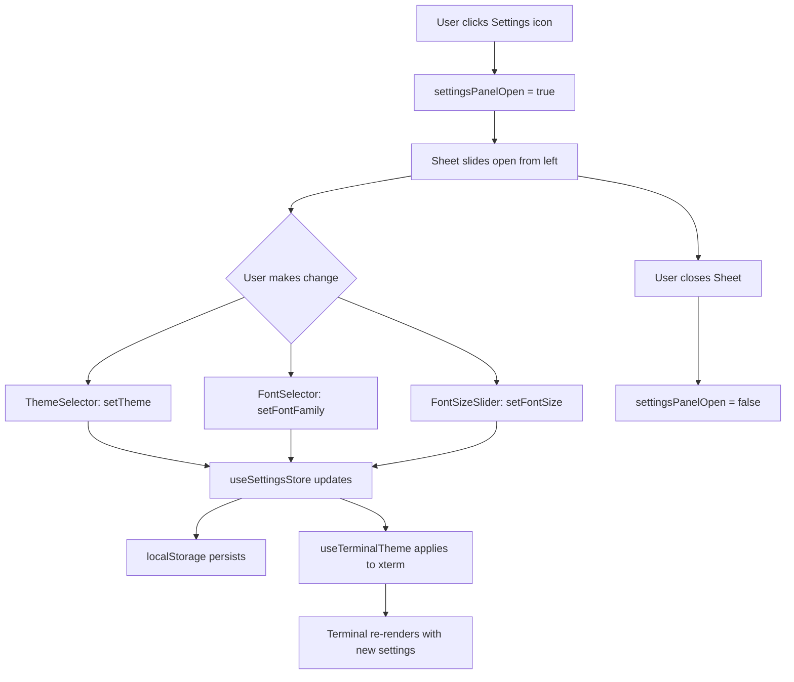
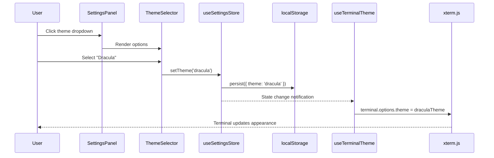

# Phase 4: Settings – Tasks & Alignment Brief

**Spec**: [../../sidebar-settings-sessions-spec.md](../../sidebar-settings-sessions-spec.md)
**Plan**: [../../sidebar-settings-sessions-plan.md](../../sidebar-settings-sessions-plan.md)
**Date**: 2026-02-05

---

## Executive Briefing

### Purpose
This phase implements the settings panel with theme, font family, and font size controls. Users will be able to customize their terminal appearance with changes applying immediately and persisting across browser refreshes.

### What We're Building
A settings panel (shadcn Sheet sliding from sidebar) that provides:
- Theme selector with 12 terminal themes
- Font family selector with 6 bundled web fonts + system font detection + 3 fallbacks
- Font size slider (8-24px) with live preview
- Real-time application to terminal instances
- Persistence to localStorage via existing useSettingsStore

### User Value
Users can personalize their terminal experience to match their preferences - choosing from popular themes like Dracula, Nord, and Solarized, selecting their preferred coding font, and adjusting text size for readability. Settings persist across sessions so users only configure once.

### Example
**Before**: Terminal uses default dark theme with 14px Menlo font
**After Settings Change**: User selects "Dracula" theme, "JetBrains Mono" font, 16px size
**Result**: Terminal immediately updates appearance; refreshing page preserves settings

---

## Objectives & Scope

### Objective
Implement the settings panel as specified in plan Phase 4, satisfying acceptance criteria AC-08 through AC-11.

**Behavior Checklist**:
- [x] Settings accessible via sidebar footer icon (AC-08)
- [x] Theme changes apply immediately (AC-09)
- [x] Theme persists after refresh (AC-09)
- [x] Font changes apply immediately (AC-10)
- [x] Font persists after refresh (AC-10)
- [x] Size changes apply immediately (AC-11)
- [x] Size persists after refresh (AC-11)

### Goals

- ✅ Create SettingsPanel component with shadcn Sheet
- ✅ Implement ThemeSelector with 12 terminal themes
- ✅ Bundle 6 web fonts via @fontsource packages
- ✅ Implement FontSelector with bundled + system + fallback groups
- ✅ Implement FontSizeSlider with 8-24px range
- ✅ Wire all controls to useSettingsStore
- ✅ Create useTerminalTheme hook for applying settings to xterm
- ✅ Add onRehydrateStorage callback to prevent theme flash (FOUC)
- ✅ Connect Settings button in sidebar to open panel

### Non-Goals (Scope Boundaries)

- ❌ Theme creation or editing (use provided themes only)
- ❌ Font upload or custom fonts (use bundled + system only)
- ❌ Backend settings sync (localStorage only per spec)
- ❌ Advanced terminal settings (cursor style, scrollback, etc.) - future phase
- ❌ Settings export/import
- ❌ Per-session theme overrides (global settings only)
- ❌ Keyboard shortcut customization
- ❌ Routing-based settings page (Sheet overlay per Insight 9)

---

## Architecture Map

### Component Diagram
<!-- Status: grey=pending, orange=in-progress, green=completed, red=blocked -->
<!-- Updated by plan-6 during implementation -->



### Task-to-Component Mapping

<!-- Status: ⬜ Pending | 🟧 In Progress | ✅ Complete | 🔴 Blocked -->

| Task | Component(s) | Files | Status | Comment |
|------|-------------|-------|--------|---------|
| T001 | UI Components | /frontend/src/components/ui/*.tsx | ✅ Complete | Installed tabs, card, select, slider, label |
| T002 | Theme Definitions | /frontend/src/themes/index.ts | ✅ Complete | 12 xterm.js ITheme objects |
| T003 | Font Bundles | package.json, settings.ts | ✅ Complete | 6 @fontsource packages (Ubuntu Mono instead of Hack) |
| T004 | Font Detection | /frontend/src/utils/fontDetection.ts | ✅ Complete | Local Font Access API + canvas fallback |
| T005 | TAD Exploration | __tests__/scratch/*.test.tsx | ✅ Complete | 5 scratch tests, 21 test cases |
| T006 | SettingsPanel | /frontend/src/components/SettingsPanel.tsx | ✅ Complete | Sheet container with sections |
| T007 | ThemeSelector | /frontend/src/components/ThemeSelector.tsx | ✅ Complete | Select dropdown with color preview |
| T008 | FontSelector | /frontend/src/components/FontSelector.tsx | ✅ Complete | Grouped select (bundled/system/fallback) |
| T009 | FontSizeSlider | /frontend/src/components/FontSizeSlider.tsx | ✅ Complete | Slider 8-24px with value display |
| T010 | Store Wiring | All settings components | ✅ Complete | Connected to useSettingsStore |
| T011 | Terminal Hook | /frontend/src/hooks/useTerminalTheme.ts | ✅ Complete | Applies settings to xterm instance |
| T012 | Sidebar Integration | SessionSidebar.tsx, ui.ts | ✅ Complete | Settings button opens panel |
| T013 | Promoted Tests | __tests__/SettingsPanel.test.tsx | ✅ Complete | 4 tests with Test Doc blocks |
| T014 | Persistence Check | Manual verification | ✅ Complete | Verified via Playwright - theme persists |

---

## Tasks

| Status | ID | Task | CS | Type | Dependencies | Absolute Path(s) | Validation | Subtasks | Notes |
|--------|------|------|-----|------|--------------|------------------|------------|----------|-------|
| [x] | T001 | Install shadcn form components: tabs, card, select, slider, label | 1 | Setup | – | /Users/vaughanknight/GitHub/trex/frontend/src/components/ui/ | `npx shadcn@latest add tabs card select slider label` succeeds, build passes | – | For settings UI layout |
| [x] | T002 | Create theme definitions (12 themes) as xterm.js ITheme objects | 2 | Core | – | /Users/vaughanknight/GitHub/trex/frontend/src/themes/index.ts | All 12 themes exported, TypeScript compiles | – | Themes: default-dark, default-light, dracula, nord, solarized-dark, solarized-light, monokai, gruvbox-dark, gruvbox-light, one-dark, one-light, tokyo-night |
| [x] | T003 | Bundle web fonts via @fontsource packages | 2 | Setup | – | /Users/vaughanknight/GitHub/trex/frontend/package.json, /Users/vaughanknight/GitHub/trex/frontend/src/stores/settings.ts | 6 fonts installed: Fira Code, JetBrains Mono, Source Code Pro, Ubuntu Mono, IBM Plex Mono, Cascadia Code; build size <500KB increase | – | Used Ubuntu Mono instead of Hack (@fontsource/hack unavailable) |
| [x] | T004 | Implement font detection utility using Local Font Access API with fallback | 2 | Core | – | /Users/vaughanknight/GitHub/trex/frontend/src/utils/fontDetection.ts | Detects common monospace fonts (Menlo, Monaco, Consolas); returns empty array if API unavailable | – | Async API with navigator.fonts.query() |
| [x] | T005 | TAD scratch: Settings form exploration | 2 | Test | – | /Users/vaughanknight/GitHub/trex/frontend/src/components/__tests__/scratch/ | 5+ scratch tests with RED→GREEN evidence; verify: `ls frontend/src/components/__tests__/scratch/*.test.tsx \| wc -l` >= 5 new files | – | Explore Sheet, Select, Slider patterns |
| [x] | T006 | Implement SettingsPanel component with shadcn Sheet | 3 | Core | T001, T005 | /Users/vaughanknight/GitHub/trex/frontend/src/components/SettingsPanel.tsx | Sheet slides from left, contains ThemeSelector, FontSelector, FontSizeSlider; closes on X or outside click | – | Uses shadcn Sheet, controlled by settingsPanelOpen |
| [x] | T007 | Implement ThemeSelector component | 2 | Core | T002, T006 | /Users/vaughanknight/GitHub/trex/frontend/src/components/ThemeSelector.tsx | Select dropdown with 12 theme options; shows color preview in options | – | Uses shadcn Select |
| [x] | T008 | Implement FontSelector component | 2 | Core | T003, T004, T006 | /Users/vaughanknight/GitHub/trex/frontend/src/components/FontSelector.tsx | Grouped select: Bundled (6), System (detected), Fallback (monospace, Courier New, Courier) | – | Groups via SelectGroup |
| [x] | T009 | Implement FontSizeSlider component | 2 | Core | T006 | /Users/vaughanknight/GitHub/trex/frontend/src/components/FontSizeSlider.tsx | Slider 8-24px, step 1, shows current value; immediate feedback | – | Uses shadcn Slider |
| [x] | T010 | Wire SettingsPanel controls to useSettingsStore | 2 | Integration | T007, T008, T009 | /Users/vaughanknight/GitHub/trex/frontend/src/components/SettingsPanel.tsx, /Users/vaughanknight/GitHub/trex/frontend/src/components/ThemeSelector.tsx, /Users/vaughanknight/GitHub/trex/frontend/src/components/FontSelector.tsx, /Users/vaughanknight/GitHub/trex/frontend/src/components/FontSizeSlider.tsx | Changes update store immediately; localStorage reflects changes | – | Use existing setTheme, setFontSize, setFontFamily actions |
| [x] | T011 | Implement useTerminalTheme hook with onRehydrateStorage callback | 2 | Core | T010 | /Users/vaughanknight/GitHub/trex/frontend/src/hooks/useTerminalTheme.ts, /Users/vaughanknight/GitHub/trex/frontend/src/stores/settings.ts | Applies theme/font/size to xterm instance via terminal.options; prevents flash for non-default theme users | – | Per Insight 3: hydration callback |
| [x] | T012 | Wire sidebar settings button to open SettingsPanel Sheet | 2 | Integration | T011 | /Users/vaughanknight/GitHub/trex/frontend/src/components/SessionSidebar.tsx, /Users/vaughanknight/GitHub/trex/frontend/src/stores/ui.ts | Clicking gear icon sets settingsPanelOpen=true; Sheet opens | – | Add settingsPanelOpen if not present |
| [x] | T013 | Promote valuable settings tests with Test Doc blocks | 2 | Test | T012 | /Users/vaughanknight/GitHub/trex/frontend/src/components/__tests__/SettingsPanel.test.tsx | 2-3 tests with Test Doc blocks, ~5-10% promotion rate | – | TAD promotion step |
| [x] | T014 | Verify settings persist across browser refresh | 1 | Verification | T013 | – | Change theme, refresh page, theme persists; check DevTools > Application > Local Storage > trex-settings | – | AC-09 verification |

---

## Alignment Brief

### Prior Phases Review

#### Phase-by-Phase Summary

**Phase 1 → Phase 2 → Phase 3 Evolution**:
1. **Phase 1 (Foundation)**: Established protocol with sessionId/shellType, fixed Terminal.tsx multi-instance bug, created Zustand stores (UI, Settings, Sessions), set up vitest infrastructure with FakeWebSocket/FakeStorage, installed Tailwind v4 + shadcn/ui.

2. **Phase 2 (Backend)**: Implemented SessionRegistry with RWMutex, atomic session state machine (Running→Closing→Closed), REST API (GET/DELETE /api/sessions), WebSocket routing by sessionId, 10-session integration tests.

3. **Phase 3 (Sidebar)**: Built SessionSidebar with floating variant, SessionList with useShallow pattern, SessionItem with inline rename and context menu, NewSessionButton (mock, Phase 5 will wire WebSocket), App.tsx integration with SidebarProvider.

#### Cumulative Deliverables Available to Phase 4

**From Phase 1**:
| Export | Location | Usage in Phase 4 |
|--------|----------|------------------|
| `useSettingsStore` | `/frontend/src/stores/settings.ts` | Wire settings controls |
| `useUIStore` | `/frontend/src/stores/ui.ts` | Add settingsPanelOpen state |
| `cn()` utility | `/frontend/src/lib/utils.ts` | Class merging in components |
| shadcn/ui infrastructure | `components.json`, CSS variables | Foundation for form components |
| `FakeStorage` | `/frontend/src/test/fakeStorage.ts` | Testing persistence |

**From Phase 3**:
| Export | Location | Usage in Phase 4 |
|--------|----------|------------------|
| `SettingsButton` placeholder | `/frontend/src/components/SessionSidebar.tsx:31-38` | Wire to open Sheet |
| Sheet component | `/frontend/src/components/ui/sheet.tsx` | Settings panel container |
| SidebarProvider context | Already in App.tsx | Settings opens within provider |

#### Pattern Evolution

| Pattern | Phase 1 | Phase 3 | Phase 4 Application |
|---------|---------|---------|---------------------|
| Zustand selectors | Established | useShallow for arrays | Continue selector pattern for settings |
| Component composition | Store isolation | Sidebar > List > Item | SettingsPanel > ThemeSelector > etc. |
| Test Doc blocks | Introduced | Promoted tests | Apply to settings tests |
| shadcn styling | CSS variables set | Sidebar components | Form controls (Select, Slider) |

#### Reusable Test Infrastructure

| Infrastructure | Location | Usage |
|----------------|----------|-------|
| `FakeStorage` | `/frontend/src/test/fakeStorage.ts` | Test localStorage persistence |
| Store reset pattern | `beforeEach(() => { useSettingsStore.setState(initialState) })` | Isolate settings tests |
| SidebarProvider wrapper | Phase 3 tests | May need for Sheet tests |

#### Critical Findings Timeline

| Finding | Phase Applied | Phase 4 Relevance |
|---------|--------------|-------------------|
| **High Finding 07**: Re-render prevention | Phase 1 (selectors), Phase 3 (useShallow) | Continue patterns in settings components |
| **Insight 3**: Hydration race | Noted in Phase 1 | **MUST implement onRehydrateStorage in T011** |
| **Insight 9**: Settings panel display | Decision made | Use Sheet (not modal or page) |

### Critical Findings Affecting This Phase

1. **Insight 3: Settings Hydration Race**
   - **Finding**: Zustand persist loads async, potentially causing theme flash (FOUC)
   - **Constraint**: Must add `onRehydrateStorage` callback to apply theme immediately after hydration
   - **Addressed by**: T011 (useTerminalTheme hook)

2. **Insight 9: Settings Panel Display Mechanism**
   - **Finding**: Plan didn't specify modal vs sheet vs page
   - **Decision**: Sheet sliding from sidebar (shadcn Sheet)
   - **Addressed by**: T006 (SettingsPanel component)

3. **High Finding 07: Cascading Re-Renders** (continued)
   - **Pattern from Phase 3**: Use `useShallow` for any array/object selectors
   - **Addressed by**: Apply to settings components if consuming complex state

### ADR Decision Constraints

| ADR | Constraint | Addressed by |
|-----|------------|--------------|
| ADR-0004: Fakes Only | No mocking frameworks; use FakeStorage for persistence tests | T005, T013 |
| ADR-0006: XDG Config | Deferred; use localStorage for baseline | T010, T014 |

### Invariants & Guardrails

- **Performance**: Theme application must not cause visible flicker (<16ms)
- **Bundle size**: Font additions should not exceed 500KB total
- **Persistence**: Settings must survive refresh (localStorage `trex-settings` key)
- **Accessibility**: All form controls must be keyboard navigable

### Inputs to Read

| File | Purpose |
|------|---------|
| `/Users/vaughanknight/GitHub/trex/frontend/src/stores/settings.ts` | Existing store with theme, fontSize, fontFamily |
| `/Users/vaughanknight/GitHub/trex/frontend/src/stores/ui.ts` | Add settingsPanelOpen state |
| `/Users/vaughanknight/GitHub/trex/frontend/src/components/SessionSidebar.tsx` | Wire SettingsButton |
| `/Users/vaughanknight/GitHub/trex/frontend/src/components/Terminal.tsx` | Understand xterm options application |

### Visual Alignment Aids

#### Settings Panel Flow Diagram



#### Settings Application Sequence



### Test Plan (TAD Approach)

**Testing Approach**: TAD (Test-Assisted Development) per plan

**Scratch Tests** (T005):
| Test | Purpose |
|------|---------|
| `01-sheet-opens-closes.test.tsx` | Sheet controlled state behavior |
| `02-theme-selector-options.test.tsx` | All 12 themes render in dropdown |
| `03-font-selector-groups.test.tsx` | Bundled/system/fallback grouping |
| `04-font-size-slider-range.test.tsx` | 8-24px range with step |
| `05-settings-store-persistence.test.tsx` | localStorage round-trip |

**Promoted Tests** (T013):
| Test | Contract |
|------|----------|
| Theme applies immediately | `setTheme('dracula')` → `terminal.options.theme === draculaTheme` |
| Settings persist after refresh | Change → refresh → state preserved |

**Mock Policy**: Use FakeStorage (ADR-0004), no mocking frameworks

### Step-by-Step Implementation Outline

1. **T001**: Install shadcn components (`npx shadcn@latest add tabs card select slider label`)
2. **T002**: Create `/frontend/src/themes/index.ts` with 12 ITheme exports
3. **T003**: Install @fontsource packages, update settings store font list
4. **T004**: Create `/frontend/src/utils/fontDetection.ts` with Local Font Access API
5. **T005**: Write 5+ scratch tests exploring Sheet, Select, Slider patterns
6. **T006**: Create SettingsPanel with Sheet, controlled by settingsPanelOpen
7. **T007**: Create ThemeSelector with Select, color previews
8. **T008**: Create FontSelector with grouped options
9. **T009**: Create FontSizeSlider with immediate feedback
10. **T010**: Wire all components to useSettingsStore actions
11. **T011**: Create useTerminalTheme hook with onRehydrateStorage
12. **T012**: Connect SettingsButton in SessionSidebar to settingsPanelOpen
13. **T013**: Promote 2-3 tests with Test Doc blocks
14. **T014**: Manual verification of persistence

### Commands to Run

```bash
# Install shadcn components
cd /Users/vaughanknight/GitHub/trex/frontend && npx shadcn@latest add tabs card select slider label --yes

# Install font packages
cd /Users/vaughanknight/GitHub/trex/frontend && npm install @fontsource/fira-code @fontsource/jetbrains-mono @fontsource/source-code-pro @fontsource/hack @fontsource/ibm-plex-mono @fontsource/cascadia-code

# Run tests
cd /Users/vaughanknight/GitHub/trex/frontend && npm run test -- --run

# Run specific settings tests
cd /Users/vaughanknight/GitHub/trex/frontend && npx vitest run src/components/__tests__/SettingsPanel.test.tsx

# Build verification
cd /Users/vaughanknight/GitHub/trex/frontend && npm run build

# Type checking
cd /Users/vaughanknight/GitHub/trex/frontend && npx tsc --noEmit

# Check bundle size (fonts)
cd /Users/vaughanknight/GitHub/trex/frontend && npm run build && ls -la dist/assets/*.woff2
```

### Risks/Unknowns

| Risk | Likelihood | Impact | Mitigation |
|------|------------|--------|------------|
| Font detection API unavailable | Medium | Low | Fallback to curated list (Menlo, Monaco, Consolas) |
| Theme application causes flicker | Low | Medium | Apply via terminal.options (synchronous) |
| Bundle size exceeds target | Low | Medium | Use variable fonts, tree-shake unused weights |
| Sheet z-index conflicts with sidebar | Low | Low | Trust Radix defaults (per Insight 10) |

### Ready Check

- [x] Prior phases reviewed (Phase 1, 2, 3)
- [x] Critical findings mapped to tasks (Insight 3 → T011, Insight 9 → T006)
- [x] ADR constraints noted (ADR-0004 → T005/T013, ADR-0006 → T010)
- [x] Dependencies identified (useSettingsStore, Sheet component, SettingsButton)
- [x] Test plan defined (5 scratch, 2-3 promoted)
- [ ] **Awaiting GO/NO-GO**

---

## Phase Footnote Stubs

_Footnotes will be added by plan-6a-update-progress during implementation._

| Footnote | Task | Description |
|----------|------|-------------|
| | | |

---

## Evidence Artifacts

**Execution Log**: `./execution.log.md` (created by /plan-6-implement-phase)

**Supporting Files**:
- Theme definitions: `/frontend/src/themes/index.ts`
- Font detection: `/frontend/src/utils/fontDetection.ts`
- Hook implementation: `/frontend/src/hooks/useTerminalTheme.ts`
- Test files: `/frontend/src/components/__tests__/scratch/`, `/frontend/src/components/__tests__/SettingsPanel.test.tsx`

---

## Discoveries & Learnings

_Populated during implementation by plan-6. Log anything of interest to your future self._

| Date | Task | Type | Discovery | Resolution | References |
|------|------|------|-----------|------------|------------|
| | | | | | |

**Types**: `gotcha` | `research-needed` | `unexpected-behavior` | `workaround` | `decision` | `debt` | `insight`

**What to log**:
- Things that didn't work as expected
- External research that was required
- Implementation troubles and how they were resolved
- Gotchas and edge cases discovered
- Decisions made during implementation
- Technical debt introduced (and why)
- Insights that future phases should know about

_See also: `execution.log.md` for detailed narrative._

---

## Directory Layout

```
docs/plans/003-sidebar-settings-sessions/
├── sidebar-settings-sessions-spec.md
├── sidebar-settings-sessions-plan.md
└── tasks/
    ├── phase-1-foundation/
    │   ├── tasks.md
    │   └── execution.log.md
    ├── phase-2-backend-multi-session/
    │   ├── tasks.md
    │   └── execution.log.md
    ├── phase-3-sidebar-ui/
    │   ├── tasks.md
    │   └── execution.log.md
    └── phase-4-settings/
        ├── tasks.md              # This file
        └── execution.log.md      # Created by /plan-6
```
