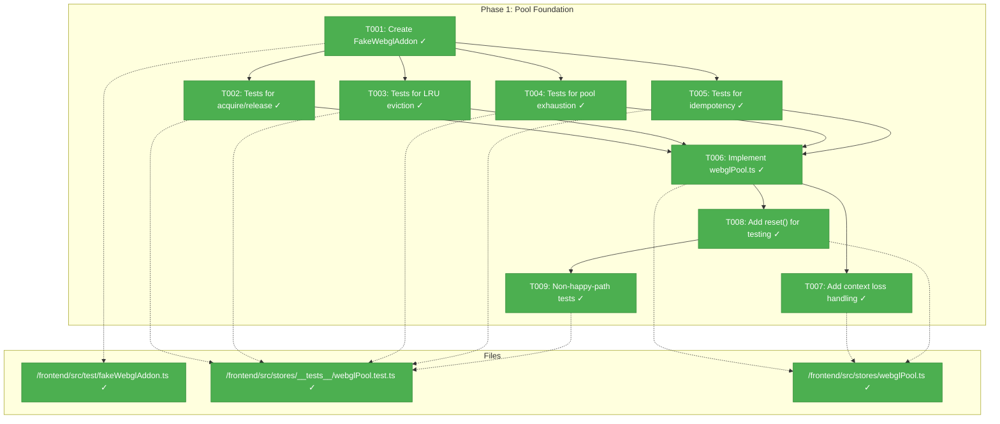
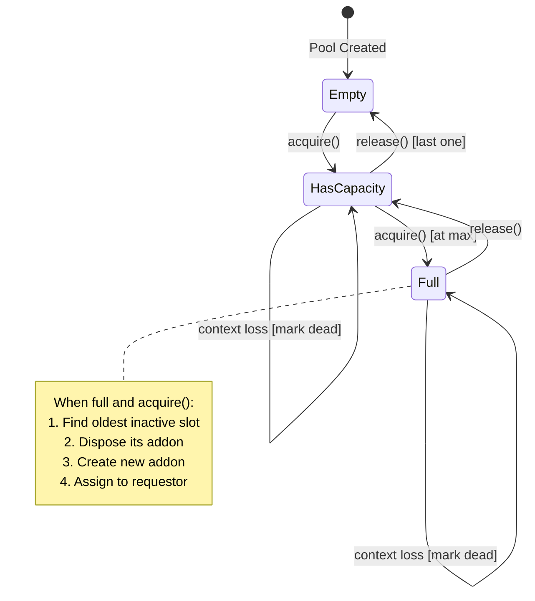
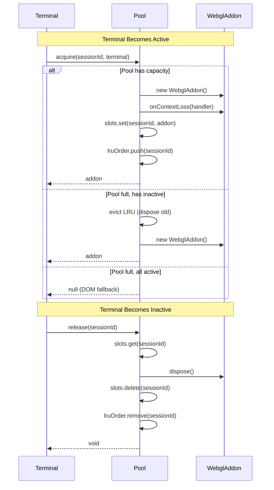

# Phase 1: Pool Foundation – Tasks & Alignment Brief

**Spec**: [../../webgl-context-pooling-spec.md](../../webgl-context-pooling-spec.md)
**Plan**: [../../webgl-context-pooling-plan.md](../../webgl-context-pooling-plan.md)
**Date**: 2026-02-05
**GitHub Issue**: [#22](https://github.com/vaughanknight/trex/issues/22)

---

## Executive Briefing

### Purpose

This phase creates the WebGL addon pool foundation—a Zustand store that manages WebGL context allocation across terminal sessions. Without this pool, trex is limited to 3 WebGL-accelerated terminals regardless of device capability, and the active terminal may not always have GPU rendering.

### What We're Building

A `useWebGLPoolStore` Zustand store that:
- Tracks WebGL addon assignments to sessions via a Map-based state
- Provides `acquire(sessionId, terminal)` to allocate WebGL to active terminals
- Provides `release(sessionId)` to deallocate and dispose addons properly
- Implements LRU eviction when pool reaches capacity
- Handles context loss events at the pool level
- Exposes `getStats()` for debugging and observability

### User Value

Users will benefit from GPU-accelerated terminal rendering on whichever terminal they're actively using, rather than being limited to whichever 3 terminals were created first. This enables smooth, responsive text rendering for all sessions.

### Example

**Before** (current):
```
Sessions: A, B, C, D, E (5 total)
WebGL: A=yes, B=yes, C=yes, D=NO, E=NO (fixed at creation)
User working in E → DOM renderer, laggy text
```

**After** (with pool):
```
Sessions: A, B, C, D, E (5 total)
User activates E → Pool: acquire(E), evict(A)
WebGL: E=yes, B=yes, C=yes (active always gets WebGL)
```

---

## Objectives & Scope

### Objective

Create the WebGL pool store with acquire/release/LRU mechanics, following TDD methodology and ADR-0004 (fakes only).

**Behavior Checklist** (from AC-01 through AC-05, AC-10):
- [x] Pool initializes with configurable max size (will use GPU detection in Phase 2)
- [x] acquire() returns WebGL addon when pool has capacity
- [x] acquire() is idempotent (same session → same addon)
- [x] release() disposes addon and updates pool state
- [x] LRU eviction occurs when pool at capacity
- [x] getStats() returns accurate { maxSize, activeCount, availableCount }
- [x] Context loss is handled at pool level

### Goals

- ✅ Create FakeWebglAddon following FakeWebSocket pattern for testing
- ✅ Write comprehensive unit tests FIRST (TDD red phase)
- ✅ Implement webglPool.ts store to make tests pass (TDD green phase)
- ✅ Ensure all pool operations are idempotent (per Critical Discovery 05)
- ✅ Pool owns addon lifecycle—dispose on release (per Critical Discovery 03)
- ✅ Register context loss handlers at creation (per Critical Discovery 04)
- ✅ Follow sessions.ts Map-based state pattern (per Critical Discovery 08)

### Non-Goals

- ❌ GPU capability detection (Phase 2)
- ❌ Integration with Terminal.tsx (Phase 3)
- ❌ Container simplification (Phase 4)
- ❌ User-configurable pool size (spec says no user override)
- ❌ Actual WebGL context creation in tests (use FakeWebglAddon)
- ❌ Performance optimization (focus on correctness first)
- ❌ requestAnimationFrame timing (Terminal integration handles this)

---

## Architecture Map

### Component Diagram

<!-- Status: grey=pending, orange=in-progress, green=completed, red=blocked -->
<!-- Updated by plan-6 during implementation -->



### Task-to-Component Mapping

<!-- Status: ⬜ Pending | 🟧 In Progress | ✅ Complete | 🔴 Blocked -->

| Task | Component(s) | Files | Status | Comment |
|------|-------------|-------|--------|---------|
| T001 | Test Infrastructure | fakeWebglAddon.ts | ✅ Complete | Fake following FakeWebSocket pattern |
| T002 | Test Suite | webglPool.test.ts | ✅ Complete | TDD: acquire/release tests first |
| T003 | Test Suite | webglPool.test.ts | ✅ Complete | TDD: LRU eviction tests |
| T004 | Test Suite | webglPool.test.ts | ✅ Complete | TDD: pool exhaustion tests |
| T005 | Test Suite | webglPool.test.ts | ✅ Complete | TDD: idempotency tests |
| T006 | Pool Store | webglPool.ts | ✅ Complete | Core implementation |
| T007 | Pool Store | webglPool.ts | ✅ Complete | Context loss handling |
| T008 | Pool Store | webglPool.ts | ✅ Complete | Test isolation support |
| T009 | Test Suite | webglPool.test.ts | ✅ Complete | Edge case coverage |

---

## Tasks

| Status | ID | Task | CS | Type | Dependencies | Absolute Path(s) | Validation | Subtasks | Notes |
|--------|------|------|----|------|--------------|------------------|------------|----------|-------|
| [x] | T001 | Create FakeWebglAddon with dispose(), wasDisposed(), onContextLoss(), simulateContextLoss() | 2 | Setup | – | /Users/vaughanknight/GitHub/trex/frontend/src/test/fakeWebglAddon.ts | dispose() tracks calls, simulateContextLoss() triggers handler | – | Follow FakeWebSocket pattern per ADR-0004 |
| [x] | T002 | Write tests for pool acquire and release operations | 2 | Test | T001 | /Users/vaughanknight/GitHub/trex/frontend/src/stores/__tests__/webglPool.test.ts | Tests: acquire returns addon, release disposes, stats update correctly | – | TDD: tests must fail initially |
| [x] | T003 | Write tests for LRU eviction when pool at capacity | 2 | Test | T001 | /Users/vaughanknight/GitHub/trex/frontend/src/stores/__tests__/webglPool.test.ts | Tests: oldest evicted first, evicted addon disposed, new acquires successfully | – | Use monotonic counter for ordering |
| [x] | T004 | Write tests for pool exhaustion behavior | 2 | Test | T001 | /Users/vaughanknight/GitHub/trex/frontend/src/stores/__tests__/webglPool.test.ts | Tests: returns null when full and can't evict, getStats shows exhausted state | – | Exhaustion = all active, none evictable |
| [x] | T005 | Write tests for idempotent acquire/release operations | 2 | Test | T001 | /Users/vaughanknight/GitHub/trex/frontend/src/stores/__tests__/webglPool.test.ts | Tests: double acquire same addon, double release no error, rapid toggle safe | – | Per Critical Discovery 05 |
| [x] | T006 | Implement webglPool.ts Zustand store with acquire/release/evict | 3 | Core | T002, T003, T004, T005 | /Users/vaughanknight/GitHub/trex/frontend/src/stores/webglPool.ts | All tests from T002-T005 pass | – | Map-based state per Critical Discovery 08 |
| [x] | T007 | Add context loss handling with markDead() and pool state update | 2 | Core | T006 | /Users/vaughanknight/GitHub/trex/frontend/src/stores/webglPool.ts | Context loss test passes, slot marked dead, stats accurate | – | Per Critical Discovery 04 |
| [x] | T008 | Add reset() action for test isolation | 1 | Core | T006 | /Users/vaughanknight/GitHub/trex/frontend/src/stores/webglPool.ts | Store resets between tests, no state leakage | – | Required for test isolation |
| [x] | T009 | Write non-happy-path tests for edge cases | 2 | Test | T008 | /Users/vaughanknight/GitHub/trex/frontend/src/stores/__tests__/webglPool.test.ts | Tests: null terminal, non-existent release, context loss during acquire, double release | – | Edge case coverage |

---

## Alignment Brief

### Critical Findings Affecting This Phase

| Finding | Constraint/Requirement | Addressed By |
|---------|------------------------|--------------|
| **Critical Discovery 02**: WebglAddon cannot be reattached | Pool must dispose on release, create fresh on acquire. Track context COUNT, not addon reuse. | T002, T006 |
| **Critical Discovery 03**: Memory leak risk from improper disposal | Pool OWNS all addons. Terminal never calls dispose() directly. | T002, T006 |
| **Critical Discovery 04**: Pool state desync with actual contexts | Pool registers onContextLoss at addon creation. Mark slot as DEAD on loss. | T007 |
| **Critical Discovery 05**: Rapid session switching race condition | Make acquire/release idempotent. Multiple calls same result. | T005, T006 |
| **Critical Discovery 07**: FakeWebglAddon required per ADR-0004 | Create FakeWebglAddon following FakeWebSocket pattern. No mocking frameworks. | T001 |
| **Critical Discovery 08**: Store pattern must match sessions.ts | Mirror Map-based state, typed interfaces, selector exports. | T006 |

### ADR Decision Constraints

**ADR-0004: Fakes Only Testing Policy**
- Decision: No mocking frameworks (jest.mock, sinon) permitted
- Constrains: All WebglAddon behavior must use FakeWebglAddon
- Addressed by: T001 (creates FakeWebglAddon)

### Invariants & Guardrails

- **Memory**: Each WebGL context ~7-34MB. Pool max prevents exhaustion.
- **Context Limit**: Browser limit 8-16 contexts. Pool default 4-6.
- **Disposal**: Every created addon MUST be disposed on release or eviction.
- **Idempotency**: acquire(same) returns same, release(same) is no-op.

### Inputs to Read

| File | Purpose | Key Lines |
|------|---------|-----------|
| `/Users/vaughanknight/GitHub/trex/frontend/src/stores/sessions.ts` | Pattern to follow | All (Map-based state, selectors) |
| `/Users/vaughanknight/GitHub/trex/frontend/src/test/fakeWebSocket.ts` | Fake pattern | All (simulate*, was*, install*) |
| `/Users/vaughanknight/GitHub/trex/frontend/src/test/setup.ts` | Test setup | Vitest configuration |

### Visual Alignment Aids

#### Flow Diagram: Pool State Machine



#### Sequence Diagram: Acquire/Release Cycle



### Test Plan (TDD)

**Test File**: `/Users/vaughanknight/GitHub/trex/frontend/src/stores/__tests__/webglPool.test.ts`

| Test Name | Type | Purpose | Fixtures | Expected Output |
|-----------|------|---------|----------|-----------------|
| `acquire returns addon when pool has capacity` | Unit | Verify basic allocation | FakeWebglAddon | addon !== null, stats.activeCount === 1 |
| `release disposes addon and decrements count` | Unit | Verify disposal | FakeWebglAddon | wasDisposed() === true, activeCount === 0 |
| `acquire is idempotent for same session` | Unit | Prevent double allocation | FakeWebglAddon | same addon returned, count stays 1 |
| `release is idempotent for same session` | Unit | Prevent double dispose | FakeWebglAddon | no error on second release |
| `evicts LRU when pool at capacity` | Unit | Verify eviction | maxSize=2 | oldest evicted, new acquired |
| `LRU ordering respects access time` | Unit | Verify access tracking | 3 sessions | middle accessed = preserved |
| `returns null when pool exhausted` | Unit | Graceful degradation | maxSize=1, 2 requests | second returns null |
| `getStats returns accurate counts` | Unit | Observability | Various states | accurate numbers |
| `context loss marks slot dead` | Unit | Recovery handling | simulateContextLoss() | slot removed from active |
| `null terminal reference handled` | Edge | Defensive coding | null terminal | returns null, no error |
| `release non-existent session is no-op` | Edge | Defensive coding | random id | no error |
| `double release same session is no-op` | Edge | Idempotency | same id twice | no error |

**Fixtures Required**:
- FakeWebglAddon instances (created via installFakeWebglAddon)
- Mock terminal objects (`{} as any` sufficient for pool tests)

### Step-by-Step Implementation Outline

1. **T001: Create FakeWebglAddon** (Setup)
   - Create `/frontend/src/test/fakeWebglAddon.ts`
   - Implement: `dispose()`, `wasDisposed()`, `onContextLoss()`, `simulateContextLoss()`
   - Export `installFakeWebglAddon()` for global replacement
   - Pattern: Follow FakeWebSocket structure exactly

2. **T002-T005: Write Failing Tests** (TDD Red)
   - Create `/frontend/src/stores/__tests__/webglPool.test.ts`
   - Write all tests from Test Plan table
   - Import from non-existent `../webglPool` (will fail)
   - Each test includes Test Doc block per plan
   - Run tests, verify all fail with import error

3. **T006: Implement Pool Store** (TDD Green)
   - Create `/frontend/src/stores/webglPool.ts`
   - Define interfaces: `PoolSlot`, `WebGLPoolState`, `WebGLPoolActions`
   - Implement: `acquire()`, `release()`, `getStats()`, `hasWebGL()`
   - Internal: `evictLRU()`, `createAddon()`
   - Run tests, fix until all pass

4. **T007: Context Loss Handling** (Enhancement)
   - Add `markDead()` action to store
   - Register `onContextLoss` in `createAddon()`
   - Update relevant tests
   - Verify context loss test passes

5. **T008: Reset Action** (Test Support)
   - Add `reset()` action per sessions.ts pattern
   - Use in `beforeEach()` for test isolation
   - Verify no state leakage between tests

6. **T009: Edge Case Tests** (Coverage)
   - Add non-happy-path tests from Test Plan
   - Defensive coding: null checks, idempotency
   - Run full suite, verify 100% pass

### Commands to Run

```bash
# Navigate to frontend
cd /Users/vaughanknight/GitHub/trex/frontend

# Install dependencies (if needed)
npm install

# Run all tests (should fail initially for TDD)
npm test

# Run specific test file
npm test -- src/stores/__tests__/webglPool.test.ts

# Run tests in watch mode during development
npm test -- --watch

# Type check
npm run type-check

# Lint
npm run lint
```

### Risks & Unknowns

| Risk | Severity | Mitigation |
|------|----------|------------|
| WebglAddon import in test file | Low | Use dynamic import or conditional loading |
| LRU ordering edge cases (ties) | Medium | Use monotonic counter, explicit tests |
| Store pattern drift from sessions.ts | Low | Code review against sessions.ts structure |
| FakeWebglAddon doesn't cover all addon API | Medium | Only implement methods pool actually uses |

### Ready Check

- [x] Plan reviewed and understood
- [x] Critical findings integrated into task design
- [x] ADR constraints mapped to tasks (ADR-0004 → T001)
- [x] Test plan enumerated with expected outputs
- [x] Implementation steps map 1:1 to tasks
- [x] Commands documented and tested
- [x] **PHASE COMPLETE**

---

## Phase Footnote Stubs

_Populated during implementation by plan-6a when deviations or discoveries occur._

| Footnote | Phase | Task | Description |
|----------|-------|------|-------------|
| | | | |

---

## Evidence Artifacts

**Execution Log**: `./execution.log.md` (created by plan-6 during implementation)

**Supporting Files**:
- Test output snapshots (if needed)
- Coverage reports (optional)

---

## Discoveries & Learnings

_Populated during implementation by plan-6. Log anything of interest to your future self._

| Date | Task | Type | Discovery | Resolution | References |
|------|------|------|-----------|------------|------------|
| | | | | | |

**Types**: `gotcha` | `research-needed` | `unexpected-behavior` | `workaround` | `decision` | `debt` | `insight`

**What to log**:
- Things that didn't work as expected
- External research that was required
- Implementation troubles and how they were resolved
- Gotchas and edge cases discovered
- Decisions made during implementation
- Technical debt introduced (and why)
- Insights that future phases should know about

_See also: `execution.log.md` for detailed narrative._

---

## Directory Layout

```
docs/plans/004-webgl-context-pooling/
├── webgl-context-pooling-spec.md
├── webgl-context-pooling-plan.md
├── research-dossier.md
└── tasks/
    └── phase-1-pool-foundation/
        ├── tasks.md              # This file
        └── execution.log.md      # Created by plan-6
```

---

**Next Step**: Await **GO** approval, then run `/plan-6-implement-phase --phase "Phase 1: Pool Foundation" --plan "/Users/vaughanknight/GitHub/trex/docs/plans/004-webgl-context-pooling/webgl-context-pooling-plan.md"`.
