# Phase 2: GPU Detection – Tasks & Alignment Brief

**Spec**: [../../webgl-context-pooling-spec.md](../../webgl-context-pooling-spec.md)
**Plan**: [../../webgl-context-pooling-plan.md](../../webgl-context-pooling-plan.md)
**Date**: 2026-02-05
**GitHub Issue**: [#22](https://github.com/vaughanknight/trex/issues/22)

---

## Executive Briefing

### Purpose

This phase creates the GPU capability detection utility that determines the optimal WebGL pool size based on the user's hardware. Without this, the pool uses a fixed default of 4 contexts regardless of whether the device could support 6-8 contexts (wasting capability) or struggles with even 4 (causing instability).

### What We're Building

A `detectGPUCapability()` utility that:
- Queries the GPU renderer string via `WEBGL_debug_renderer_info` extension
- Returns device-appropriate pool sizes: Apple Silicon=6, Intel=4, NVIDIA/AMD=8
- Falls back to conservative default (4) when detection fails or is blocked
- Integrates with pool initialization via `setMaxSize()`

### User Value

Users with high-end GPUs (NVIDIA RTX, Apple M-series) get more WebGL-accelerated terminals simultaneously. Users with integrated GPUs still get stable performance with appropriate limits.

### Example

**Before** (hardcoded):
```
Device: MacBook Pro M3 Pro (capable of 8 contexts)
Pool maxSize: 4 (fixed default)
User opens 6 terminals → only 4 get WebGL
```

**After** (with detection):
```
Device: MacBook Pro M3 Pro
GPU detected: "Apple M3 Pro" → maxSize = 6
User opens 6 terminals → all 6 get WebGL
```

---

## Objectives & Scope

### Objective

Create device capability detection utility with conservative fallbacks and integrate with pool initialization.

**Behavior Checklist** (from AC-11):
- [x] GPU is detected via WEBGL_debug_renderer_info
- [x] Pool maxSize set appropriately:
  - Apple Silicon: 6
  - Intel integrated: 4
  - NVIDIA/AMD discrete: 8
  - Unknown/WebGL unavailable: 4 (conservative default)
- [x] Detection runs once on first acquire (lazy initialization)
- [x] Console logs detected capability for debugging

### Goals

- ✅ Create FakeGPUContext utility for testing (per ADR-0004)
- ✅ Implement `detectGPUCapability()` with GPU heuristics
- ✅ Add try-catch fallback for detection failures
- ✅ Write lightweight validation tests
- ✅ Integrate with pool initialization

### Non-Goals

- ❌ User-configurable pool size override (spec says no)
- ❌ Real-time GPU monitoring (detection runs once)
- ❌ WebGPU detection (future enhancement)
- ❌ Cross-browser GPU string normalization (accept vendor differences)
- ❌ Detailed GPU benchmarking (heuristics sufficient)
- ❌ Caching detection results in localStorage (memory-only)

---

## Architecture Map

### Component Diagram

<!-- Status: grey=pending, orange=in-progress, green=completed, red=blocked -->
<!-- Updated by plan-6 during implementation -->


### Task-to-Component Mapping

<!-- Status: ⬜ Pending | 🟧 In Progress | ✅ Complete | 🔴 Blocked -->

| Task | Component(s) | Files | Status | Comment |
|------|-------------|-------|--------|---------|
| T001 | Test Infrastructure | fakeGPUContext.ts | ✅ Complete | Fake for GPU renderer string injection |
| T002 | GPU Detection | gpuCapability.ts | ✅ Complete | Core detection logic |
| T003 | GPU Detection | gpuCapability.ts | ✅ Complete | Try-catch fallback handling |
| T004 | Test Suite | gpuCapability.test.ts | ✅ Complete | Validation tests for GPU types (15 tests) |
| T005 | Pool Integration | webglPool.ts | ✅ Complete | Lazy detection on first acquire |

---

## Tasks

| Status | ID | Task | CS | Type | Dependencies | Absolute Path(s) | Validation | Subtasks | Notes |
|--------|------|------|----|------|--------------|------------------|------------|----------|-------|
| [x] | T001 | Create FakeGPUContext utility for simulating GPU renderer strings | 1 | Setup | – | /Users/vaughanknight/GitHub/trex/frontend/src/test/fakeGPUContext.ts | Can set/get fake renderer string, can simulate null context | – | Per ADR-0004 |
| [x] | T002 | Implement detectGPUCapability() with GPU heuristics | 2 | Core | T001 | /Users/vaughanknight/GitHub/trex/frontend/src/utils/gpuCapability.ts | Returns 6 for Apple, 4 for Intel, 8 for NVIDIA/AMD | – | Pure function |
| [x] | T003 | Add try-catch fallback for detection failures | 1 | Core | T002 | /Users/vaughanknight/GitHub/trex/frontend/src/utils/gpuCapability.ts | Returns 4 on any exception | – | Per Critical Discovery 09 |
| [x] | T004 | Write validation tests for GPU types and fallback | 2 | Test | T003 | /Users/vaughanknight/GitHub/trex/frontend/src/utils/__tests__/gpuCapability.test.ts | Tests: Apple=6, Intel=4, NVIDIA=8, AMD=8, null=4, exception=4 | – | Lightweight validation |
| [x] | T005 | Integrate detection with pool initialization (lazy init on first acquire) | 2 | Integration | T004 | /Users/vaughanknight/GitHub/trex/frontend/src/stores/webglPool.ts | Pool calls detectGPUCapability() once, logs result, sets maxSize | – | Uses Phase 1 setMaxSize() |

---

## Alignment Brief

### Prior Phases Review

#### Phase 1: Pool Foundation (COMPLETE)

**A. Deliverables Created**:
| File | Purpose |
|------|---------|
| `/frontend/src/test/fakeWebglAddon.ts` | FakeWebglAddon test double (174 lines) |
| `/frontend/src/test/fakeWebglAddon.test.ts` | 6 unit tests |
| `/frontend/src/stores/webglPool.ts` | WebGL Pool Zustand store (261 lines) |
| `/frontend/src/stores/__tests__/webglPool.test.ts` | 20 unit tests |

**B. Lessons Learned**:
- Injectable factory pattern (`getWebglAddonFactory()`) enables seamless test injection
- TDD Red-Green flow validated that tests were actually running
- Following sessions.ts pattern reduced design decisions

**C. Technical Discoveries**:
- Context loss handler must be registered at addon creation time within the pool
- `reset()` must dispose addons before clearing the Map

**D. Dependencies Exported for Phase 2**:
| Export | Location | Purpose |
|--------|----------|---------|
| `setMaxSize(size: number)` | webglPool.ts:227-229 | GPU detection calls this to set pool size |
| `DEFAULT_MAX_SIZE = 4` | webglPool.ts:105 | Fallback if detection fails |

**E. Critical Findings Applied**:
- CD-02: WebglAddon cannot be reattached → dispose on release, create fresh on acquire
- CD-03: Memory leak risk → Pool OWNS all addons
- CD-04: Context loss desync → Pool registers onContextLoss at creation
- CD-05: Race conditions → Idempotent acquire/release
- CD-07: FakeWebglAddon per ADR-0004 → Created following FakeWebSocket pattern

**F. Incomplete/Blocked Items**: None

**G. Test Infrastructure**:
- `installFakeWebglAddon()` returns `{ instances, restore }` for test injection
- `mockTerminal = {} as any` pattern for minimal Terminal stubs

**H. Technical Debt**:
- `require()` in factory (should use dynamic import)
- No `availableCount` in stats

**I. Architectural Decisions**:
- Injectable Factory pattern for test injection
- Map-based state consistent with sessions.ts
- Pool owns all addon lifecycle

**J. Scope Changes**: None

**K. Key Log References**:
- T001 Design Decisions: Injectable factory pattern
- T006 Key Design: Pool owns disposal, idempotent ops

### Critical Findings Affecting This Phase

| Finding | Impact on Phase 2 | Addressed By |
|---------|-------------------|--------------|
| **Medium Discovery 09**: GPU Detection Conservative Defaults | Wrap detection in try-catch, accept false negatives as safe, default to 4 | T002, T003, T004 |
| **High Discovery 07**: FakeWebglAddon per ADR-0004 | Same pattern applies - create FakeGPUContext for testing | T001 |

### ADR Decision Constraints

**ADR-0004: Fakes Only Testing Policy**
- Decision: No mocking frameworks (jest.mock, sinon) permitted
- Constrains: GPU detection must use FakeGPUContext, not mocks
- Addressed by: T001 (creates FakeGPUContext)

### Invariants & Guardrails

- **Default Value**: Always return 4 if detection fails (never 0, never undefined)
- **Renderer String**: May contain vendor-specific formatting, match substrings
- **Context Creation**: GPU detection creates a temporary canvas+context, must clean up
- **Logging**: Always log detected capability to console.info for debugging

### Inputs to Read

| File | Purpose | Key Lines |
|------|---------|-----------|
| `/Users/vaughanknight/GitHub/trex/frontend/src/test/fakeWebglAddon.ts` | Pattern for fake creation | All (installFake*, setFake* pattern) |
| `/Users/vaughanknight/GitHub/trex/frontend/src/stores/webglPool.ts` | Pool integration point | setMaxSize(), acquire() |
| `/Users/vaughanknight/GitHub/trex/frontend/src/utils/fontDetection.ts` | Similar canvas-based detection pattern | If exists |

### Visual Alignment Aids

#### Flow Diagram: GPU Detection Flow

```mermaid
flowchart TD
    A[App Start] --> B{First acquire() called?}
    B -->|No| C[Wait]
    B -->|Yes| D{Pool initialized?}
    D -->|Yes| E[Use existing maxSize]
    D -->|No| F[detectGPUCapability]

    F --> G[Create temp canvas]
    G --> H{WebGL available?}
    H -->|No| I[Return 4 default]
    H -->|Yes| J{debug_renderer_info?}
    J -->|No| I
    J -->|Yes| K[Get renderer string]

    K --> L{Contains 'Apple'?}
    L -->|Yes| M[Return 6]
    L -->|No| N{Contains 'NVIDIA'?}
    N -->|Yes| O[Return 8]
    N -->|No| P{Contains 'AMD'?}
    P -->|Yes| O
    P -->|No| Q{Contains 'Intel'?}
    Q -->|Yes| R[Return 4]
    Q -->|No| I

    I --> S[console.info log]
    M --> S
    O --> S
    R --> S
    S --> T[setMaxSize]
    T --> E
```

#### Sequence Diagram: Detection Integration

```mermaid
sequenceDiagram
    participant App
    participant Pool as webglPool
    participant GPU as gpuCapability
    participant Canvas as HTMLCanvas

    App->>Pool: acquire(sessionId, terminal)

    alt First acquire (not initialized)
        Pool->>GPU: detectGPUCapability()
        GPU->>Canvas: createElement('canvas')
        GPU->>Canvas: getContext('webgl')

        alt WebGL available
            Canvas-->>GPU: WebGLRenderingContext
            GPU->>Canvas: getExtension('WEBGL_debug_renderer_info')

            alt Extension available
                Canvas-->>GPU: Extension
                GPU->>Canvas: getParameter(UNMASKED_RENDERER_WEBGL)
                Canvas-->>GPU: "Apple M3 Pro"
                GPU-->>GPU: Match heuristics → 6
            else Extension blocked
                GPU-->>GPU: Fallback → 4
            end
        else WebGL unavailable
            GPU-->>GPU: Fallback → 4
        end

        GPU-->>Pool: maxSize (4-8)
        Pool->>Pool: setMaxSize(maxSize)
        Note over Pool: console.info("GPU detected: ... → maxSize")
    end

    Pool->>Pool: Create addon, return
    Pool-->>App: addon
```



### Test Plan (Lightweight)

**Test File**: `/Users/vaughanknight/GitHub/trex/frontend/src/utils/__tests__/gpuCapability.test.ts`

| Test Name | Type | Purpose | Fixtures | Expected Output |
|-----------|------|---------|----------|-----------------|
| `returns 6 for Apple Silicon GPU` | Unit | Verify Apple heuristic | FakeGPUContext('Apple M2 Pro') | 6 |
| `returns 6 for Apple M3 GPU` | Unit | Verify M3 variant | FakeGPUContext('Apple M3 Max') | 6 |
| `returns 4 for Intel integrated GPU` | Unit | Verify Intel heuristic | FakeGPUContext('Intel(R) UHD Graphics 630') | 4 |
| `returns 8 for NVIDIA discrete GPU` | Unit | Verify NVIDIA heuristic | FakeGPUContext('NVIDIA GeForce RTX 3080') | 8 |
| `returns 8 for AMD discrete GPU` | Unit | Verify AMD heuristic | FakeGPUContext('AMD Radeon RX 6800') | 8 |
| `returns 4 when WebGL unavailable` | Unit | Fallback path | FakeGPUContext(null) | 4 |
| `returns 4 when extension blocked` | Unit | Fallback path | FakeGPUContext with blocked extension | 4 |
| `returns 4 for unknown GPU` | Unit | Fallback path | FakeGPUContext('Unknown Vendor GPU') | 4 |

**Fixtures Required**:
- FakeGPUContext with configurable renderer string
- Ability to simulate null context and blocked extension

### Step-by-Step Implementation Outline

1. **T001: Create FakeGPUContext** (Setup)
   - Create `/frontend/src/test/fakeGPUContext.ts`
   - Implement: configurable renderer string, null simulation, extension blocking
   - Export `setFakeGPUContext()` and `resetFakeGPUContext()`
   - Pattern: Follow FakeWebglAddon structure

2. **T002: Implement detectGPUCapability()** (Core)
   - Create `/frontend/src/utils/gpuCapability.ts`
   - Create temporary canvas, get WebGL context
   - Query `WEBGL_debug_renderer_info` extension
   - Get `UNMASKED_RENDERER_WEBGL` parameter
   - Apply heuristics: Apple→6, Intel→4, NVIDIA/AMD→8, unknown→4
   - Clean up canvas (remove from DOM if added)

3. **T003: Add Fallback Handling** (Enhancement)
   - Wrap detection in try-catch
   - Return 4 on any exception
   - Log warning on fallback
   - Per Critical Discovery 09: accept false negatives as safe

4. **T004: Write Validation Tests** (Test)
   - Create `/frontend/src/utils/__tests__/gpuCapability.test.ts`
   - Test each GPU type from Test Plan
   - Test fallback paths (null context, blocked extension)
   - Verify console.info logging

5. **T005: Integrate with Pool** (Integration)
   - Modify `webglPool.ts` acquire() to call detection once
   - Add `initialized` flag to prevent repeated detection
   - Call `setMaxSize()` with detected value
   - Log: `console.info('[WebGL Pool] GPU detected: ${renderer} → maxSize ${size}')`

### Commands to Run

```bash
# Navigate to frontend
cd /Users/vaughanknight/GitHub/trex/frontend

# Run all tests
npm test

# Run specific test file
npm test -- src/utils/__tests__/gpuCapability.test.ts

# Run tests in watch mode
npm test -- --watch

# Type check
npm run type-check

# Lint
npm run lint
```

### Risks & Unknowns

| Risk | Severity | Mitigation |
|------|----------|------------|
| Privacy extensions block WEBGL_debug_renderer_info | Low | Fallback to 4 (conservative) |
| Electron has different WebGL behavior | Low | Test in both browser and Electron |
| Canvas creation fails in test environment | Medium | FakeGPUContext bypasses real canvas |
| GPU string format varies by driver | Low | Use substring matching, not exact match |

### Ready Check

- [x] Phase 1 review completed
- [x] Critical findings integrated into task design
- [x] ADR constraints mapped to tasks (ADR-0004 → T001)
- [x] Test plan enumerated with expected outputs
- [x] Implementation steps map 1:1 to tasks
- [x] Commands documented
- [ ] **AWAITING GO/NO-GO**

---

## Phase Footnote Stubs

_Populated during implementation by plan-6a when deviations or discoveries occur._

| Footnote | Phase | Task | Description |
|----------|-------|------|-------------|
| | | | |

---

## Evidence Artifacts

**Execution Log**: `./execution.log.md` (created by plan-6 during implementation)

**Supporting Files**:
- Test output snapshots (if needed)

---

## Discoveries & Learnings

_Populated during implementation by plan-6. Log anything of interest to your future self._

| Date | Task | Type | Discovery | Resolution | References |
|------|------|------|-----------|------------|------------|
| 2026-02-05 | T005 | insight | Lazy initialization vs eager: Lazy is better for testing | Detection on first acquire allows tests to configure fakes before detection runs | webglPool.ts |
| 2026-02-05 | T005 | gotcha | Pool tests broke after adding GPU detection - maxSize changed unexpectedly | Tests that set maxSize must do so AFTER first acquire triggers detection | webglPool.test.ts |
| 2026-02-05 | T004 | insight | console.info outputs single template string, not multiple arguments | Test expectations must match actual call signature | gpuCapability.test.ts |

**Types**: `gotcha` | `research-needed` | `unexpected-behavior` | `workaround` | `decision` | `debt` | `insight`

**What to log**:
- Things that didn't work as expected
- External research that was required
- Implementation troubles and how they were resolved
- Gotchas and edge cases discovered
- Decisions made during implementation
- Technical debt introduced (and why)
- Insights that future phases should know about

_See also: `execution.log.md` for detailed narrative._

---

## Directory Layout

```
docs/plans/004-webgl-context-pooling/
├── webgl-context-pooling-spec.md
├── webgl-context-pooling-plan.md
├── research-dossier.md
└── tasks/
    ├── phase-1-pool-foundation/
    │   ├── tasks.md              # COMPLETE
    │   └── execution.log.md      # COMPLETE
    └── phase-2-gpu-detection/
        ├── tasks.md              # This file
        └── execution.log.md      # Created by plan-6
```

---

**Next Step**: Await **GO** approval, then run `/plan-6-implement-phase --phase "Phase 2: GPU Detection" --plan "/Users/vaughanknight/GitHub/trex/docs/plans/004-webgl-context-pooling/webgl-context-pooling-plan.md"`.
