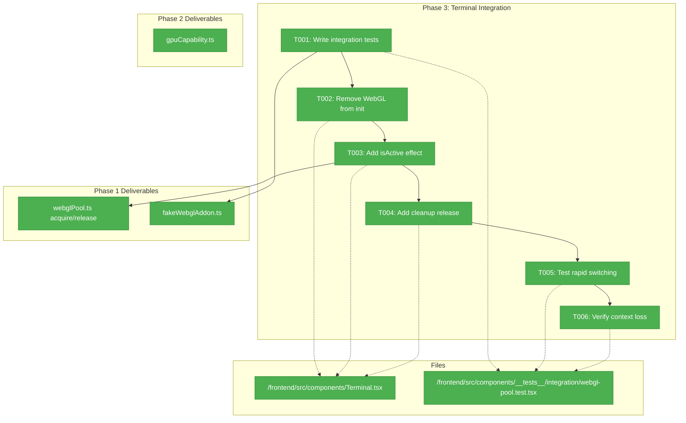
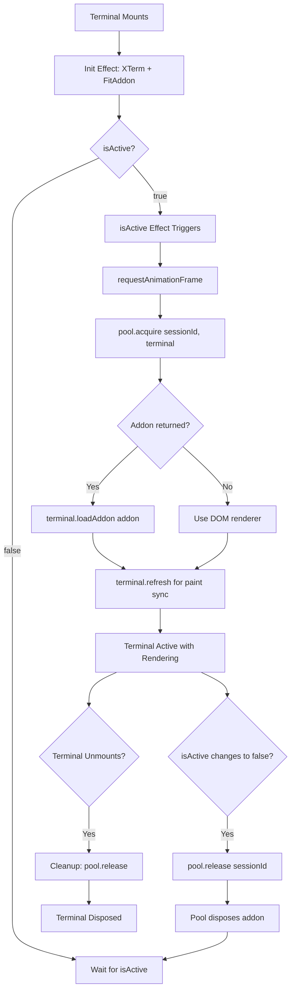
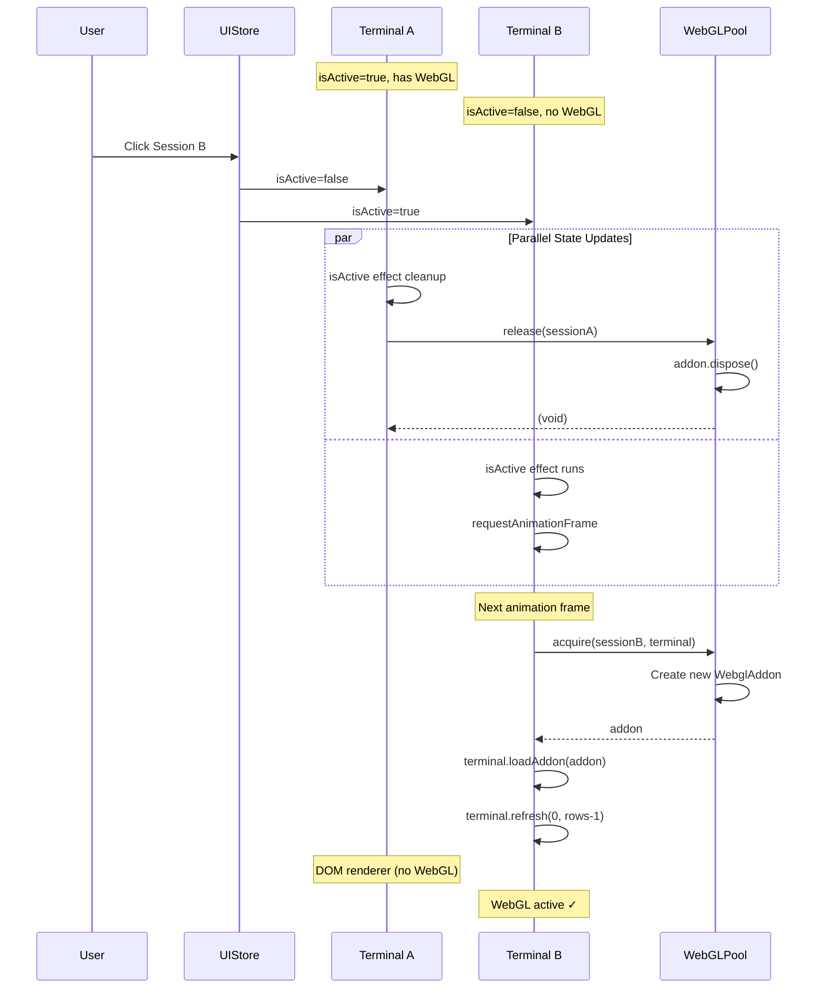

# Phase 3: Terminal Integration – Tasks & Alignment Brief

**Spec**: [../../webgl-context-pooling-spec.md](../../webgl-context-pooling-spec.md)
**Plan**: [../../webgl-context-pooling-plan.md](../../webgl-context-pooling-plan.md)
**Date**: 2026-02-05
**GitHub Issue**: [#22](https://github.com/vaughanknight/trex/issues/22)

---

## Executive Briefing

### Purpose

This phase is the critical integration point where the WebGL pool (Phase 1) meets the Terminal component. Currently, Terminal.tsx captures `useWebGL` in a ref at mount time (line 41), making dynamic WebGL allocation impossible. This phase replaces static mount-time allocation with pool-based acquisition tied to the `isActive` prop, enabling the active terminal to always have GPU-accelerated rendering.

### What We're Building

Modifications to `Terminal.tsx` that:
- Remove WebGL initialization from the mount-time effect (lines 114-130)
- Add a new `isActive`-based effect that acquires from pool when active
- Release back to pool when terminal becomes inactive or unmounts
- Use `requestAnimationFrame` to prevent visual flicker during switching
- Properly integrate with pool context loss handling

### User Value

Users can open 20+ terminal sessions and the **active terminal will always have crisp WebGL rendering**. Session switching is seamless with no flicker. The pool automatically manages context limits so no session causes WebGL context exhaustion errors.

### Example

**Before** (static allocation):
```
Session 1: active, has WebGL ✓
Session 2: active, has WebGL ✓
Session 3: active, has WebGL ✓
Session 4: active, NO WebGL (maxWebGLSessions=3)  ← User sees degraded rendering
Session 5: active, NO WebGL ← User sees degraded rendering
```

**After** (pool-based):
```
Session 1: inactive, no WebGL (released to pool)
Session 2: inactive, no WebGL (released to pool)
Session 3: inactive, no WebGL (released to pool)
Session 4: inactive, no WebGL (released to pool)
Session 5: ACTIVE, has WebGL ✓ ← User always gets GPU rendering
```

---

## Objectives & Scope

### Objective

Modify Terminal.tsx to use WebGL pool based on `isActive` prop instead of mount-time allocation.

**Behavior Checklist** (from AC-04 through AC-07):
- [x] AC-04: Active terminal acquires WebGL from pool when becoming active
- [x] AC-05: Inactive terminal releases WebGL back to pool
- [x] AC-06: Session switch completes without visual flicker (<50ms latency)
- [x] AC-07: useEffect cleanup properly releases pool resources

### Goals

- ✅ Remove WebGL initialization from Terminal mount effect
- ✅ Add isActive-based effect for pool acquire/release
- ✅ Use requestAnimationFrame pattern for flicker prevention
- ✅ Ensure useEffect cleanup calls pool.release()
- ✅ Handle context loss gracefully (pool already handles, Terminal refreshes)
- ✅ Write integration tests verifying acquire/release/switch behavior

### Non-Goals

- ❌ Modifying TerminalContainer.tsx (Phase 4)
- ❌ Removing useWebGL prop entirely (Phase 4 will do this)
- ❌ Adding pool stats UI/logging (Phase 5)
- ❌ Handling edge case where pool returns null (graceful degradation already exists)
- ❌ Performance optimization beyond requestAnimationFrame (sufficient for now)
- ❌ WebGL addon feature flags (out of scope)

---

## Architecture Map

### Component Diagram

<!-- Status: grey=pending, orange=in-progress, green=completed, red=blocked -->
<!-- Updated by plan-6 during implementation -->



### Task-to-Component Mapping

<!-- Status: ⬜ Pending | 🟧 In Progress | ✅ Complete | 🔴 Blocked -->

| Task | Component(s) | Files | Status | Comment |
|------|-------------|-------|--------|---------|
| T001 | Integration Tests | webgl-pool.test.tsx | ✅ Complete | 8 tests written, TDD validated |
| T002 | Terminal Init | Terminal.tsx | ✅ Complete | WebGL init removed, pool import added |
| T003 | Terminal isActive | Terminal.tsx | ✅ Complete | Pool acquire/release with requestAnimationFrame |
| T004 | Terminal Cleanup | Terminal.tsx | ✅ Complete | Cleanup calls pool.release() |
| T005 | Rapid Switching | webgl-pool.test.tsx | ✅ Complete | 10 switches work correctly |
| T006 | Context Loss | webgl-pool.test.tsx | ✅ Complete | Graceful degradation verified |

---

## Tasks

| Status | ID | Task | CS | Type | Dependencies | Absolute Path(s) | Validation | Subtasks | Notes |
|--------|------|------|----|------|--------------|------------------|------------|----------|-------|
| [x] | T001 | Write integration tests for pool-based WebGL acquisition | 3 | Test | – | /Users/vaughanknight/GitHub/trex/frontend/src/components/__tests__/integration/webgl-pool.test.tsx | Tests fail initially (TDD RED), cover acquire on activate, release on deactivate, session switch | – | TDD: tests first |
| [x] | T002 | Remove WebGL initialization from Terminal mount effect | 2 | Core | T001 | /Users/vaughanknight/GitHub/trex/frontend/src/components/Terminal.tsx | Lines 114-130 removed, FitAddon still loaded, tests still fail | – | Per CD-01 |
| [x] | T003 | Add isActive-based WebGL management effect | 3 | Core | T002 | /Users/vaughanknight/GitHub/trex/frontend/src/components/Terminal.tsx | Effect acquires from pool when isActive=true, uses requestAnimationFrame, integration tests pass | – | Per CD-01, CD-06 |
| [x] | T004 | Add useEffect cleanup for pool.release() | 2 | Core | T003 | /Users/vaughanknight/GitHub/trex/frontend/src/components/Terminal.tsx | Cleanup calls pool.release(sessionId), no memory leaks | – | Per CD-03 |
| [x] | T005 | Test rapid session switching (10 switches/second) | 2 | Test | T004 | /Users/vaughanknight/GitHub/trex/frontend/src/components/__tests__/integration/webgl-pool.test.tsx | Final session has WebGL, pool state consistent, no errors | – | Per CD-05 |
| [x] | T006 | Verify context loss recovery integration | 2 | Test | T004 | /Users/vaughanknight/GitHub/trex/frontend/src/components/__tests__/integration/webgl-pool.test.tsx | Pool handles context loss, terminal continues working with DOM renderer | – | Per CD-04 |

---

## Alignment Brief

### Prior Phases Review

#### Phase-by-Phase Summary

**Phase 1: Pool Foundation (COMPLETE)**

Created the core WebGL pool Zustand store with full TDD coverage:
- 20 tests verifying acquire/release, idempotency, context loss handling
- FakeWebglAddon test fake per ADR-0004
- Map-based state following sessions.ts pattern
- Injectable factory pattern for test injection

**Phase 2: GPU Detection (COMPLETE)**

Created GPU capability detection with conservative fallbacks:
- 15 tests covering Apple/Intel/NVIDIA/AMD detection
- FakeGPUContext for test isolation
- Lazy detection on first acquire (not module load)
- Pool integration via setMaxSize()

#### Cumulative Deliverables

**From Phase 1:**
| File | Key Exports |
|------|-------------|
| `/frontend/src/stores/webglPool.ts` | `useWebGLPoolStore`, `acquire()`, `release()`, `hasWebGL()`, `getStats()`, `setMaxSize()`, `reset()` |
| `/frontend/src/test/fakeWebglAddon.ts` | `FakeWebglAddon`, `installFakeWebglAddon()`, `getWebglAddonFactory()`, `IWebglAddon` |
| `/frontend/src/stores/__tests__/webglPool.test.ts` | 24 tests with Test Doc blocks |

**From Phase 2:**
| File | Key Exports |
|------|-------------|
| `/frontend/src/utils/gpuCapability.ts` | `detectGPUCapability()`, `getDefaultPoolSize()`, `GPUCapabilityResult` |
| `/frontend/src/test/fakeGPUContext.ts` | `installFakeGPUContext()`, `resetFakeGPUContext()` |
| `/frontend/src/utils/__tests__/gpuCapability.test.ts` | 15 tests |

#### Cumulative Dependencies

Phase 3 depends on:
- `useWebGLPoolStore.getState().acquire(sessionId, terminal)` - returns `IWebglAddon | null`
- `useWebGLPoolStore.getState().release(sessionId)` - idempotent disposal
- `useWebGLPoolStore.getState().hasWebGL(sessionId)` - query state
- `installFakeWebglAddon()` / `installFakeGPUContext()` - test isolation

#### Pattern Evolution

| Pattern | Phase 1 | Phase 2 | Phase 3 Continuation |
|---------|---------|---------|----------------------|
| Injectable Factory | Established for WebglAddon | Applied to GPU context | Reuse for terminal tests |
| Lazy Initialization | – | Established for GPU detection | Apply same pattern (isActive, not mount) |
| TDD Red-Green | Validated 20 tests | Skipped (lightweight) | Resume TDD approach |
| Idempotent Operations | acquire/release idempotent | – | Leverage in Terminal effects |

#### Reusable Test Infrastructure

```typescript
// From Phase 1
import { installFakeWebglAddon, FakeWebglAddon } from '../test/fakeWebglAddon'
const { instances, restore } = installFakeWebglAddon()
// instances[] populated as pool creates addons

// From Phase 2
import { installFakeGPUContext, resetFakeGPUContext } from '../test/fakeGPUContext'
const { restore } = installFakeGPUContext('Apple M3 Pro')

// Reset between tests
beforeEach(() => {
  useWebGLPoolStore.getState().reset()
  resetFakeGPUContext()
})
```

#### Technical Debt from Prior Phases

| Phase | Item | Location | Severity |
|-------|------|----------|----------|
| 1 | Factory uses require() instead of dynamic import | fakeWebglAddon.ts:127-129 | Low |
| 1 | No __DEV__ logging for acquire/release | webglPool.ts | Low |

#### Key Log References

- **Phase 1 execution.log.md**: Injectable factory decision (T001), TDD validation (T002-T006), context loss handling (T007)
- **Phase 2 execution.log.md**: Lazy detection rationale (T005), test order gotcha discovery

### Critical Findings Affecting This Phase

| Finding | Impact on Phase 3 | Addressed By |
|---------|-------------------|--------------|
| **CD-01**: useWebGL prop frozen at mount | Must move WebGL to isActive effect, not init effect | T002, T003 |
| **CD-03**: Memory leak from improper disposal | Terminal cleanup must call pool.release(), NOT addon.dispose() | T004 |
| **CD-04**: Pool state desync with contexts | Pool already handles via onContextLoss; Terminal should refresh() | T006 |
| **CD-05**: Rapid switching race condition | Leverage pool's idempotent acquire/release | T003, T005 |
| **CD-06**: Terminal flicker prevention | Use requestAnimationFrame before loadAddon | T003 |

### ADR Decision Constraints

**ADR-0004: Fakes Only Testing Policy**
- Decision: No mocking frameworks (jest.mock, sinon) permitted
- Constrains: Integration tests must use FakeWebglAddon and FakeGPUContext
- Addressed by: T001 (uses installFakeWebglAddon)

### Invariants & Guardrails

- **Ownership**: Pool OWNS all addons. Terminal never calls `addon.dispose()` directly.
- **Idempotency**: Multiple acquire() calls for same session return same addon.
- **Timing**: All WebGL operations wrapped in requestAnimationFrame.
- **Cleanup**: useEffect cleanup MUST call `pool.release(sessionId)`.
- **Fallback**: If pool returns null (exhausted), Terminal uses DOM renderer (existing behavior).

### Inputs to Read

| File | Purpose | Key Lines |
|------|---------|-----------|
| `/Users/vaughanknight/GitHub/trex/frontend/src/components/Terminal.tsx` | Component to modify | 41 (frozen ref), 114-130 (WebGL init), 213-232 (isActive effect) |
| `/Users/vaughanknight/GitHub/trex/frontend/src/stores/webglPool.ts` | Pool API | acquire(), release(), hasWebGL() |
| `/Users/vaughanknight/GitHub/trex/frontend/src/test/fakeWebglAddon.ts` | Test fake | installFakeWebglAddon(), FakeWebglAddon |

### Visual Alignment Aids

#### Flow Diagram: Terminal WebGL Lifecycle



#### Sequence Diagram: Session Switch A → B



### Test Plan (TDD)

**Test File**: `/Users/vaughanknight/GitHub/trex/frontend/src/components/__tests__/integration/webgl-pool.test.tsx`

| Test Name | Type | Purpose | Fixtures | Expected Output |
|-----------|------|---------|----------|-----------------|
| `active terminal acquires WebGL from pool` | Integration | Verify acquire on isActive=true | FakeWebglAddon | pool.hasWebGL(sessionId) === true |
| `inactive terminal releases WebGL to pool` | Integration | Verify release on isActive=false | FakeWebglAddon | pool.hasWebGL(sessionId) === false |
| `session switch releases old, acquires new` | Integration | Verify switch sequence | Two sessions | A released, B acquired |
| `unmount calls pool.release()` | Integration | Verify cleanup | FakeWebglAddon | addon.wasDisposed() === true |
| `rapid switching (10x) ends with correct state` | Stress | Verify idempotency | FakeWebglAddon | Final session has WebGL, count=1 |
| `context loss handled gracefully` | Edge | Verify pool+terminal integration | FakeWebglAddon.simulateContextLoss() | Pool removes slot, terminal continues |
| `pool exhaustion uses DOM renderer` | Edge | Graceful degradation | Pool with maxSize=0 | No error, terminal works |

### Step-by-Step Implementation Outline

1. **T001: Write Integration Tests** (TDD RED)
   - Create `/frontend/src/components/__tests__/integration/` directory
   - Create `webgl-pool.test.tsx` with 7 tests from Test Plan
   - Tests should FAIL initially (Terminal still uses static WebGL)

2. **T002: Remove WebGL from Init Effect**
   - Remove lines 114-130 from Terminal.tsx initialization effect
   - Keep XTerm and FitAddon initialization
   - Remove webglAddonRef population from init
   - Tests still fail (no acquire yet)

3. **T003: Add isActive-Based Effect**
   - Add new useEffect dependent on `isActive`
   - Import `useWebGLPoolStore`
   - Wrap in `requestAnimationFrame` per CD-06
   - Call `pool.acquire(sessionId, xtermRef.current)`
   - Call `terminal.loadAddon(addon)` if addon returned
   - Call `terminal.refresh(0, rows-1)` for paint sync
   - Tests should start passing (TDD GREEN)

4. **T004: Add Cleanup Release**
   - Add cleanup function to isActive effect
   - Call `pool.release(sessionId)` in cleanup
   - Ensure cleanup runs on unmount AND when isActive changes
   - Per CD-03: Pool handles disposal, not Terminal

5. **T005: Rapid Switching Test**
   - Add stress test: 10 session switches in 1 second
   - Verify final session has WebGL
   - Verify pool stats show activeCount=1
   - Per CD-05: Idempotency prevents race conditions

6. **T006: Context Loss Integration**
   - Use FakeWebglAddon.simulateContextLoss()
   - Verify pool removes slot
   - Verify terminal continues working (DOM renderer)
   - Per CD-04: Pool already handles, verify integration

### Commands to Run

```bash
# Navigate to frontend
cd /Users/vaughanknight/GitHub/trex/frontend

# Run all tests
npm test

# Run specific integration test file
npm test -- src/components/__tests__/integration/webgl-pool.test.tsx

# Run tests in watch mode
npm test -- --watch

# Type check
npm run type-check

# Lint
npm run lint
```

### Risks & Unknowns

| Risk | Severity | Mitigation |
|------|----------|------------|
| Terminal flicker during switch | Medium | requestAnimationFrame pattern, acquire before showing |
| React Testing Library async issues | Medium | Use act(), waitFor() appropriately |
| Multiple isActive changes in single frame | Low | Pool idempotency handles this |
| xterm.js loadAddon on already-loaded terminal | Low | Pool prevents double-acquire |

### Ready Check

- [x] Phase 1 review completed (pool mechanics understood)
- [x] Phase 2 review completed (GPU detection integrated)
- [x] Critical findings mapped to tasks (CD-01→T002/T003, CD-03→T004, CD-04→T006, CD-05→T003/T005, CD-06→T003)
- [x] ADR constraints mapped to tasks (ADR-0004 → T001 uses fakes only)
- [x] Test plan enumerated with expected outputs
- [x] Implementation steps map 1:1 to tasks
- [x] Commands documented
- [ ] **AWAITING GO/NO-GO**

---

## Phase Footnote Stubs

_Populated during implementation by plan-6a when deviations or discoveries occur._

| Footnote | Phase | Task | Description |
|----------|-------|------|-------------|
| | | | |

---

## Evidence Artifacts

**Execution Log**: `./execution.log.md` (created by plan-6 during implementation)

**Supporting Files**:
- Integration test file created
- Terminal.tsx modifications tracked in log

---

## Discoveries & Learnings

_Populated during implementation by plan-6. Log anything of interest to your future self._

| Date | Task | Type | Discovery | Resolution | References |
|------|------|------|-----------|------------|------------|
| 2026-02-05 | T001 | gotcha | vi.mock with inline classes causes hoisting error "Cannot access before initialization" | Use factory function returning class inside vi.mock callback | webgl-pool.test.tsx |
| 2026-02-05 | T001 | insight | Need to mock @xterm/addon-webgl even though Terminal will use pool - Terminal still imports it | Added mock that returns no-op class | webgl-pool.test.tsx |
| 2026-02-05 | T003 | decision | Used requestAnimationFrame for acquire timing | Prevents flicker per CD-06, also allows proper cleanup via cancelAnimationFrame | Terminal.tsx |
| 2026-02-05 | T003 | insight | Return cleanup from both if-branches of isActive effect | Ensures release happens whether isActive changes or component unmounts | Terminal.tsx |

**Types**: `gotcha` | `research-needed` | `unexpected-behavior` | `workaround` | `decision` | `debt` | `insight`

**What to log**:
- Things that didn't work as expected
- External research that was required
- Implementation troubles and how they were resolved
- Gotchas and edge cases discovered
- Decisions made during implementation
- Technical debt introduced (and why)
- Insights that future phases should know about

_See also: `execution.log.md` for detailed narrative._

---

## Directory Layout

```
docs/plans/004-webgl-context-pooling/
├── webgl-context-pooling-spec.md
├── webgl-context-pooling-plan.md
├── research-dossier.md
└── tasks/
    ├── phase-1-pool-foundation/
    │   ├── tasks.md              # COMPLETE
    │   └── execution.log.md      # COMPLETE
    ├── phase-2-gpu-detection/
    │   ├── tasks.md              # COMPLETE
    │   └── execution.log.md      # COMPLETE
    └── phase-3-terminal-integration/
        ├── tasks.md              # This file
        └── execution.log.md      # Created by plan-6
```

---

**Next Step**: Await **GO** approval, then run `/plan-6-implement-phase --phase "Phase 3: Terminal Integration" --plan "/Users/vaughanknight/GitHub/trex/docs/plans/004-webgl-context-pooling/webgl-context-pooling-plan.md"`.
