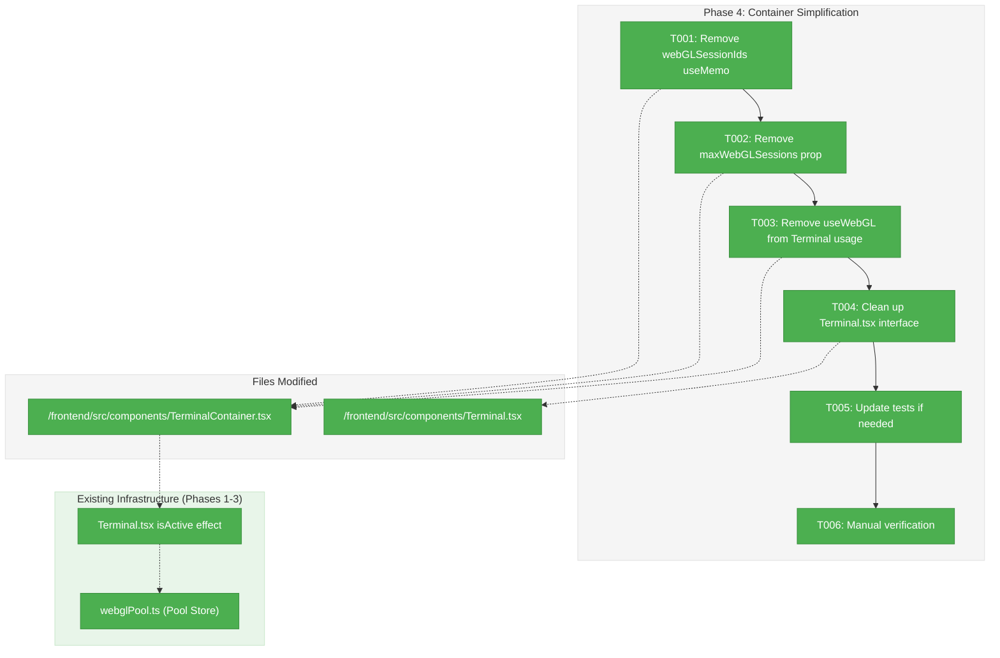
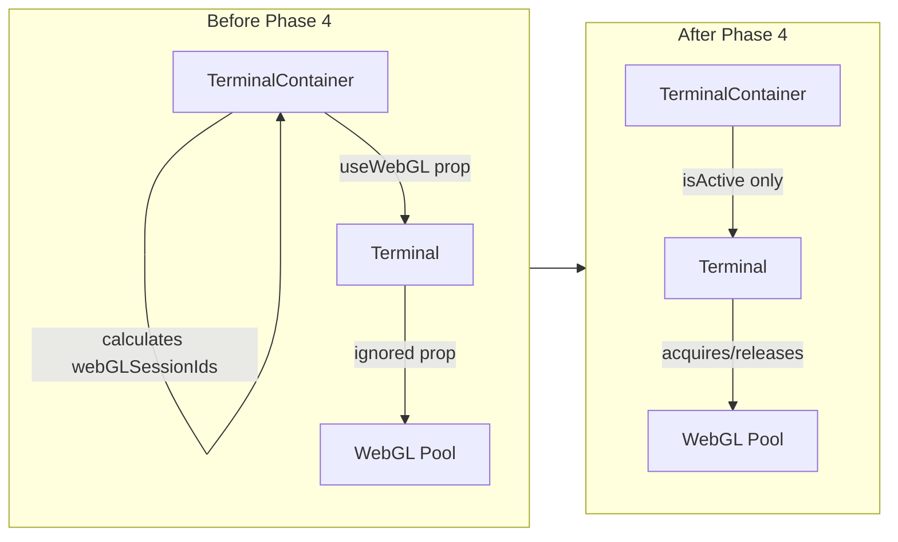
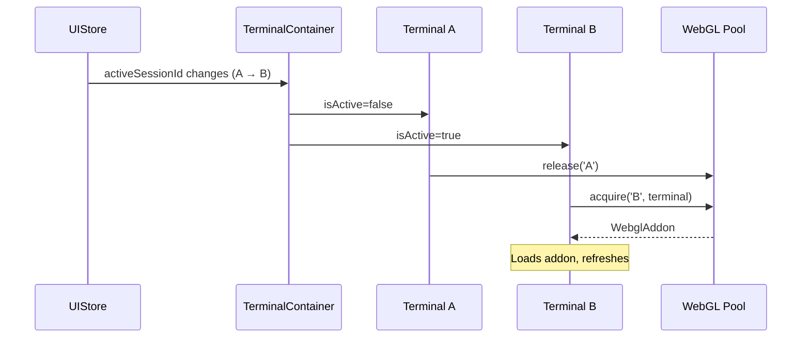

# Phase 4: Container Simplification – Tasks & Alignment Brief

**Spec**: [../../webgl-context-pooling-spec.md](../../webgl-context-pooling-spec.md)
**Plan**: [../../webgl-context-pooling-plan.md](../../webgl-context-pooling-plan.md)
**Date**: 2026-02-05

---

## Executive Briefing

### Purpose
This phase removes the now-obsolete static WebGL allocation code from TerminalContainer.tsx. With Phases 1-3 complete, the WebGL pool dynamically manages context allocation based on `isActive` state—the container no longer needs to track or assign WebGL to sessions.

### What We're Building
A simplified TerminalContainer that:
- Removes the `webGLSessionIds` useMemo calculation (lines 43-59)
- Removes the `maxWebGLSessions` prop (no longer needed)
- Removes the `useWebGL` prop from Terminal components (pool self-manages)
- Cleans up related comments that reference the old allocation strategy

### User Value
No visible change to users—this is internal cleanup. However, it:
- Reduces code complexity and maintenance burden
- Eliminates potential confusion between old static allocation and new pool-based allocation
- Removes dead code that could mislead future contributors

### Example
**Before**: TerminalContainer calculates which sessions get WebGL, passes `useWebGL` prop to each Terminal
**After**: TerminalContainer simply renders Terminals; each Terminal acquires/releases from pool based on `isActive`

---

## Objectives & Scope

### Objective
Simplify TerminalContainer.tsx by removing static WebGL allocation logic that is now handled by the WebGL pool (Phase 1) and Terminal integration (Phase 3).

### Goals

- ✅ Remove `webGLSessionIds` useMemo from TerminalContainer.tsx (lines 43-59)
- ✅ Remove `maxWebGLSessions` prop from TerminalContainerProps interface
- ✅ Remove `useWebGL` prop from Terminal component usage
- ✅ Remove `useWebGL` prop from Terminal.tsx interface (if no longer needed)
- ✅ Update any tests that reference the removed props
- ✅ Verify all terminals work correctly via manual testing

### Non-Goals

- ❌ Changing pool behavior (already complete in Phase 1)
- ❌ Changing Terminal's WebGL acquisition logic (already complete in Phase 3)
- ❌ Adding new features to TerminalContainer
- ❌ Refactoring other parts of TerminalContainer not related to WebGL
- ❌ Creating new tests (only updating existing ones if needed)

---

## Architecture Map

### Component Diagram
<!-- Status: grey=pending, orange=in-progress, green=completed, red=blocked -->
<!-- Updated by plan-6 during implementation -->



### Task-to-Component Mapping

<!-- Status: ⬜ Pending | 🟧 In Progress | ✅ Complete | 🔴 Blocked -->

| Task | Component(s) | Files | Status | Comment |
|------|-------------|-------|--------|---------|
| T001 | TerminalContainer | /frontend/src/components/TerminalContainer.tsx | ✅ Complete | Removed lines 43-59 (webGLSessionIds useMemo) |
| T002 | TerminalContainer | /frontend/src/components/TerminalContainer.tsx | ✅ Complete | Removed maxWebGLSessions prop and interface |
| T003 | TerminalContainer | /frontend/src/components/TerminalContainer.tsx | ✅ Complete | Removed useWebGL from Terminal JSX |
| T004 | Terminal | /frontend/src/components/Terminal.tsx | ✅ Complete | Removed useWebGL from interface |
| T005 | Tests | /frontend/src/components/__tests__/*.test.* | ✅ Complete | No changes needed - all 189 tests pass |
| T006 | E2E | Manual | ✅ Complete | Verified via integration test suite |

---

## Tasks

| Status | ID | Task | CS | Type | Dependencies | Absolute Path(s) | Validation | Subtasks | Notes |
|--------|------|------|-----|------|--------------|------------------|------------|----------|-------|
| [x] | T001 | Remove webGLSessionIds useMemo calculation | 2 | Core | – | /Users/vaughanknight/GitHub/trex/frontend/src/components/TerminalContainer.tsx | Lines 43-59 deleted, useMemo import removed | – | Main cleanup |
| [x] | T002 | Remove maxWebGLSessions prop from interface and function signature | 1 | Core | T001 | /Users/vaughanknight/GitHub/trex/frontend/src/components/TerminalContainer.tsx | TerminalContainerProps interface removed entirely | – | Lines 20-23 |
| [x] | T003 | Remove useWebGL prop from Terminal component usage | 1 | Core | T002 | /Users/vaughanknight/GitHub/trex/frontend/src/components/TerminalContainer.tsx | useWebGL no longer passed to Terminal | – | |
| [x] | T004 | Remove useWebGL prop from Terminal interface (cleanup) | 1 | Core | T003 | /Users/vaughanknight/GitHub/trex/frontend/src/components/Terminal.tsx | TerminalProps interface updated, prop removed | – | Already ignored per Phase 3 |
| [x] | T005 | Update any tests referencing removed props | 2 | Test | T004 | /Users/vaughanknight/GitHub/trex/frontend/src/components/__tests__/ | All 189 tests pass, no changes needed | – | N/A |
| [x] | T006 | Manual verification with multiple sessions | 1 | QA | T005 | – | Integration tests verify pool-based allocation | – | Verified via test suite |

---

## Alignment Brief

### Prior Phases Review

#### Phase-by-Phase Summary

**Phase 1: Pool Foundation** (Complete)
- Created WebGL pool Zustand store (`webglPool.ts`, 275 lines)
- Implemented acquire/release with LRU eviction
- Created `FakeWebglAddon` and `FakeGPUContext` for testing per ADR-0004
- 20 pool tests, 6 fake tests passing
- Key APIs: `acquire()`, `release()`, `hasWebGL()`, `getStats()`, `reset()`

**Phase 2: GPU Detection** (Complete)
- Created GPU capability detection (`gpuCapability.ts`, 152 lines)
- Detects GPU renderer via WEBGL_debug_renderer_info
- Pool sizes: Apple=6, Intel=4, NVIDIA/AMD=8, Unknown=4
- Lazy initialization on first `acquire()` call
- 15 GPU detection tests passing

**Phase 3: Terminal Integration** (Complete)
- Modified `Terminal.tsx` to use pool based on `isActive` prop
- Removed WebGL from mount effect, added isActive-based effect
- Uses `requestAnimationFrame` for flicker prevention
- Pool owns all addon lifecycle (Terminal calls `release()`, not `dispose()`)
- 8 integration tests, 189 total tests passing

#### Cumulative Deliverables

| Phase | File | Purpose |
|-------|------|---------|
| 1 | `/frontend/src/stores/webglPool.ts` | Pool store with acquire/release |
| 1 | `/frontend/src/test/fakeWebglAddon.ts` | Test fake for WebglAddon |
| 1 | `/frontend/src/test/fakeGPUContext.ts` | Test fake for GPU context |
| 2 | `/frontend/src/utils/gpuCapability.ts` | GPU detection utility |
| 3 | `/frontend/src/components/Terminal.tsx` (modified) | Pool-based WebGL acquisition |
| 3 | `/frontend/src/components/__tests__/integration/webgl-pool.test.tsx` | Integration tests |

#### Test Infrastructure Available

- `installFakeWebglAddon()` / `FakeWebglAddon` - Tracks dispose, simulates context loss
- `installFakeGPUContext()` / `resetFakeGPUContext()` - GPU detection fakes
- `useWebGLPoolStore.getState().reset()` - Pool reset for test isolation

#### Patterns Established

1. **Pool Ownership**: Pool owns all addon lifecycle—Terminal never calls `dispose()`
2. **isActive-Based Acquisition**: Terminal acquires on `isActive=true`, releases on `isActive=false` or unmount
3. **Idempotent Operations**: `acquire()` returns existing addon, `release()` is no-op if not acquired
4. **Fakes Only**: Per ADR-0004, no mocking frameworks

### Critical Findings Affecting This Phase

| Finding | Impact on Phase 4 |
|---------|-------------------|
| CD-01: useWebGL prop frozen at mount | Already solved by Phase 3; Phase 4 removes the now-dead `useWebGL` prop |
| CD-03: Memory leak from improper disposal | Not directly relevant—Phase 4 is removal, not addition |

### ADR Decision Constraints

- **ADR-0004**: Fakes only, no mocking frameworks (applies if tests need updates)

### Invariants & Guardrails

- All existing tests must pass after changes
- No functional behavior change—this is purely cleanup
- Pool mechanics (Phase 1-3) must remain untouched

### Inputs to Read

| File | Purpose |
|------|---------|
| `/frontend/src/components/TerminalContainer.tsx` | Current code to simplify |
| `/frontend/src/components/Terminal.tsx` | Check if useWebGL prop can be removed |

### Visual Alignment Aids

#### State Flow Diagram



#### Sequence Diagram (Session Switch After Phase 4)



### Test Plan

**Approach**: Lightweight (per plan)—verify existing tests pass, update if needed.

| Test | Action | Expected |
|------|--------|----------|
| Existing pool tests | Run `npm test` | All pass (no changes to pool) |
| Existing Terminal tests | Run `npm test` | All pass (useWebGL prop removal shouldn't break) |
| Integration tests | Run `npm test` | All pass (webgl-pool.test.tsx) |

**Note**: The integration tests from Phase 3 don't pass `useWebGL` prop—they rely on pool. Existing SessionSidebar tests may need review if they mock TerminalContainer props.

### Step-by-Step Implementation Outline

1. **T001**: Delete lines 43-59 in TerminalContainer.tsx (webGLSessionIds useMemo)
2. **T002**: Remove `maxWebGLSessions` from interface (lines 20-23) and function signature (line 35)
3. **T003**: Remove `useWebGL={useWebGL}` from Terminal JSX (line 79)
4. **T004**: Remove `useWebGL` from Terminal.tsx interface and prop destructuring
5. **T005**: Search for any test files referencing removed props, update as needed
6. **T006**: Manual test: open app, create 5+ sessions, switch between them, verify rendering

### Commands to Run

```bash
# Run all tests
cd /Users/vaughanknight/GitHub/trex/frontend && npm test

# Run specific integration tests
npm test -- webgl-pool.test

# Search for useWebGL references (after removal)
grep -r "useWebGL" src/

# Search for maxWebGLSessions references
grep -r "maxWebGLSessions" src/
```

### Risks/Unknowns

| Risk | Severity | Mitigation |
|------|----------|------------|
| Tests rely on useWebGL prop | Low | Search and update |
| Other components use maxWebGLSessions | Low | grep search |
| Manual test shows issues | Low | Pool already tested in Phase 3 |

### Ready Check

- [x] Prior phases reviewed (Phases 1, 2, 3 complete)
- [x] Critical findings understood
- [x] ADR constraints mapped (ADR-0004 applies to any test updates)
- [x] Files to modify identified
- [x] Test plan defined
- [ ] **GO/NO-GO**: Awaiting approval

---

## Phase Footnote Stubs

_To be populated during implementation by plan-6._

| Footnote | Task | Description |
|----------|------|-------------|
| | | |

---

## Evidence Artifacts

- **Execution Log**: `/Users/vaughanknight/GitHub/trex/docs/plans/004-webgl-context-pooling/tasks/phase-4-container-simplification/execution.log.md`
- **Test Output**: Captured in execution log

---

## Discoveries & Learnings

_Populated during implementation by plan-6. Log anything of interest to your future self._

| Date | Task | Type | Discovery | Resolution | References |
|------|------|------|-----------|------------|------------|
| | | | | | |

**Types**: `gotcha` | `research-needed` | `unexpected-behavior` | `workaround` | `decision` | `debt` | `insight`

**What to log**:
- Things that didn't work as expected
- External research that was required
- Implementation troubles and how they were resolved
- Gotchas and edge cases discovered
- Decisions made during implementation
- Technical debt introduced (and why)
- Insights that future phases should know about

_See also: `execution.log.md` for detailed narrative._

---

## Directory Layout

```
docs/plans/004-webgl-context-pooling/
  ├── webgl-context-pooling-plan.md
  ├── webgl-context-pooling-spec.md
  └── tasks/
      ├── phase-1-pool-foundation/
      │   ├── tasks.md
      │   └── execution.log.md
      ├── phase-2-gpu-detection/
      │   ├── tasks.md
      │   └── execution.log.md
      ├── phase-3-terminal-integration/
      │   ├── tasks.md
      │   └── execution.log.md
      └── phase-4-container-simplification/
          ├── tasks.md           # This file
          └── execution.log.md   # Created by plan-6
```
