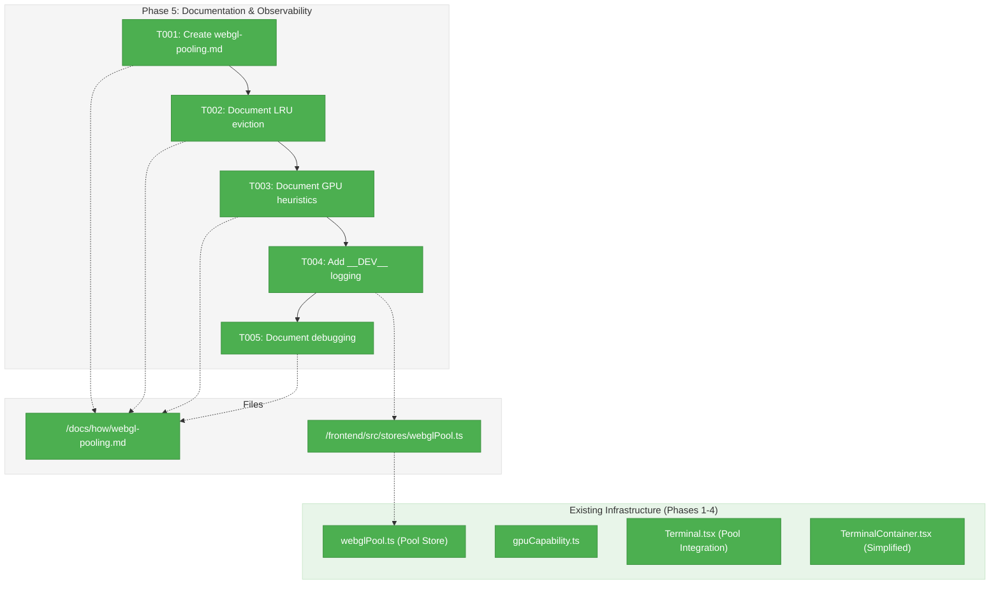
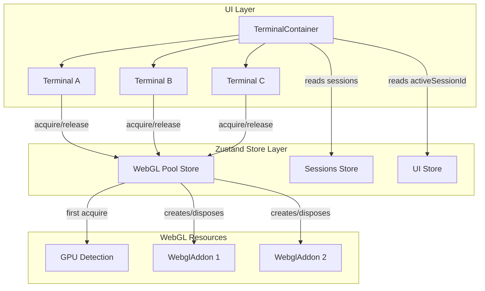
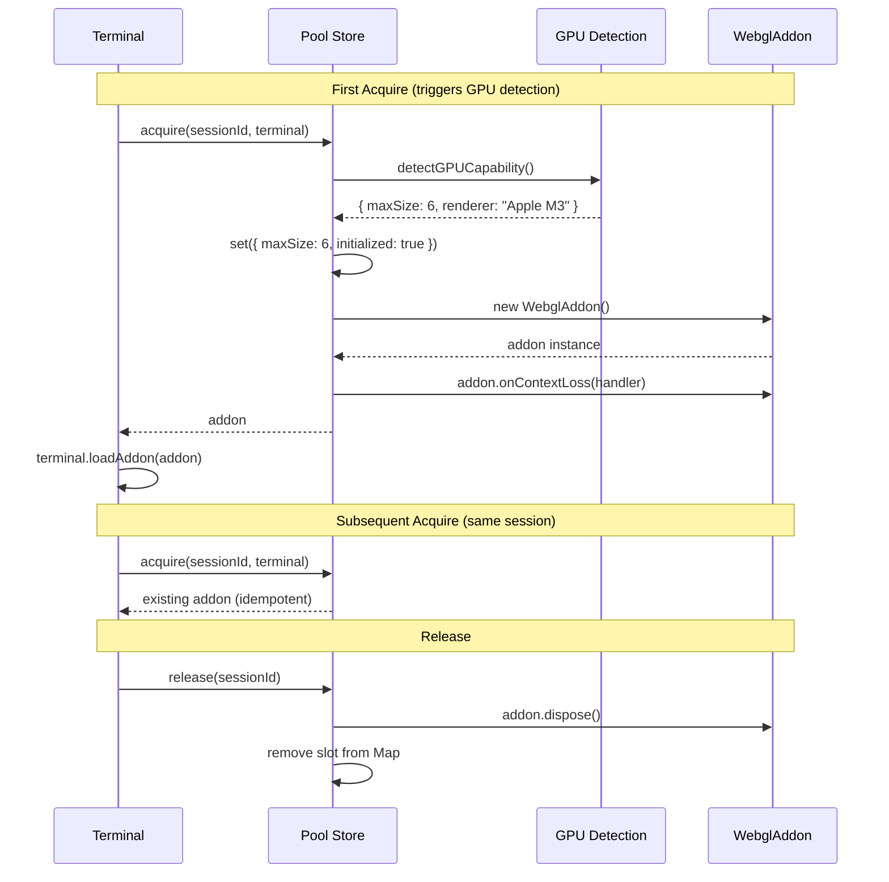

# Phase 5: Documentation & Observability – Tasks & Alignment Brief

**Spec**: [../../webgl-context-pooling-spec.md](../../webgl-context-pooling-spec.md)
**Plan**: [../../webgl-context-pooling-plan.md](../../webgl-context-pooling-plan.md)
**Date**: 2026-02-05

---

## Executive Briefing

### Purpose
This phase creates architecture documentation for the WebGL pooling system and adds development-mode logging for pool operations. With Phases 1-4 complete, the pooling system is fully functional—this phase ensures it's understandable and debuggable for future contributors.

### What We're Building
1. **Architecture Documentation** (`docs/how/webgl-pooling.md`):
   - Overview of why pooling exists and what problem it solves
   - Architecture diagram showing Pool, Terminal, Store relationships
   - LRU eviction algorithm explanation
   - GPU detection heuristics table
   - Debugging and troubleshooting guide

2. **Development-Mode Logging**:
   - Add `__DEV__` conditional logging to pool acquire/release/context-loss
   - Enable developers to see pool state changes in console during development

### User Value
- **Contributors**: Can understand and modify the pooling system without reading all implementation code
- **Debuggers**: Can diagnose WebGL issues by observing pool operations in dev console
- **Maintainers**: Have a single source of truth for pooling architecture decisions

### Example
**Before**: Developer opens DevTools, sees `[WebGL Pool] GPU detected: "Apple M3 Pro" → maxSize 6` but nothing about acquire/release.
**After**: Developer also sees `[WebGL Pool] acquire("session-1") → addon created, activeCount: 1/6` and `[WebGL Pool] release("session-1") → disposed, activeCount: 0/6`.

---

## Objectives & Scope

### Objective
Create documentation and observability tooling per plan acceptance criteria:
- AC-08: Documentation created in docs/how/
- AC-09: Pool stats observable in DevTools
- AC-10: getStats() returns accurate information

### Goals

- ✅ Create `docs/how/webgl-pooling.md` with architecture overview
- ✅ Document LRU eviction strategy with worked examples
- ✅ Document GPU detection heuristics table
- ✅ Add `__DEV__` conditional logging to pool acquire/release
- ✅ Document how to inspect pool state via DevTools

### Non-Goals

- ❌ User-facing documentation (this is contributor/developer docs only)
- ❌ API reference documentation (code is self-documenting with TypeScript)
- ❌ Automated metrics collection or telemetry
- ❌ Production logging (only `__DEV__` conditional)
- ❌ UI for pool stats (console-only observability)
- ❌ Changes to pool behavior (documentation phase, not feature phase)

---

## Architecture Map

### Component Diagram
<!-- Status: grey=pending, orange=in-progress, green=completed, red=blocked -->
<!-- Updated by plan-6 during implementation -->



### Task-to-Component Mapping

<!-- Status: ⬜ Pending | 🟧 In Progress | ✅ Complete | 🔴 Blocked -->

| Task | Component(s) | Files | Status | Comment |
|------|-------------|-------|--------|---------|
| T001 | Documentation | /docs/how/webgl-pooling.md | ✅ Complete | Created main doc with overview and architecture |
| T002 | Documentation | /docs/how/webgl-pooling.md | ✅ Complete | Added LRU eviction section |
| T003 | Documentation | /docs/how/webgl-pooling.md | ✅ Complete | Added GPU detection heuristics table |
| T004 | Pool Store | /frontend/src/stores/webglPool.ts | ✅ Complete | Added __DEV__ logging to acquire/release |
| T005 | Documentation | /docs/how/webgl-pooling.md | ✅ Complete | Added debugging/troubleshooting section |

---

## Tasks

| Status | ID | Task | CS | Type | Dependencies | Absolute Path(s) | Validation | Subtasks | Notes |
|--------|------|------|-----|------|--------------|------------------|------------|----------|-------|
| [x] | T001 | Create docs/how/webgl-pooling.md with overview and architecture diagram | 2 | Doc | – | /Users/vaughanknight/GitHub/trex/docs/how/webgl-pooling.md | File exists with Overview, Architecture sections | – | Per plan 5.1 |
| [x] | T002 | Document LRU eviction strategy with algorithm and worked example | 2 | Doc | T001 | /Users/vaughanknight/GitHub/trex/docs/how/webgl-pooling.md | LRU section has algorithm steps and example | – | Per plan 5.2 |
| [x] | T003 | Document GPU detection heuristics table with all GPU types | 1 | Doc | T002 | /Users/vaughanknight/GitHub/trex/docs/how/webgl-pooling.md | Table shows Apple/Intel/NVIDIA/AMD/Unknown | – | Per plan 5.3 |
| [x] | T004 | Add __DEV__ conditional logging to pool acquire/release/context-loss | 2 | Core | – | /Users/vaughanknight/GitHub/trex/frontend/src/stores/webglPool.ts | Console shows acquire/release in dev mode | – | Per plan 5.4 |
| [x] | T005 | Document debugging guide: how to inspect pool state via DevTools | 1 | Doc | T004 | /Users/vaughanknight/GitHub/trex/docs/how/webgl-pooling.md | Debugging section with console examples | – | Per plan 5.5 |

---

## Alignment Brief

### Prior Phases Review

#### Phase-by-Phase Summary

**Phase 1: Pool Foundation** (Complete)
- Created WebGL pool Zustand store with acquire/release mechanics
- Key files: `webglPool.ts` (275 lines), `fakeWebglAddon.ts`, `fakeGPUContext.ts`
- APIs: `acquire()`, `release()`, `hasWebGL()`, `getStats()`, `setMaxSize()`, `reset()`
- 20 pool tests + 6 fake tests
- Pattern: Factory injection for testing (ADR-0004)

**Phase 2: GPU Detection** (Complete)
- Created GPU capability detection with heuristics
- Key file: `gpuCapability.ts` (152 lines)
- Heuristics: Apple=6, Intel=4, NVIDIA/AMD=8, Unknown=4
- Existing logging: `console.info('[WebGL Pool] GPU detected: ...')`
- 15 GPU detection tests

**Phase 3: Terminal Integration** (Complete)
- Modified Terminal.tsx to use pool based on `isActive` prop
- Uses `requestAnimationFrame` for flicker prevention
- Pool owns all addon lifecycle (Terminal never calls dispose)
- 8 integration tests
- Pattern: isActive-based effect with cleanup

**Phase 4: Container Simplification** (Complete)
- Removed 36 lines of obsolete code
- Removed `webGLSessionIds` useMemo, `maxWebGLSessions` prop, `useWebGL` prop
- TerminalContainer now just renders terminals with `isActive`
- No test changes needed (all 189 tests pass)

#### Cumulative Deliverables

| Phase | File | Purpose | Lines |
|-------|------|---------|-------|
| 1 | `/frontend/src/stores/webglPool.ts` | Pool store | 275 |
| 1 | `/frontend/src/test/fakeWebglAddon.ts` | Test fake | 174 |
| 1 | `/frontend/src/test/fakeGPUContext.ts` | Test fake | 96 |
| 2 | `/frontend/src/utils/gpuCapability.ts` | GPU detection | 152 |
| 3 | `/frontend/src/components/Terminal.tsx` | Pool integration | 267 |
| 4 | `/frontend/src/components/TerminalContainer.tsx` | Simplified | 56 |

#### Test Infrastructure Available
- `installFakeWebglAddon()` / `FakeWebglAddon`
- `installFakeGPUContext()` / `resetFakeGPUContext()`
- `useWebGLPoolStore.getState().reset()`

#### Key Patterns to Document
1. **Pool Ownership**: Pool owns addon lifecycle, Terminal releases
2. **Lazy Initialization**: GPU detection on first `acquire()`
3. **Idempotent Operations**: Safe to call acquire/release multiple times
4. **requestAnimationFrame**: For flicker prevention
5. **Graceful Degradation**: Returns null when pool exhausted, falls back to DOM renderer

### Critical Findings Affecting This Phase

| Finding | Impact on Phase 5 |
|---------|-------------------|
| CD-09: Conservative GPU fallback | Document in heuristics table with rationale |

### ADR Decision Constraints

- **ADR-0004**: Fakes only (not directly relevant to docs, but mention testing approach)

### Invariants & Guardrails

- Documentation must accurately reflect implemented behavior
- `__DEV__` logging must not affect production bundle size
- No changes to pool behavior—documentation only

### Inputs to Read

| File | Purpose |
|------|---------|
| `/frontend/src/stores/webglPool.ts` | Pool implementation to document |
| `/frontend/src/utils/gpuCapability.ts` | GPU heuristics to document |
| `/frontend/src/components/Terminal.tsx` | Integration pattern to document |

### Visual Alignment Aids

#### Pool Architecture Diagram (for docs)



#### Acquisition Sequence Diagram (for docs)



### Test Plan

**Approach**: Lightweight (documentation phase)—verify docs are accurate and logging works.

| Test | Action | Expected |
|------|--------|----------|
| Doc accuracy | Review against implementation | Matches code behavior |
| __DEV__ logging | Run dev mode, switch sessions | Console shows acquire/release |
| Production build | Run prod build | No __DEV__ logging appears |

### Step-by-Step Implementation Outline

1. **T001**: Create `docs/how/webgl-pooling.md` with overview and architecture diagram
2. **T002**: Add LRU eviction section with algorithm steps and worked example
3. **T003**: Add GPU detection heuristics table (copy from gpuCapability.ts)
4. **T004**: Add `__DEV__` logging to `webglPool.ts` acquire/release functions
5. **T005**: Add debugging section with console examples and DevTools inspection guide

### Commands to Run

```bash
# Verify docs render
cat /Users/vaughanknight/GitHub/trex/docs/how/webgl-pooling.md

# Test __DEV__ logging in dev mode
cd /Users/vaughanknight/GitHub/trex/frontend && npm run dev
# Open app, switch sessions, check console

# Run tests to ensure no regressions
cd /Users/vaughanknight/GitHub/trex/frontend && npm test

# Verify production build (no __DEV__ logs)
cd /Users/vaughanknight/GitHub/trex/frontend && npm run build
```

### Risks/Unknowns

| Risk | Severity | Mitigation |
|------|----------|------------|
| __DEV__ not defined in Vite | Low | Use `import.meta.env.DEV` instead |
| Docs drift from implementation | Low | Review against code during writing |

### Ready Check

- [x] Prior phases reviewed (Phases 1-4 complete)
- [x] Critical findings understood
- [x] ADR constraints mapped (ADR-0004 referenced for testing)
- [x] Files to modify identified
- [x] Test plan defined
- [ ] **GO/NO-GO**: Awaiting approval

---

## Phase Footnote Stubs

_To be populated during implementation by plan-6._

| Footnote | Task | Description |
|----------|------|-------------|
| | | |

---

## Evidence Artifacts

- **Execution Log**: `/Users/vaughanknight/GitHub/trex/docs/plans/004-webgl-context-pooling/tasks/phase-5-documentation-observability/execution.log.md`
- **Documentation**: `/Users/vaughanknight/GitHub/trex/docs/how/webgl-pooling.md`

---

## Discoveries & Learnings

_Populated during implementation by plan-6. Log anything of interest to your future self._

| Date | Task | Type | Discovery | Resolution | References |
|------|------|------|-----------|------------|------------|
| | | | | | |

**Types**: `gotcha` | `research-needed` | `unexpected-behavior` | `workaround` | `decision` | `debt` | `insight`

**What to log**:
- Things that didn't work as expected
- External research that was required
- Implementation troubles and how they were resolved
- Gotchas and edge cases discovered
- Decisions made during implementation
- Technical debt introduced (and why)
- Insights that future phases should know about

_See also: `execution.log.md` for detailed narrative._

---

## Directory Layout

```
docs/plans/004-webgl-context-pooling/
  ├── webgl-context-pooling-plan.md
  ├── webgl-context-pooling-spec.md
  └── tasks/
      ├── phase-1-pool-foundation/
      │   ├── tasks.md
      │   └── execution.log.md
      ├── phase-2-gpu-detection/
      │   ├── tasks.md
      │   └── execution.log.md
      ├── phase-3-terminal-integration/
      │   ├── tasks.md
      │   └── execution.log.md
      ├── phase-4-container-simplification/
      │   ├── tasks.md
      │   └── execution.log.md
      └── phase-5-documentation-observability/
          ├── tasks.md           # This file
          └── execution.log.md   # Created by plan-6

docs/how/
  └── webgl-pooling.md           # Created by T001
```
