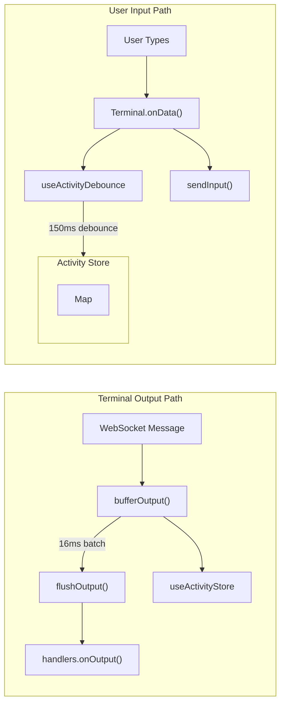
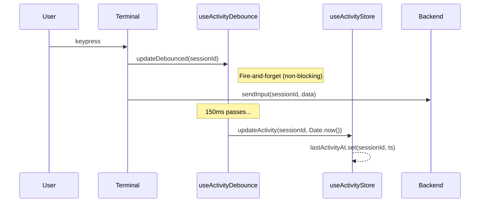
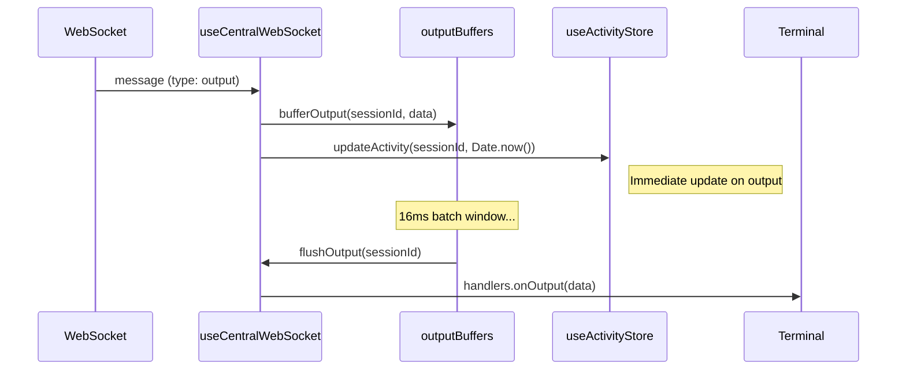

# Phase 1: Activity Tracking Foundation – Tasks & Alignment Brief

**Spec**: [../../session-idle-indicators-spec.md](../../session-idle-indicators-spec.md)
**Plan**: [../../session-idle-indicators-plan.md](../../session-idle-indicators-plan.md)
**Date**: 2026-02-05
**GitHub Issue**: https://github.com/vaughanknight/trex/issues/25

---

## Executive Briefing

### Purpose
This phase establishes the foundational activity tracking infrastructure that will power idle state indicators. It creates a separate Zustand store for activity timestamps and implements debounced activity updates to prevent re-render storms while maintaining accurate activity tracking.

### What We're Building
A `useActivityStore` Zustand store and `useActivityDebounce` hook that:
- Tracks `lastActivityAt` timestamps per session in a Map-based store (isolated from session data)
- Debounces activity updates at 150ms to prevent performance degradation
- Integrates with Terminal.tsx `onData` handler for user input tracking
- Integrates with useCentralWebSocket.ts for terminal output tracking
- Provides selectors for fine-grained subscriptions to individual session timestamps

### User Value
Users will have accurate activity timestamps for each terminal session, enabling subsequent phases to calculate and display idle duration. This phase ensures activity tracking has zero perceptible impact on terminal input/output latency.

### Example
**Before**: No activity tracking exists
**After**:
```typescript
// Activity store tracks timestamps per session
useActivityStore.getState().updateActivity('session-1', Date.now())
useActivityStore.getState().lastActivityAt.get('session-1') // → 1738764800000

// Debounced updates in Terminal
onData((data) => {
  updateActivityDebounced('session-1') // Fire-and-forget, 150ms debounce
  sendInput('session-1', data)
})
```

---

## Objectives & Scope

### Objective
Implement activity timestamp tracking infrastructure as specified in the plan, satisfying:
- AC-01: Activity Timestamp Tracking (user input + terminal output updates `lastActivityAt`)
- AC-05: Activity Reset on User Input (idle state resets immediately)
- AC-06: Activity Reset on Terminal Output (idle state resets on output)
- AC-07: Independent Session Tracking (each session has independent timestamps)
- AC-10: Performance - No Input Latency Impact (<5ms overhead)
- AC-11: Timer Cleanup (debounce timers properly cleaned up)

### Goals

- ✅ Create `useActivityStore` with `lastActivityAt` Map and `updateActivity` action
- ✅ Create `useActivityDebounce` hook with per-session debounce timers (150ms)
- ✅ Integrate activity tracking into Terminal.tsx `onData` handler (fire-and-forget)
- ✅ Integrate activity tracking into useCentralWebSocket.ts output handler (batched with 16ms window)
- ✅ Add `selectLastActivityAt(id)` selector for fine-grained subscriptions
- ✅ Implement proper timer cleanup on component unmount

### Non-Goals

- ❌ Idle state computation (Phase 2)
- ❌ Visual indicators or color changes (Phase 3)
- ❌ Settings integration or configurable thresholds (Phase 4)
- ❌ Session cleanup when session is removed (will use existing store cleanup patterns)
- ❌ Persistence of activity timestamps (transient state per spec)
- ❌ Backend involvement (frontend-only per spec Non-Goals)

---

## Architecture Map

### Component Diagram

```mermaid
flowchart TD
    classDef pending fill:#9E9E9E,stroke:#757575,color:#fff
    classDef inprogress fill:#FF9800,stroke:#F57C00,color:#fff
    classDef completed fill:#4CAF50,stroke:#388E3C,color:#fff
    classDef blocked fill:#F44336,stroke:#D32F2F,color:#fff

    style Phase fill:#F5F5F5,stroke:#E0E0E0
    style Stores fill:#F5F5F5,stroke:#E0E0E0
    style Hooks fill:#F5F5F5,stroke:#E0E0E0
    style Components fill:#F5F5F5,stroke:#E0E0E0
    style Tests fill:#F5F5F5,stroke:#E0E0E0

    subgraph Phase["Phase 1: Activity Tracking Foundation"]
        T001["T001: Write activity store tests"]:::completed
        T002["T002: Create useActivityStore"]:::completed
        T003["T003: Write useActivityDebounce tests"]:::completed
        T004["T004: Implement useActivityDebounce"]:::completed
        T005["T005: Integrate into Terminal.tsx"]:::completed
        T006["T006: Integrate into WebSocket handler"]:::completed
        T007["T007: Add selectLastActivityAt selector"]:::completed
        T008["T008: Verify no latency impact"]:::completed

        T001 --> T002
        T003 --> T004
        T002 --> T005
        T004 --> T005
        T002 --> T006
        T004 --> T006
        T002 --> T007
        T005 --> T008
        T006 --> T008
    end

    subgraph Stores["Stores"]
        F1["/frontend/src/stores/activityStore.ts"]:::completed
    end

    subgraph Hooks["Hooks"]
        F2["/frontend/src/hooks/useActivityDebounce.ts"]:::completed
    end

    subgraph Components["Components"]
        F3["/frontend/src/components/Terminal.tsx"]:::completed
        F4["/frontend/src/hooks/useCentralWebSocket.ts"]:::completed
    end

    subgraph Tests["Tests"]
        F5["/frontend/src/stores/__tests__/activityStore.test.ts"]:::completed
        F6["/frontend/src/hooks/__tests__/useActivityDebounce.test.ts"]:::completed
    end

    T001 -.-> F5
    T002 -.-> F1
    T003 -.-> F6
    T004 -.-> F2
    T005 -.-> F3
    T006 -.-> F4
    T007 -.-> F1
```

<!-- Status: grey=pending, orange=in-progress, green=completed, red=blocked -->
<!-- Updated by plan-6 during implementation -->



### Task-to-Component Mapping

<!-- Status: ⬜ Pending | 🟧 In Progress | ✅ Complete | 🔴 Blocked -->

| Task | Component(s) | Files | Status | Comment |
|------|-------------|-------|--------|---------|
| T001 | Activity Store Tests | activityStore.test.ts | ✅ Complete | 9 tests passing |
| T002 | Activity Store | activityStore.ts | ✅ Complete | Map-based store with updateActivity, removeActivity, clearActivity |
| T003 | Debounce Hook Tests | useActivityDebounce.test.ts | ✅ Complete | 10 tests passing with vi.useFakeTimers() |
| T004 | Debounce Hook | useActivityDebounce.ts | ✅ Complete | 150ms debounce with cleanup |
| T005 | Terminal Integration | Terminal.tsx | ✅ Complete | Fire-and-forget in onData handler |
| T006 | WebSocket Integration | useCentralWebSocket.ts | ✅ Complete | Activity update in bufferOutput |
| T007 | Selector | activityStore.ts | ✅ Complete | selectLastActivityAt(id) selector |
| T008 | Performance Verification | Terminal.tsx | ✅ Complete | Type check passes, no blocking calls |

---

## Tasks

| Status | ID | Task | CS | Type | Dependencies | Absolute Path(s) | Validation | Subtasks | Notes |
|--------|------|------|----|------|--------------|------------------|------------|----------|-------|
| [x] | T001 | Write tests for activity store `updateActivity` action | 2 | Test | – | /Users/vaughanknight/GitHub/trex/frontend/src/stores/__tests__/activityStore.test.ts | Tests cover: single update, multiple sessions, timestamp accuracy, clearActivity | – | TDD |
| [x] | T002 | Create `useActivityStore` with `lastActivityAt` Map | 2 | Core | T001 | /Users/vaughanknight/GitHub/trex/frontend/src/stores/activityStore.ts | Store created, tests from T001 pass, follows sessions.ts pattern | – | Per Critical Finding 05 |
| [x] | T003 | Write tests for `useActivityDebounce` hook | 2 | Test | – | /Users/vaughanknight/GitHub/trex/frontend/src/hooks/__tests__/useActivityDebounce.test.ts | Tests cover: debounce timing, cleanup, per-session isolation, timer leak prevention | – | TDD, use vi.useFakeTimers() |
| [x] | T004 | Implement `useActivityDebounce` hook | 2 | Core | T003 | /Users/vaughanknight/GitHub/trex/frontend/src/hooks/useActivityDebounce.ts | Hook created, tests from T003 pass, proper cleanup in useEffect | – | Per Critical Finding 06 |
| [x] | T005 | Integrate activity tracking into Terminal.tsx `onData` | 2 | Integration | T002, T004 | /Users/vaughanknight/GitHub/trex/frontend/src/components/Terminal.tsx | Activity updates fire on input, debounced at 150ms, fire-and-forget pattern | – | Per Critical Finding 02 |
| [x] | T006 | Integrate activity tracking into useCentralWebSocket output handler | 2 | Integration | T002, T004 | /Users/vaughanknight/GitHub/trex/frontend/src/hooks/useCentralWebSocket.ts | Activity updates fire on output receipt, aligned with 16ms batching window | – | Per Critical Finding 04 |
| [x] | T007 | Add selector `selectLastActivityAt(id)` to activity store | 1 | Core | T002 | /Users/vaughanknight/GitHub/trex/frontend/src/stores/activityStore.ts | Selector returns number or undefined, primitive comparison for stable refs | – | Completed with T002 |
| [x] | T008 | Verify no input latency impact | 1 | Verification | T005, T006 | /Users/vaughanknight/GitHub/trex/frontend/src/components/Terminal.tsx | Manual test: typing feels normal, dev measurement shows <5ms overhead | – | Per AC-10 |

---

## Alignment Brief

### Critical Findings Affecting This Phase

| Finding | Title | Constraint/Requirement | Addressed By |
|---------|-------|------------------------|--------------|
| 🚨 Critical Finding 01 | Re-render Storm Risk | Debounce activity updates to 100-200ms, use primitive selectors | T003, T004, T007 |
| 🚨 Critical Finding 02 | Terminal Input Non-Blocking | Fire-and-forget debounced updates, no sync logic in onData handler | T005 |
| 🔴 High Finding 04 | Output Batching Interaction | Align activity updates with existing 16ms output batching | T006 |
| 🔴 High Finding 05 | Separate Activity Store | Isolate timestamps from Session interface to prevent shallow equality breaks | T002 |
| 🟡 Medium Finding 06 | Debounce Implementation Pattern | Per-sessionId debounce map with ref-based timer management | T004 |

### ADR Decision Constraints

| ADR | Status | Decision | Affects | Addressed By |
|-----|--------|----------|---------|--------------|
| ADR-0004 | Accepted | Fakes-only testing - no mocking frameworks | All tests | T001, T003 use vi.useFakeTimers(), no jest.mock() |

### Invariants & Guardrails

- **Performance**: Activity tracking overhead must be <5ms (per AC-10)
- **Memory**: Debounce timers must be cleaned up on component unmount (per AC-11)
- **Isolation**: Activity store must be completely separate from sessions store (per Critical Finding 05)

### Inputs to Read

| File | Purpose |
|------|---------|
| `/Users/vaughanknight/GitHub/trex/frontend/src/stores/sessions.ts` | Reference pattern for Map-based Zustand store |
| `/Users/vaughanknight/GitHub/trex/frontend/src/stores/__tests__/webglPool.test.ts` | Reference pattern for TDD with fakes |
| `/Users/vaughanknight/GitHub/trex/frontend/src/components/Terminal.tsx` | Integration point: onData handler (line 169) |
| `/Users/vaughanknight/GitHub/trex/frontend/src/hooks/useCentralWebSocket.ts` | Integration point: bufferOutput (line 81), output handling (line 206) |

### Visual Alignment Aids

#### Data Flow Diagram



#### Sequence Diagram: User Input Activity Update



#### Sequence Diagram: Terminal Output Activity Update



### Test Plan (TDD Approach, Fakes-Only per ADR-0004)

#### T001: Activity Store Tests

| Test | Rationale | Fixtures | Expected Output |
|------|-----------|----------|-----------------|
| `should update lastActivityAt for a session` | Core functionality - timestamp storage | None | Timestamp stored, retrievable by ID |
| `should track multiple sessions independently` | AC-07 requirement | Two session IDs | Each has independent timestamp |
| `should clear activity data` | Test isolation, session cleanup | Stored activity | Empty Map after clear |
| `should overwrite previous timestamp` | Activity reset behavior | Two updates | Latest timestamp kept |

#### T003: Debounce Hook Tests

| Test | Rationale | Fixtures | Expected Output |
|------|-----------|----------|-----------------|
| `should debounce rapid updates to 150ms` | Prevent re-render storms | vi.useFakeTimers() | Single store update after 150ms |
| `should isolate debounce per session` | AC-07, independent tracking | Two session IDs | Separate debounce timers |
| `should cleanup timers on unmount` | AC-11, memory leak prevention | renderHook unmount | No pending timers |
| `should update immediately after debounce expires` | Accuracy requirement | Advance timer 150ms | Store updated |

### Step-by-Step Implementation Outline

1. **T001**: Create `activityStore.test.ts` with failing tests
   - Import pattern from `webglPool.test.ts`
   - Write 4+ tests for `updateActivity`, `clearActivity`, multi-session
   - Run tests → expect failures (store doesn't exist)

2. **T002**: Create `activityStore.ts`
   - Copy pattern from `sessions.ts` (Map-based Zustand store)
   - Implement `lastActivityAt: Map<string, number>`
   - Add `updateActivity(id, timestamp)` and `clearActivity()` actions
   - Run tests → expect pass

3. **T003**: Create `useActivityDebounce.test.ts` with failing tests
   - Use `vi.useFakeTimers()` for deterministic timing
   - Test debounce timing, per-session isolation, cleanup
   - Use `renderHook` from `@testing-library/react`
   - Run tests → expect failures

4. **T004**: Create `useActivityDebounce.ts`
   - Use `useRef<Map<string, NodeJS.Timeout>>` for timer map
   - Implement `updateDebounced(sessionId)` callback
   - Add `useEffect` cleanup for timer disposal
   - Run tests → expect pass

5. **T005**: Integrate into Terminal.tsx
   - Import `useActivityDebounce`
   - Call `updateDebounced(sessionId)` in `onData` handler (fire-and-forget)
   - Verify existing tests still pass

6. **T006**: Integrate into useCentralWebSocket.ts
   - Import `useActivityStore`
   - Add `updateActivity` call in `bufferOutput` method
   - Aligns with existing 16ms batching

7. **T007**: Add selector to activityStore.ts
   - Add `selectLastActivityAt(id)` returning `number | undefined`
   - Primitive value for stable refs

8. **T008**: Manual verification
   - Open terminal, type rapidly
   - Verify no perceptible lag
   - Optional: Add dev-only performance measurement

### Commands to Run

```bash
# Navigate to frontend
cd /Users/vaughanknight/GitHub/trex/frontend

# Run specific test file (during TDD)
npm test -- src/stores/__tests__/activityStore.test.ts
npm test -- src/hooks/__tests__/useActivityDebounce.test.ts

# Run all tests after integration
npm test

# Type check
npm run typecheck

# Lint
npm run lint

# Build to verify no errors
npm run build
```

### Risks/Unknowns

| Risk | Severity | Likelihood | Mitigation |
|------|----------|------------|------------|
| Debounce timer leaks | Medium | Low | Proper useEffect cleanup, test with unmount |
| Re-render storms from store updates | High | Medium | Separate store (Critical Finding 05), primitive selectors |
| Input latency regression | High | Low | Fire-and-forget pattern, dev measurement |
| Test flakiness with fake timers | Low | Medium | Follow webglPool.test.ts patterns exactly |

### Ready Check

- [x] Plan reviewed and understood
- [x] Critical Findings mapped to tasks (see table above)
- [x] ADR constraints mapped to tasks (ADR-0004 → T001, T003)
- [x] Test plan defined with rationale
- [x] Implementation steps mapped 1:1 to tasks
- [x] Commands documented for execution
- [x] Risks identified with mitigations

**Awaiting GO/NO-GO from sponsor before implementation.**

---

## Phase Footnote Stubs

_Populated during implementation by plan-6._

| Footnote | Date | Task | Description | Files Affected |
|----------|------|------|-------------|----------------|
| | | | | |

---

## Evidence Artifacts

- **Execution Log**: `./execution.log.md` (created by plan-6)
- **Test Results**: Captured in execution log
- **Performance Measurements**: Captured in execution log (if T008 uses dev tooling)

---

## Discoveries & Learnings

_Populated during implementation by plan-6. Log anything of interest to your future self._

| Date | Task | Type | Discovery | Resolution | References |
|------|------|------|-----------|------------|------------|
| | | | | | |

**Types**: `gotcha` | `research-needed` | `unexpected-behavior` | `workaround` | `decision` | `debt` | `insight`

**What to log**:
- Things that didn't work as expected
- External research that was required
- Implementation troubles and how they were resolved
- Gotchas and edge cases discovered
- Decisions made during implementation
- Technical debt introduced (and why)
- Insights that future phases should know about

_See also: `execution.log.md` for detailed narrative._

---

## Directory Layout

```
docs/plans/007-session-idle-indicators/
├── session-idle-indicators-spec.md
├── session-idle-indicators-plan.md
└── tasks/
    └── phase-1-activity-tracking-foundation/
        ├── tasks.md                    # This file
        └── execution.log.md            # Created by plan-6
```

---

**Phase 1 Tasks Ready**: 2026-02-05
**Next Step**: Await sponsor GO, then run `/plan-6-implement-phase phase 1`
