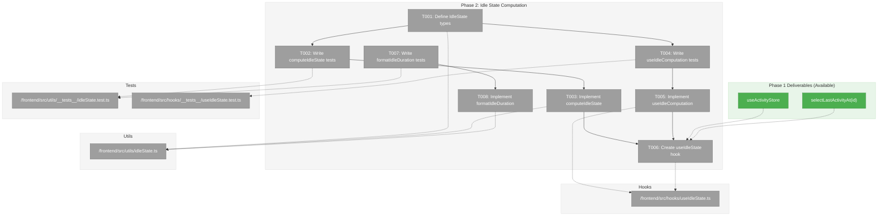
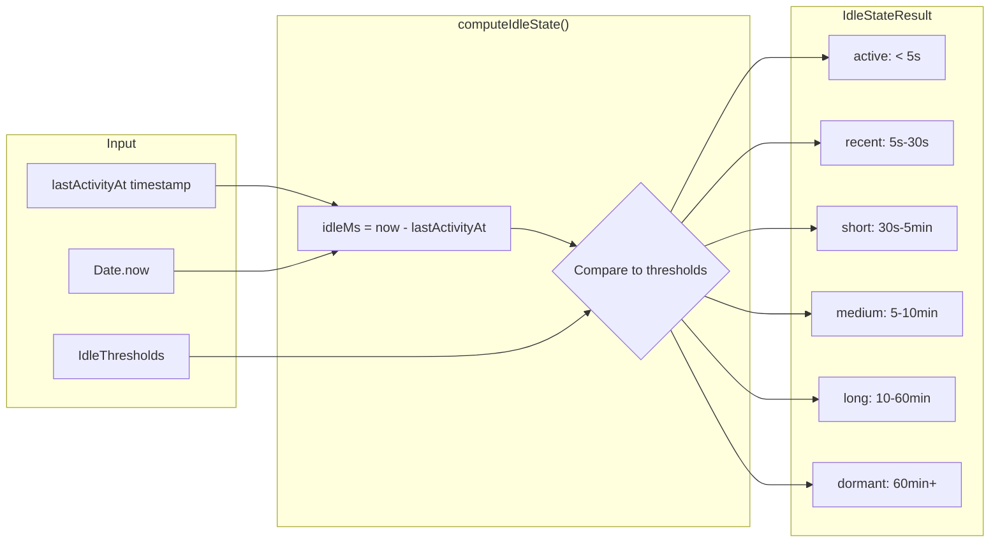
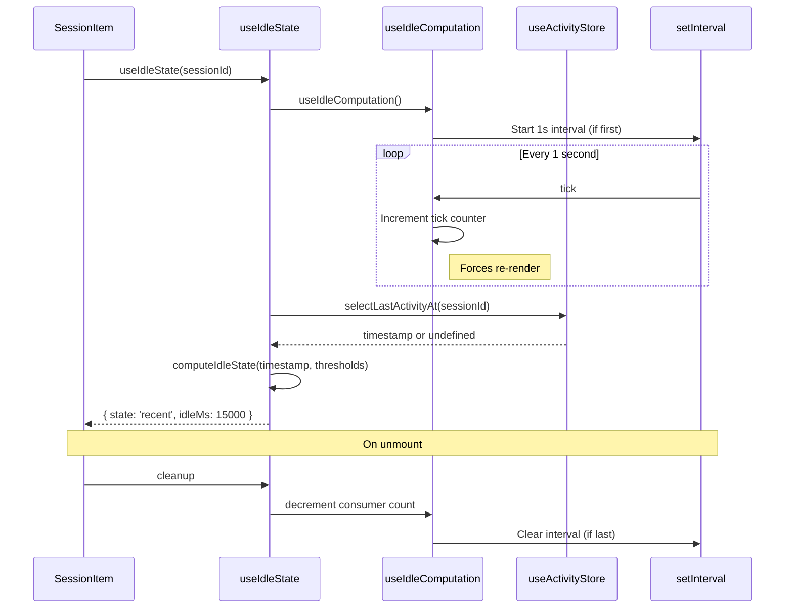

# Phase 2: Idle State Computation – Tasks & Alignment Brief

**Spec**: [../../session-idle-indicators-spec.md](../../session-idle-indicators-spec.md)
**Plan**: [../../session-idle-indicators-plan.md](../../session-idle-indicators-plan.md)
**Date**: 2026-02-05
**GitHub Issue**: https://github.com/vaughanknight/trex/issues/25

---

## Executive Briefing

### Purpose
This phase implements the core idle state computation logic that transforms activity timestamps into categorized idle states. It provides the brain behind the idle indicators - calculating whether a session is active, recently idle, or dormant based on configurable thresholds.

### What We're Building
A `computeIdleState()` utility and `useIdleState(sessionId)` hook that:
- Computes idle state from `lastActivityAt` timestamp and configurable thresholds
- Categorizes into 6 states: active, recent, short, medium, long, dormant
- Provides a global 1-second interval timer for periodic recalculation
- Formats idle duration for tooltip display ("Active", "Idle: 5 minutes")

### User Value
The SessionItem component (Phase 3) will consume the computed idle state to display appropriate color-coded indicators. Users will see at a glance which sessions are actively receiving output versus idle.

### Example
```typescript
// Input: lastActivityAt = Date.now() - 45000 (45 seconds ago)
// Thresholds: { active: 5000, recent: 30000, short: 300000, medium: 600000, long: 3600000 }

const result = computeIdleState(lastActivityAt, thresholds)
// Output: { state: 'short', idleMs: 45000 }

const formatted = formatIdleDuration(45000)
// Output: "Idle: 45 seconds"
```

---

## Objectives & Scope

### Objective
Implement time-based idle state calculation as specified in the plan, satisfying:
- AC-02: Idle State Computation (correct threshold classification)
- AC-12: Tooltip Shows Idle Duration (formatted duration string)

### Goals

- ✅ Define `IdleState` type and `IdleThresholds` interface
- ✅ Implement `computeIdleState()` pure function with all 6 threshold states
- ✅ Implement `formatIdleDuration()` utility for human-readable durations
- ✅ Create global interval timer via `useIdleComputation` hook
- ✅ Create `useIdleState(sessionId)` hook for component consumption
- ✅ Comprehensive TDD tests for all threshold boundaries

### Non-Goals

- ❌ Visual indicators or color changes (Phase 3)
- ❌ Settings UI for threshold configuration (Phase 4)
- ❌ Settings persistence of custom thresholds (Phase 4)
- ❌ Performance optimization beyond 1-second interval
- ❌ Animated transitions between states (Phase 3)

---

## Architecture Map

### Component Diagram
<!-- Status: grey=pending, orange=in-progress, green=completed, red=blocked -->
<!-- Updated by plan-6 during implementation -->



### Task-to-Component Mapping

<!-- Status: ⬜ Pending | 🟧 In Progress | ✅ Complete | 🔴 Blocked -->

| Task | Component(s) | Files | Status | Comment |
|------|-------------|-------|--------|---------|
| T001 | Type Definitions | idleState.ts | ✅ Complete | IdleState, IdleThresholds, DEFAULT_THRESHOLDS |
| T002 | computeIdleState Tests | idleState.test.ts | ✅ Complete | 17 tests: all 6 states + boundaries + edge cases |
| T003 | computeIdleState | idleState.ts | ✅ Complete | Pure function, handles clock skew + undefined |
| T004 | useIdleComputation Tests | useIdleState.test.ts | ✅ Complete | 5 tests: interval lifecycle |
| T005 | useIdleComputation | useIdleState.ts | ✅ Complete | 1s interval with cleanup |
| T006 | useIdleState Hook | useIdleState.ts | ✅ Complete | 5 tests: per-session idle state |
| T007 | formatIdleDuration Tests | idleState.test.ts | ✅ Complete | 12 tests: seconds/minutes/hours |
| T008 | formatIdleDuration | idleState.ts | ✅ Complete | Human-readable strings |

---

## Tasks

| Status | ID | Task | CS | Type | Dependencies | Absolute Path(s) | Validation | Subtasks | Notes |
|--------|------|------|----|------|--------------|------------------|------------|----------|-------|
| [x] | T001 | Define `IdleState` type, `IdleThresholds` interface, and `DEFAULT_THRESHOLDS` constant | 1 | Core | – | /Users/vaughanknight/GitHub/trex/frontend/src/utils/idleState.ts | Types exported, thresholds match spec defaults | – | Per AC-02 |
| [x] | T002 | Write comprehensive tests for `computeIdleState()` | 3 | Test | T001 | /Users/vaughanknight/GitHub/trex/frontend/src/utils/__tests__/idleState.test.ts | Tests cover all 6 states, boundary conditions (lower bound inclusive) | – | TDD, 17 tests |
| [x] | T003 | Implement `computeIdleState()` utility | 2 | Core | T002 | /Users/vaughanknight/GitHub/trex/frontend/src/utils/idleState.ts | All tests from T002 pass, pure function | – | – |
| [x] | T004 | Write tests for idle recomputation interval | 2 | Test | T001 | /Users/vaughanknight/GitHub/trex/frontend/src/hooks/__tests__/useIdleState.test.ts | Tests cover: start/stop lifecycle, cleanup, tick counter | – | TDD, 5 tests |
| [x] | T005 | Implement `useIdleComputation` hook with global interval | 2 | Core | T004 | /Users/vaughanknight/GitHub/trex/frontend/src/hooks/useIdleState.ts | Single interval, proper cleanup, triggers re-renders | – | Per Critical Finding 03 |
| [x] | T006 | Create `useIdleState(sessionId)` hook for components | 2 | Core | T003, T005 | /Users/vaughanknight/GitHub/trex/frontend/src/hooks/useIdleState.ts | Returns computed idle state, uses Phase 1 selector | – | Consumes activityStore |
| [x] | T007 | Write tests for `formatIdleDuration()` utility | 1 | Test | – | /Users/vaughanknight/GitHub/trex/frontend/src/utils/__tests__/idleState.test.ts | Formats: "Active", "5 seconds", "2 minutes", "1 hour" | – | TDD, 12 tests |
| [x] | T008 | Implement `formatIdleDuration()` utility | 1 | Core | T007 | /Users/vaughanknight/GitHub/trex/frontend/src/utils/idleState.ts | All tests pass, handles edge cases | – | Per AC-12 |

---

## Alignment Brief

### Prior Phases Review

#### Phase 1: Activity Tracking Foundation (COMPLETE)

**A. Deliverables Created:**
- `/Users/vaughanknight/GitHub/trex/frontend/src/stores/activityStore.ts` - Zustand store with `lastActivityAt: Map<string, number>`
- `/Users/vaughanknight/GitHub/trex/frontend/src/hooks/useActivityDebounce.ts` - 150ms debounce hook
- `/Users/vaughanknight/GitHub/trex/frontend/src/stores/__tests__/activityStore.test.ts` - 9 tests
- `/Users/vaughanknight/GitHub/trex/frontend/src/hooks/__tests__/useActivityDebounce.test.ts` - 10 tests

**B. Lessons Learned:**
- TDD with `vi.useFakeTimers()` works well for time-based behavior
- Separate store pattern prevents re-render cascades
- Per-session ref maps enable independent timers

**C. Technical Discoveries:**
- Timer callback captures `Date.now()` at fire time, not call time
- Map immutability required for Zustand change detection (`new Map(...)`)
- WebSocket output updates are immediate (not debounced)

**D. Dependencies Exported for Phase 2:**
| Export | Location | Purpose |
|--------|----------|---------|
| `selectLastActivityAt(sessionId)` | `activityStore.ts:66` | Get timestamp for idle calculation |
| `useActivityStore` | `activityStore.ts:34` | Subscribe to store changes |
| `ActivityStore` type | `activityStore.ts:26` | Type-safe store access |

**E. Critical Findings Applied:**
- Critical Finding 01, 02, 04, 05, 06 all addressed in Phase 1
- Phase 2 must address Critical Finding 03 (Timer Memory Leak Risk)

**F. Incomplete Items:** None

**G. Test Infrastructure:**
- Pattern: `beforeEach` with `vi.useFakeTimers()`, `afterEach` with `vi.restoreAllMocks()`
- Pattern: Store tests use `useStore.getState().clearX()` for isolation

**H. Technical Debt:** Activity cleanup on session close not wired (low priority)

**I. Architectural Decisions:**
- Separate stores for high-frequency data
- Primitive selectors for fine-grained subscriptions
- Fire-and-forget in performance-critical paths

### Critical Findings Affecting This Phase

| Finding | Title | Constraint | Addressed By |
|---------|-------|------------|--------------|
| 🔴 High Finding 03 | Timer Memory Leak Risk | Single global interval with lifecycle control, useEffect cleanup | T004, T005 |
| 🟡 Medium Finding 07 | Fake Timer Test Patterns | Follow webglPool.test.ts patterns with vi.useFakeTimers() | T002, T004 |

### ADR Decision Constraints

| ADR | Status | Decision | Affects | Addressed By |
|-----|--------|----------|---------|--------------|
| ADR-0004 | Accepted | Fakes-only testing | All tests | T002, T004, T007 use vi.useFakeTimers() |

### Invariants & Guardrails

- **Interval Frequency**: 1 second (1000ms) - conservative for CPU usage
- **Timer Cleanup**: Global interval must be cleared on last consumer unmount
- **Pure Function**: `computeIdleState()` must have no side effects
- **Boundary Behavior**: Lower bound inclusive (at 5s → 'recent', not 'active')

### Inputs to Read

| File | Purpose |
|------|---------|
| `/Users/vaughanknight/GitHub/trex/frontend/src/stores/activityStore.ts` | Activity store API for idle calculation |
| `/Users/vaughanknight/GitHub/trex/frontend/src/stores/__tests__/webglPool.test.ts` | Reference pattern for fake timer tests |

### Visual Alignment Aids

#### Idle State Flow Diagram



#### Sequence Diagram: useIdleState Hook



### Test Plan (TDD, Fakes-Only per ADR-0004)

#### T002: computeIdleState Tests

| Test | Rationale | Expected Output |
|------|-----------|-----------------|
| `returns "active" when idle < 5s` | Active threshold | `{ state: 'active', idleMs: 4999 }` |
| `returns "recent" at exactly 5s (lower bound)` | Boundary behavior | `{ state: 'recent', idleMs: 5000 }` |
| `returns "recent" when idle 5s-30s` | Recent threshold | `{ state: 'recent' }` |
| `returns "short" at exactly 30s` | Boundary | `{ state: 'short' }` |
| `returns "short" when idle 30s-5min` | Short threshold | `{ state: 'short' }` |
| `returns "medium" at exactly 5min` | Boundary | `{ state: 'medium' }` |
| `returns "medium" when idle 5-10min` | Medium threshold | `{ state: 'medium' }` |
| `returns "long" at exactly 10min` | Boundary | `{ state: 'long' }` |
| `returns "long" when idle 10-60min` | Long threshold | `{ state: 'long' }` |
| `returns "dormant" at exactly 60min` | Boundary | `{ state: 'dormant' }` |
| `returns "dormant" when idle > 60min` | Dormant threshold | `{ state: 'dormant' }` |
| `handles future timestamp (clock skew)` | Edge case | `{ state: 'active' }` |
| `handles undefined lastActivityAt` | Edge case | `{ state: 'dormant' }` |

#### T004: useIdleComputation Tests

| Test | Rationale | Expected Output |
|------|-----------|-----------------|
| `starts interval on mount` | Lifecycle | `setInterval` called once |
| `clears interval on unmount` | Memory leak prevention | `clearInterval` called |
| `does not create multiple intervals on re-render` | Single global interval | `setInterval` called once |
| `tick counter increments every second` | Re-render trigger | tick = 1 after 1s |

#### T007: formatIdleDuration Tests

| Test | Rationale | Expected Output |
|------|-----------|-----------------|
| `returns "Active" for 0ms` | Active state | `"Active"` |
| `returns "Active" for < 5s` | Active threshold | `"Active"` |
| `returns "Idle: X seconds" for < 60s` | Seconds format | `"Idle: 45 seconds"` |
| `returns "Idle: 1 minute" for 60s` | Singular minute | `"Idle: 1 minute"` |
| `returns "Idle: X minutes" for < 60min` | Minutes format | `"Idle: 5 minutes"` |
| `returns "Idle: 1 hour" for 60min` | Singular hour | `"Idle: 1 hour"` |
| `returns "Idle: X hours" for > 60min` | Hours format | `"Idle: 2 hours"` |

### Step-by-Step Implementation Outline

1. **T001**: Create `idleState.ts` with type definitions
   - Define `IdleState` union type
   - Define `IdleThresholds` interface
   - Export `DEFAULT_THRESHOLDS` constant

2. **T002**: Create `idleState.test.ts` with failing tests
   - All threshold boundary tests
   - Edge case tests (future timestamp, undefined)
   - Run tests → expect failures

3. **T003**: Implement `computeIdleState()`
   - Pure function comparing idle time to thresholds
   - Run tests → expect pass

4. **T004**: Create `useIdleState.test.ts` with interval tests
   - Test interval lifecycle with fake timers
   - Run tests → expect failures

5. **T005**: Implement `useIdleComputation` hook
   - Global interval with ref-based consumer counting
   - Run tests → expect pass

6. **T006**: Implement `useIdleState(sessionId)` hook
   - Consume activity store selector
   - Call computeIdleState with current time
   - Return idle state result

7. **T007**: Add formatIdleDuration tests
   - Duration formatting tests
   - Run tests → expect failures

8. **T008**: Implement `formatIdleDuration()`
   - Human-readable duration strings
   - Run tests → expect pass

### Commands to Run

```bash
cd /Users/vaughanknight/GitHub/trex/frontend

# Run specific test files (during TDD)
npm test -- src/utils/__tests__/idleState.test.ts
npm test -- src/hooks/__tests__/useIdleState.test.ts

# Run all tests after integration
npm test

# Type check
npx tsc --noEmit

# Build
npm run build
```

### Risks/Unknowns

| Risk | Severity | Likelihood | Mitigation |
|------|----------|------------|------------|
| Multiple intervals from React StrictMode | Medium | Medium | Use ref-based consumer counting |
| Test flakiness with fake timers | Low | Medium | Follow webglPool.test.ts patterns |
| Re-render performance with many sessions | Low | Low | 1-second interval is conservative |

### Ready Check

- [x] Phase 1 review complete
- [x] Critical Findings mapped to tasks (Finding 03 → T004, T005)
- [x] ADR constraints mapped (ADR-0004 → T002, T004, T007)
- [x] Test plan defined with expected outputs
- [x] Implementation steps mapped 1:1 to tasks
- [x] Commands documented

**Proceeding directly to implementation per user request.**

---

## Phase Footnote Stubs

_Populated during implementation by plan-6._

| Footnote | Date | Task | Description | Files Affected |
|----------|------|------|-------------|----------------|
| | | | | |

---

## Evidence Artifacts

- **Execution Log**: `./execution.log.md` (created by plan-6)
- **Test Results**: Captured in execution log

---

## Discoveries & Learnings

_Populated during implementation by plan-6. Log anything of interest to your future self._

| Date | Task | Type | Discovery | Resolution | References |
|------|------|------|-----------|------------|------------|
| | | | | | |

**Types**: `gotcha` | `research-needed` | `unexpected-behavior` | `workaround` | `decision` | `debt` | `insight`

---

## Directory Layout

```
docs/plans/007-session-idle-indicators/
├── session-idle-indicators-spec.md
├── session-idle-indicators-plan.md
└── tasks/
    ├── phase-1-activity-tracking-foundation/
    │   ├── tasks.md
    │   └── execution.log.md
    └── phase-2-idle-state-computation/
        ├── tasks.md                    # This file
        └── execution.log.md            # Created by plan-6
```
