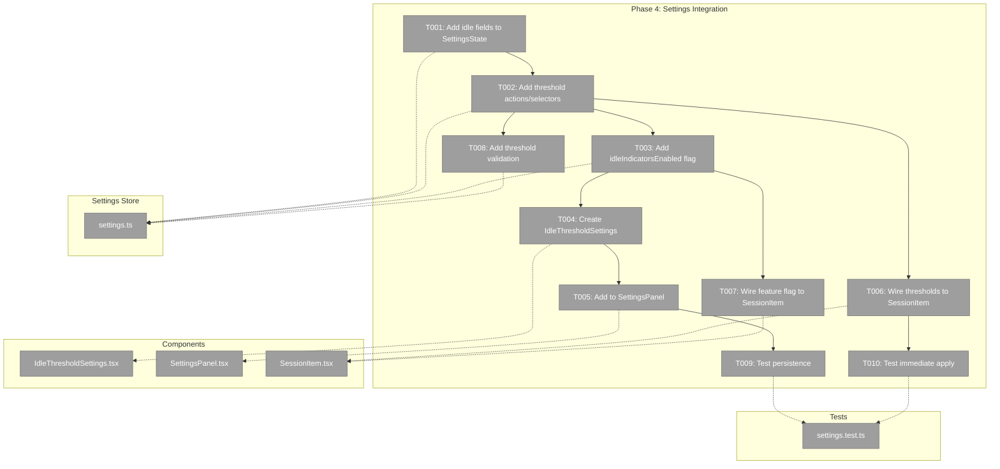
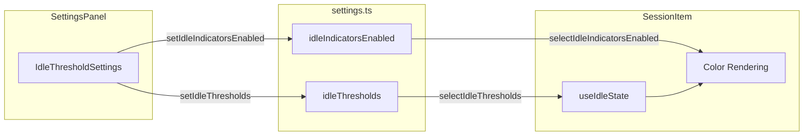
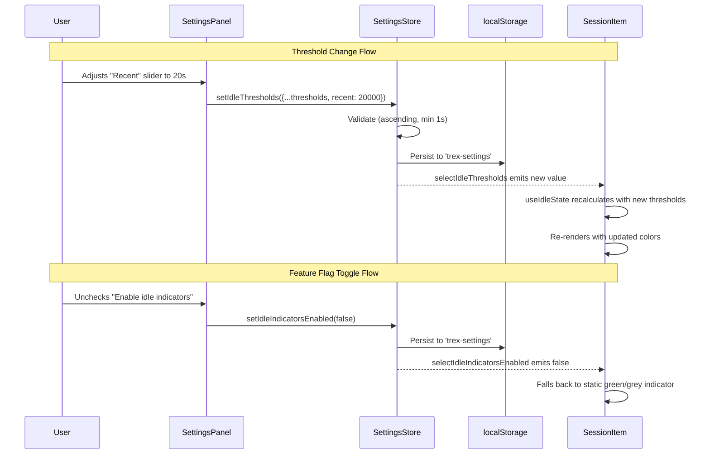

# Phase 4: Settings Integration – Tasks & Alignment Brief

**Spec**: [../../session-idle-indicators-spec.md](../../session-idle-indicators-spec.md)
**Plan**: [../../session-idle-indicators-plan.md](../../session-idle-indicators-plan.md)
**Date**: 2026-02-05
**GitHub Issue**: https://github.com/vaughanknight/trex/issues/25

---

## Executive Briefing

### Purpose
This phase adds user-configurable idle thresholds to the settings panel, enabling users to customize when sessions transition between idle states. It also adds a feature flag to disable idle indicators entirely if desired.

### What We're Building
Extensions to the settings system that:
- Add `idleThresholds` object to the persisted settings store
- Add `idleIndicatorsEnabled` boolean for emergency disable
- Create `IdleThresholdSettings` component with sliders for each threshold
- Integrate threshold settings into the SettingsPanel
- Wire custom thresholds to `useIdleState` consumers (SessionItem)
- Validate thresholds are ascending and have minimum values

### User Value
Users can customize idle timing to match their workflow preferences. Power users with many sessions can adjust thresholds for faster identification. Users who find indicators distracting can disable them entirely.

### Example
```
Before: All users use hardcoded thresholds (5s, 30s, 5min, 10min, 60min)
After:  User opens Settings → Idle Indicators section:
        - Active threshold: [====|----] 5s
        - Recent threshold: [=====|---] 30s
        - Short threshold:  [=======|-] 5min
        - Medium threshold: [========|] 10min
        - Long threshold:   [=========] 60min
        - [x] Enable idle indicators

        Changes apply immediately; persist across sessions.
```

---

## Objectives & Scope

### Objective
Add configurable idle thresholds to the settings panel, satisfying:
- AC-05: Thresholds Configurable (5 threshold values in settings)
- AC-06: Settings Persistence (survive page refresh)
- AC-07: Immediate Apply (changes reflect instantly)
- AC-13: Feature Flag (idleIndicatorsEnabled toggle)
- AC-14: Validation (min 1s, ascending order)

### Goals

- ✅ Add `idleThresholds` and `idleIndicatorsEnabled` to SettingsState interface
- ✅ Add threshold actions and selectors to settings store
- ✅ Create IdleThresholdSettings component with sliders
- ✅ Add IdleThresholdSettings section to SettingsPanel
- ✅ Wire settings thresholds to SessionItem via useIdleState
- ✅ Add threshold validation (min 1s, ascending order)
- ✅ Test settings persistence and immediate apply

### Non-Goals

- ❌ Threshold presets (e.g., "aggressive", "relaxed") - not in spec
- ❌ Per-session threshold overrides - all sessions use same thresholds
- ❌ Reset button for individual thresholds - only global reset exists
- ❌ Threshold sync across devices - localStorage only
- ❌ Animated slider feedback - simple slider is sufficient
- ❌ Unit tests for slider component itself - covered by integration tests

---

## Architecture Map

### Component Diagram
<!-- Status: grey=pending, orange=in-progress, green=completed, red=blocked -->
<!-- Updated by plan-6 during implementation -->



### Task-to-Component Mapping

<!-- Status: ⬜ Pending | 🟧 In Progress | ✅ Complete | 🔴 Blocked -->

| Task | Component(s) | Files | Status | Comment |
|------|-------------|-------|--------|---------|
| T001 | Settings Store | settings.ts | ⬜ Pending | Add IdleThresholds interface and idleThresholds field |
| T002 | Settings Store | settings.ts | ⬜ Pending | Add setIdleThresholds action and selectors |
| T003 | Settings Store | settings.ts | ⬜ Pending | Add idleIndicatorsEnabled boolean |
| T004 | IdleThresholdSettings | IdleThresholdSettings.tsx | ⬜ Pending | New component with 5 sliders + toggle |
| T005 | SettingsPanel | SettingsPanel.tsx | ⬜ Pending | Add IdleThresholdSettings section |
| T006 | SessionItem | SessionItem.tsx | ⬜ Pending | Pass custom thresholds to useIdleState |
| T007 | SessionItem | SessionItem.tsx | ⬜ Pending | Conditional rendering based on feature flag |
| T008 | Settings Store | settings.ts | ⬜ Pending | Validate thresholds on set |
| T009 | Tests | settings.test.ts | ⬜ Pending | Test localStorage persistence |
| T010 | Tests | settings.test.ts | ⬜ Pending | Test immediate apply |

---

## Tasks

| Status | ID | Task | CS | Type | Dependencies | Absolute Path(s) | Validation | Subtasks | Notes |
|--------|------|------|----|------|--------------|------------------|------------|----------|-------|
| [x] | T001 | Add `IdleThresholds` interface and `idleThresholds` field to SettingsState | 1 | Core | – | /Users/vaughanknight/GitHub/trex/frontend/src/stores/settings.ts | Interface matches Phase 2's IdleThresholds, field has defaults | – | Reuse type from idleState.ts |
| [x] | T002 | Add `setIdleThresholds` action and `selectIdleThresholds` selector | 1 | Core | T001 | /Users/vaughanknight/GitHub/trex/frontend/src/stores/settings.ts | Action updates all 5 thresholds, selector returns IdleThresholds | – | – |
| [x] | T003 | Add `idleIndicatorsEnabled` boolean field with setter and selector | 1 | Core | T001 | /Users/vaughanknight/GitHub/trex/frontend/src/stores/settings.ts | Default: true, action toggles, selector returns boolean | – | Per AC-13 |
| [x] | T004 | Create `IdleThresholdSettings` component with 5 sliders and enable toggle | 3 | Core | T002, T003 | /Users/vaughanknight/GitHub/trex/frontend/src/components/IdleThresholdSettings.tsx | Sliders for each threshold, checkbox for enable/disable | – | Follow FontSizeSlider pattern |
| [x] | T005 | Add `IdleThresholdSettings` to SettingsPanel after Font Size section | 1 | Integration | T004 | /Users/vaughanknight/GitHub/trex/frontend/src/components/SettingsPanel.tsx | New section visible in settings panel | – | – |
| [x] | T006 | Wire custom thresholds from settings to SessionItem's useIdleState call | 2 | Integration | T002 | /Users/vaughanknight/GitHub/trex/frontend/src/components/SessionItem.tsx | useIdleState receives thresholds from selectIdleThresholds | – | Per AC-07 |
| [x] | T007 | Add conditional rendering in SessionItem based on idleIndicatorsEnabled | 2 | Integration | T003, T006 | /Users/vaughanknight/GitHub/trex/frontend/src/components/SessionItem.tsx | When disabled, fall back to static green/grey indicator | – | Per AC-13 |
| [x] | T008 | Add threshold validation: min 1000ms, ascending order enforcement | 2 | Core | T002 | /Users/vaughanknight/GitHub/trex/frontend/src/stores/settings.ts | Invalid values clamped/corrected, no store errors | – | Per AC-14 |
| [x] | T009 | Write test for settings persistence (localStorage round-trip) | 2 | Test | T005 | /Users/vaughanknight/GitHub/trex/frontend/src/stores/__tests__/settings.test.ts | Thresholds persist after simulated refresh | – | Per AC-06 |
| [x] | T010 | Write test for immediate apply (threshold change → idle state update) | 2 | Test | T006 | /Users/vaughanknight/GitHub/trex/frontend/src/stores/__tests__/settings.test.ts | Changing threshold immediately changes computed idle state | – | Per AC-07 |

---

## Alignment Brief

### Prior Phases Summary

#### Phase 1: Activity Tracking Foundation (COMPLETE)

**Deliverables Created**:
- `/Users/vaughanknight/GitHub/trex/frontend/src/stores/activityStore.ts` - Zustand store with `lastActivityAt: Map<string, number>`
- `/Users/vaughanknight/GitHub/trex/frontend/src/hooks/useActivityDebounce.ts` - 150ms debounced activity updates
- `/Users/vaughanknight/GitHub/trex/frontend/src/stores/__tests__/activityStore.test.ts` - 9 tests
- `/Users/vaughanknight/GitHub/trex/frontend/src/hooks/__tests__/useActivityDebounce.test.ts` - 10 tests

**Lessons Learned**:
- TDD with `vi.useFakeTimers()` worked well for debounce timing tests
- Separate activity store prevents re-render storms (Critical Finding 05)
- Fire-and-forget pattern ensures zero-cost activity updates in critical path

**Dependencies Exported for Phase 4**:
- `useActivityStore` - Not directly needed, consumed via useIdleState
- `selectLastActivityAt(sessionId)` - Already consumed by Phase 2's useIdleState

**Test Patterns Established**:
- Store reset in beforeEach: `useActivityStore.getState().clearActivity()`
- Fake timer setup/teardown pattern

---

#### Phase 2: Idle State Computation (COMPLETE)

**Deliverables Created**:
- `/Users/vaughanknight/GitHub/trex/frontend/src/utils/idleState.ts` - Types, computeIdleState, formatIdleDuration
- `/Users/vaughanknight/GitHub/trex/frontend/src/hooks/useIdleState.ts` - useIdleComputation, useIdleState hooks
- `/Users/vaughanknight/GitHub/trex/frontend/src/utils/__tests__/idleState.test.ts` - 29 tests
- `/Users/vaughanknight/GitHub/trex/frontend/src/hooks/__tests__/useIdleState.test.ts` - 10 tests

**Key Exports for Phase 4**:
```typescript
// Phase 4 must reuse (not redefine):
import type { IdleThresholds } from '@/utils/idleState'
import { DEFAULT_THRESHOLDS } from '@/utils/idleState'

// Phase 4 consumers already use:
useIdleState(sessionId: string, thresholds?: IdleThresholds): IdleStateResult
```

**Lessons Learned**:
- Injectable `now` parameter made testing trivial
- Custom thresholds parameter already supported - Phase 4 just needs to wire it
- Lower-bound inclusive boundary behavior: at exactly 5s → 'recent'

**Technical Debt Noted**:
- No threshold validation in computeIdleState - Phase 4 should validate in settings store before persistence

---

#### Phase 3: Visual Indicators (COMPLETE)

**Deliverables Created**:
- Modified `/Users/vaughanknight/GitHub/trex/frontend/src/components/SessionItem.tsx`:
  - `IDLE_STATE_COLORS` constant (lines 34-41)
  - `useIdleState(session.id)` integration (line 66)
  - Dynamic colors on dot, icon, tint

**Phase 4 Integration Points**:
```typescript
// Current (Phase 3):
const idleState = useIdleState(session.id)

// After Phase 4:
const idleEnabled = useSettingsStore(selectIdleIndicatorsEnabled)
const thresholds = useSettingsStore(selectIdleThresholds)
const idleState = useIdleState(session.id, thresholds)

// Conditional rendering when disabled:
if (!idleEnabled) {
  // Fall back to original green/grey static indicator
}
```

**Patterns Established**:
- Color mapping with `as const` for type safety
- Tailwind opacity suffix syntax (`/10`, `/5`)
- CSS transitions on all dynamic color elements

---

### Cumulative Dependencies for Phase 4

| From Phase | Export | Used By Phase 4 |
|------------|--------|-----------------|
| Phase 2 | `IdleThresholds` interface | Settings store type (reuse, don't redefine) |
| Phase 2 | `DEFAULT_THRESHOLDS` constant | Default values for settings |
| Phase 2 | `useIdleState(sessionId, thresholds?)` | SessionItem integration |
| Phase 3 | `IDLE_STATE_COLORS` | Preserved when indicators enabled |

---

### Critical Findings Affecting This Phase

| Finding | Constraint | Addressed By |
|---------|-----------|--------------|
| CF-05: Separate Activity Store | Settings thresholds are separate from activity data | Already satisfied - settings store is separate |
| HF-03: Timer Memory Leak | Phase 4 adds no timers | N/A |

**No critical findings directly constrain Phase 4.** This phase adds static configuration only.

---

### ADR Decision Constraints

| ADR | Constraint | Addressed By |
|-----|-----------|--------------|
| ADR-0004 | Fakes-only testing | T009, T010 use `vi.useFakeTimers()` and localStorage mocks |

---

### Invariants & Guardrails

1. **Threshold Ordering**: active < recent < short < medium < long (ascending)
2. **Minimum Threshold**: All thresholds >= 1000ms (1 second)
3. **Settings Persistence**: All idle settings stored in `trex-settings` localStorage key
4. **Immediate Apply**: No "Save" button; changes take effect immediately

---

### Inputs to Read

| File | Purpose |
|------|---------|
| `/Users/vaughanknight/GitHub/trex/frontend/src/stores/settings.ts` | Existing settings store to extend |
| `/Users/vaughanknight/GitHub/trex/frontend/src/components/SettingsPanel.tsx` | Where to add new section |
| `/Users/vaughanknight/GitHub/trex/frontend/src/components/FontSizeSlider.tsx` | Pattern for slider component |
| `/Users/vaughanknight/GitHub/trex/frontend/src/components/SessionItem.tsx` | Where to wire thresholds |
| `/Users/vaughanknight/GitHub/trex/frontend/src/utils/idleState.ts` | IdleThresholds type to reuse |

---

### Visual Alignment: System Flow



### Visual Alignment: Sequence Diagram



---

### Test Plan

Per ADR-0004 (fakes-only testing), use `vi.useFakeTimers()` and real localStorage mocks.

| Test | Rationale | Expected Output |
|------|-----------|-----------------|
| `should initialize with DEFAULT_THRESHOLDS` | Verify defaults match Phase 2 constants | All 5 thresholds equal DEFAULT_THRESHOLDS values |
| `should persist thresholds to localStorage` | AC-06 verification | After set, localStorage contains updated values |
| `should rehydrate thresholds from localStorage` | AC-06 verification | After store recreation, thresholds match persisted |
| `should validate minimum threshold (1s)` | AC-14 verification | Values < 1000 clamped to 1000 |
| `should enforce ascending order` | AC-14 verification | recent >= active, short >= recent, etc. |
| `should update idle state immediately on threshold change` | AC-07 verification | Session at 10s idle changes from 'recent' to 'active' when threshold adjusted |
| `should disable indicators when flag is false` | AC-13 verification | SessionItem renders static indicator |
| `should enable indicators when flag is true` | AC-13 verification | SessionItem renders dynamic colors |

---

### Step-by-Step Implementation Outline

1. **T001**: Add `IdleThresholds` type import and `idleThresholds` field to SettingsState
2. **T002**: Add `setIdleThresholds` action, `selectIdleThresholds` selector
3. **T003**: Add `idleIndicatorsEnabled` field, action, selector
4. **T004**: Create `IdleThresholdSettings.tsx` following `FontSizeSlider` pattern
5. **T005**: Import and render `IdleThresholdSettings` in `SettingsPanel`
6. **T006**: Update `SessionItem` to get thresholds from settings and pass to `useIdleState`
7. **T007**: Add conditional in `SessionItem` to fall back to static indicator when disabled
8. **T008**: Add validation logic to `setIdleThresholds` action
9. **T009**: Write persistence test using localStorage mock
10. **T010**: Write immediate apply test with idle state verification

---

### Commands to Run

```bash
cd /Users/vaughanknight/GitHub/trex/frontend

# Type check
npx tsc --noEmit

# Run all tests
npm test -- --run

# Run settings-specific tests
npm test -- --run src/stores/__tests__/settings.test.ts

# Run all idle-related tests
npm test -- --run src/utils/__tests__/idleState.test.ts src/hooks/__tests__/useIdleState.test.ts src/stores/__tests__/activityStore.test.ts

# Build verification
npm run build
```

---

### Risks & Unknowns

| Risk | Severity | Mitigation |
|------|----------|------------|
| Slider component not in shadcn/ui components | Low | FontSizeSlider already uses Slider from @/components/ui/slider |
| Settings store persistence format change breaks existing users | Medium | Use spread operator to merge with defaults on rehydration |
| Many re-renders from multiple slider changes | Low | Changes are debounced by slider component; single zustand store update |

---

### Ready Check

- [x] Prior phases reviewed (Phases 1-3 complete)
- [x] Critical findings reviewed (none affect Phase 4 directly)
- [x] ADR constraints mapped to tasks (ADR-0004 → T009, T010)
- [x] Existing patterns identified (FontSizeSlider for component, persist middleware for storage)
- [x] Integration points documented (SessionItem needs thresholds + flag)
- [ ] **Awaiting GO/NO-GO**

---

## Phase Footnote Stubs

_No footnotes yet. Will be added by plan-6 during implementation._

| Footnote | Task | Description | Date |
|----------|------|-------------|------|
| | | | |

---

## Evidence Artifacts

- **Execution Log**: `tasks/phase-4-settings-integration/execution.log.md`
- **Test Results**: Captured in execution log
- **Screenshots**: Manual verification of settings panel (optional)

---

## Discoveries & Learnings

_Populated during implementation by plan-6. Log anything of interest to your future self._

| Date | Task | Type | Discovery | Resolution | References |
|------|------|------|-----------|------------|------------|
| 2026-02-05 | T001 | decision | Reuse IdleThresholds type from idleState.ts instead of redefining | Import and re-export for consumers | settings.ts:12, 112 |
| 2026-02-05 | T004 | insight | No Switch component in shadcn/ui | Created inline toggle button with role="switch" | IdleThresholdSettings.tsx:92-109 |
| 2026-02-05 | T008 | decision | Ascending order enforced by adding 1000ms gaps | Simple fix, prevents invalid states | settings.ts:92-96 |
| 2026-02-05 | T006 | insight | formatIdleDuration accepts custom activeThreshold | Pass thresholds.active for consistency | SessionItem.tsx:80 |

**Types**: `gotcha` | `research-needed` | `unexpected-behavior` | `workaround` | `decision` | `debt` | `insight`

**What to log**:
- Things that didn't work as expected
- External research that was required
- Implementation troubles and how they were resolved
- Gotchas and edge cases discovered
- Decisions made during implementation
- Technical debt introduced (and why)
- Insights that future phases should know about

_See also: `execution.log.md` for detailed narrative._

---

## Directory Layout

```
docs/plans/007-session-idle-indicators/
├── session-idle-indicators-spec.md
├── session-idle-indicators-plan.md
└── tasks/
    ├── phase-1-activity-tracking-foundation/
    │   ├── tasks.md
    │   └── execution.log.md
    ├── phase-2-idle-state-computation/
    │   ├── tasks.md
    │   └── execution.log.md
    ├── phase-3-visual-indicators/
    │   ├── tasks.md
    │   └── execution.log.md
    └── phase-4-settings-integration/
        ├── tasks.md              # This file
        └── execution.log.md      # Created by plan-6
```
