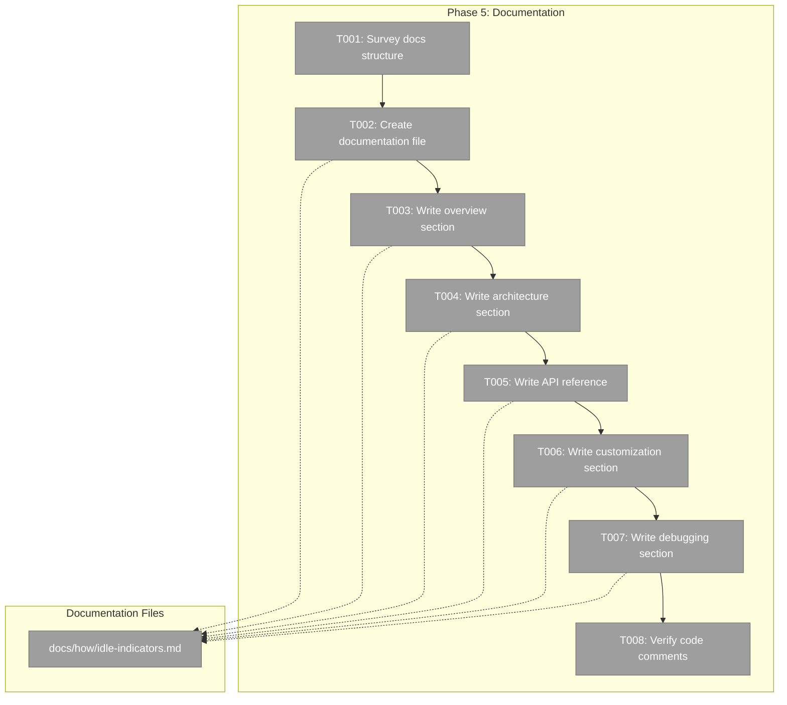

# Phase 5: Documentation – Tasks & Alignment Brief

**Spec**: [../../session-idle-indicators-spec.md](../../session-idle-indicators-spec.md)
**Plan**: [../../session-idle-indicators-plan.md](../../session-idle-indicators-plan.md)
**Date**: 2026-02-05
**GitHub Issue**: https://github.com/vaughanknight/trex/issues/25

---

## Executive Briefing

### Purpose
This phase creates developer documentation for the session idle indicator system. The documentation provides a comprehensive reference for understanding, using, and extending the feature implemented across Phases 1-4.

### What We're Building
A documentation file (`docs/how/idle-indicators.md`) containing:
- Overview explaining what idle indicators do and why they exist
- Architecture diagram showing data flow from activity tracking to visual display
- API reference for all exported functions, hooks, and stores
- Configuration guide for customizing thresholds
- Debugging tips for verifying the feature works correctly

### User Value
Developers (current and future) can quickly understand:
- How the idle indicator system works
- What APIs are available and how to use them
- How to customize behavior via settings
- How to debug issues with activity tracking

### Example
```
Before: No documentation - developers must read source code to understand feature
After:  docs/how/idle-indicators.md provides:
        - Data flow diagram: Activity → Idle State → Visual Colors
        - API reference: useIdleState(sessionId, thresholds?) → IdleStateResult
        - Threshold table: active (5s) → recent (30s) → short (5m) → medium (10m) → long (60m)
        - Debugging: How to verify timestamps update, state transitions work
```

---

## Objectives & Scope

### Objective
Create comprehensive developer documentation for the idle indicator system, satisfying:
- AC-15: Documentation exists at `docs/how/idle-indicators.md`
- All idle states documented with their thresholds and meanings
- Architecture explained with data flow diagram
- API reference for key functions and hooks

### Goals

- ✅ Survey existing `docs/how/` structure for consistency
- ✅ Create `docs/how/idle-indicators.md` with complete content
- ✅ Document all 6 idle states with thresholds and visual mappings
- ✅ Include architecture diagram showing data flow
- ✅ Provide API reference for computeIdleState, useIdleState, stores
- ✅ Add debugging and customization sections
- ✅ Verify code comments in key functions are adequate

### Non-Goals

- ❌ User-facing documentation (this is developer docs only)
- ❌ Inline help text in the UI
- ❌ Video tutorials or walkthroughs
- ❌ Refactoring existing code documentation (only add if missing)
- ❌ Documentation for internal implementation details

---

## Architecture Map

### Component Diagram
<!-- Status: grey=pending, orange=in-progress, green=completed, red=blocked -->
<!-- Updated by plan-6 during implementation -->



### Task-to-Component Mapping

<!-- Status: ⬜ Pending | 🟧 In Progress | ✅ Complete | 🔴 Blocked -->

| Task | Component(s) | Files | Status | Comment |
|------|-------------|-------|--------|---------|
| T001 | docs/how/ | existing .md files | ⬜ Pending | Understand existing documentation style |
| T002 | idle-indicators.md | docs/how/idle-indicators.md | ⬜ Pending | Create file with structure |
| T003 | Overview section | docs/how/idle-indicators.md | ⬜ Pending | What and why |
| T004 | Architecture section | docs/how/idle-indicators.md | ⬜ Pending | Data flow diagram |
| T005 | API Reference section | docs/how/idle-indicators.md | ⬜ Pending | Functions, hooks, stores |
| T006 | Customization section | docs/how/idle-indicators.md | ⬜ Pending | Settings and thresholds |
| T007 | Debugging section | docs/how/idle-indicators.md | ⬜ Pending | Verification tips |
| T008 | Code comments | source files | ⬜ Pending | Verify JSDoc comments |

---

## Tasks

| Status | ID | Task | CS | Type | Dependencies | Absolute Path(s) | Validation | Subtasks | Notes |
|--------|------|------|----|------|--------------|------------------|------------|----------|-------|
| [x] | T001 | Survey existing `docs/how/` structure and style | 1 | Setup | – | /Users/vaughanknight/GitHub/trex/docs/how/ | Document patterns, no conflicts | – | Per task 5.1 |
| [x] | T002 | Create `docs/how/idle-indicators.md` with section structure | 1 | Doc | T001 | /Users/vaughanknight/GitHub/trex/docs/how/idle-indicators.md | File created with headings | – | Per task 5.2 |
| [x] | T003 | Write Overview section explaining what and why | 1 | Doc | T002 | /Users/vaughanknight/GitHub/trex/docs/how/idle-indicators.md | Clear problem/solution statement | – | – |
| [x] | T004 | Write Architecture section with Mermaid diagram | 2 | Doc | T003 | /Users/vaughanknight/GitHub/trex/docs/how/idle-indicators.md | Data flow diagram included | – | – |
| [x] | T005 | Write API Reference for all exported functions/hooks | 2 | Doc | T004 | /Users/vaughanknight/GitHub/trex/docs/how/idle-indicators.md | All APIs documented with signatures | – | Per task 5.3 |
| [x] | T006 | Write Customization section (Settings, thresholds) | 1 | Doc | T005 | /Users/vaughanknight/GitHub/trex/docs/how/idle-indicators.md | Settings panel usage explained | – | Per task 5.3 |
| [x] | T007 | Write Debugging section with verification tips | 1 | Doc | T006 | /Users/vaughanknight/GitHub/trex/docs/how/idle-indicators.md | Troubleshooting steps included | – | Per task 5.4 |
| [x] | T008 | Verify code comments in key source files | 1 | Doc | T007 | /Users/vaughanknight/GitHub/trex/frontend/src/utils/idleState.ts, /Users/vaughanknight/GitHub/trex/frontend/src/hooks/useIdleState.ts | JSDoc present on public APIs | – | Per task 5.5 |

---

## Alignment Brief

### Prior Phases Summary

All 4 implementation phases are complete. This documentation phase synthesizes knowledge from:

#### Phase 1: Activity Tracking Foundation
- **Files Created**: `activityStore.ts`, `useActivityDebounce.ts`, tests
- **Key APIs**: `useActivityStore`, `selectLastActivityAt`, `useActivityDebounce`
- **Pattern**: Separate store for high-frequency data, 150ms debounce

#### Phase 2: Idle State Computation
- **Files Created**: `idleState.ts`, `useIdleState.ts`, tests
- **Key APIs**: `computeIdleState()`, `formatIdleDuration()`, `useIdleState()`, `IdleThresholds`
- **Pattern**: Pure functions with injectable dependencies, 1-second interval

#### Phase 3: Visual Indicators
- **Files Modified**: `SessionItem.tsx`
- **Key APIs**: `IDLE_STATE_COLORS` constant
- **Pattern**: Color mapping with Tailwind classes, CSS transitions

#### Phase 4: Settings Integration
- **Files Created**: `IdleThresholdSettings.tsx`
- **Files Modified**: `settings.ts`, `SettingsPanel.tsx`, `SessionItem.tsx`
- **Key APIs**: `selectIdleThresholds`, `selectIdleIndicatorsEnabled`, `setIdleThresholds`
- **Pattern**: Zustand persist with merge for backwards compatibility

### Cumulative API Reference (for documentation)

| Module | Exports | Purpose |
|--------|---------|---------|
| `activityStore.ts` | `useActivityStore`, `selectLastActivityAt` | Activity timestamp tracking |
| `useActivityDebounce.ts` | `useActivityDebounce`, `ACTIVITY_DEBOUNCE_MS` | Debounced activity updates |
| `idleState.ts` | `computeIdleState`, `formatIdleDuration`, `IdleState`, `IdleThresholds`, `DEFAULT_THRESHOLDS` | Idle computation and formatting |
| `useIdleState.ts` | `useIdleState`, `useIdleComputation`, `IDLE_COMPUTATION_INTERVAL_MS` | React hooks for idle state |
| `settings.ts` | `selectIdleThresholds`, `selectIdleIndicatorsEnabled`, `setIdleThresholds` | Settings persistence |

### Idle State Definitions (for documentation)

| State | Threshold | Color | Meaning |
|-------|-----------|-------|---------|
| `active` | < 5s | Blue | Currently receiving output |
| `recent` | 5s - 30s | Green | Just used |
| `short` | 30s - 5min | Light Green | Brief idle |
| `medium` | 5min - 10min | Amber | Medium idle |
| `long` | 10min - 60min | Red | Long idle |
| `dormant` | > 60min | Grey | Inactive |

### Critical Findings Affecting Documentation

None directly affect Phase 5, but the documentation should reference:
- CF-01: Why debouncing is used (re-render storm prevention)
- CF-02: Why fire-and-forget pattern in input handler
- CF-03: Why useEffect cleanup is critical (timer leaks)
- CF-05: Why separate activity store (shallow equality preservation)

### ADR Constraints

| ADR | Constraint | Documentation Impact |
|-----|-----------|---------------------|
| ADR-0004 | Fakes-only testing | Mention in debugging section (use vi.useFakeTimers) |

---

### Documentation Structure (from plan)

The plan specifies this content outline:
1. **Overview** - What idle indicators do and why
2. **Idle State Definitions** - Table of states with thresholds
3. **Architecture** - Diagram showing data flow
4. **API Reference** - computeIdleState, useIdleState, stores
5. **Debugging** - How to verify tracking works
6. **Customization** - How to change thresholds (Settings panel)

---

### Inputs to Read

| File | Purpose |
|------|---------|
| `/Users/vaughanknight/GitHub/trex/docs/how/terminal-architecture.md` | Style reference |
| `/Users/vaughanknight/GitHub/trex/docs/how/webgl-pooling.md` | Recent documentation example |
| `/Users/vaughanknight/GitHub/trex/frontend/src/utils/idleState.ts` | API signatures |
| `/Users/vaughanknight/GitHub/trex/frontend/src/hooks/useIdleState.ts` | Hook signatures |
| `/Users/vaughanknight/GitHub/trex/frontend/src/stores/settings.ts` | Settings API |

---

### Commands to Run

```bash
cd /Users/vaughanknight/GitHub/trex

# Verify documentation file exists
ls -la docs/how/idle-indicators.md

# Verify markdown renders (if you have a preview tool)
# npm run docs:preview  # if available
```

---

### Risks & Unknowns

| Risk | Severity | Mitigation |
|------|----------|------------|
| Documentation becomes outdated | Low | Link to source files, reference phase execution logs |
| Diagram too complex | Low | Use simple Mermaid flowchart |
| Missing API details | Low | Cross-reference source files during writing |

---

### Ready Check

- [x] Prior phases reviewed (Phases 1-4 complete, 69 tests passing)
- [x] Existing docs/how/ structure surveyed (3 existing files)
- [x] Content outline from plan identified
- [x] All APIs to document catalogued
- [ ] **Awaiting GO/NO-GO**

---

## Phase Footnote Stubs

_No footnotes yet. Will be added by plan-6 during implementation._

| Footnote | Task | Description | Date |
|----------|------|-------------|------|
| | | | |

---

## Evidence Artifacts

- **Execution Log**: `tasks/phase-5-documentation/execution.log.md`
- **Documentation File**: `docs/how/idle-indicators.md`

---

## Discoveries & Learnings

_Populated during implementation by plan-6. Log anything of interest to your future self._

| Date | Task | Type | Discovery | Resolution | References |
|------|------|------|-----------|------------|------------|
| | | | | | |

**Types**: `gotcha` | `research-needed` | `unexpected-behavior` | `workaround` | `decision` | `debt` | `insight`

---

## Directory Layout

```
docs/plans/007-session-idle-indicators/
├── session-idle-indicators-spec.md
├── session-idle-indicators-plan.md
└── tasks/
    ├── phase-1-activity-tracking-foundation/
    │   ├── tasks.md
    │   └── execution.log.md
    ├── phase-2-idle-state-computation/
    │   ├── tasks.md
    │   └── execution.log.md
    ├── phase-3-visual-indicators/
    │   ├── tasks.md
    │   └── execution.log.md
    ├── phase-4-settings-integration/
    │   ├── tasks.md
    │   └── execution.log.md
    └── phase-5-documentation/
        ├── tasks.md              # This file
        └── execution.log.md      # Created by plan-6

docs/how/
├── terminal-architecture.md
├── terminal-development.md
├── webgl-pooling.md
└── idle-indicators.md            # Created by this phase
```
