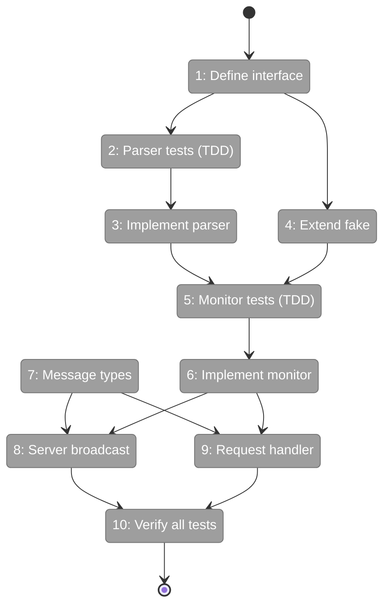
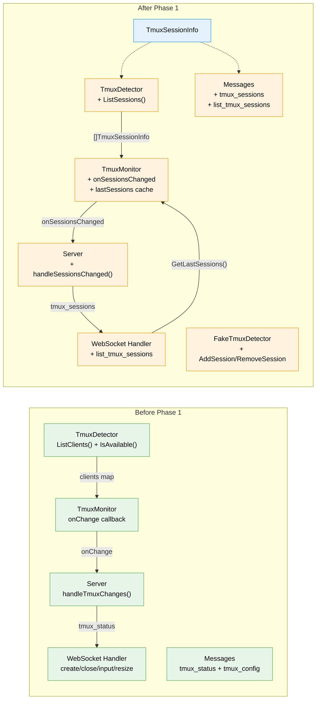

# Flight Plan: Phase 1 — Backend tmux Session Discovery

**Plan**: [deep-tmux-integration-plan.md](../../deep-tmux-integration-plan.md)
**Phase**: Phase 1: Backend tmux Session Discovery
**Generated**: 2026-02-19
**Status**: Ready for takeoff

---

## Departure → Destination

**Where we are**: The backend already tracks which trex terminals happen to be
running inside tmux (Plan 014: `TmuxDetector.ListClients()` + `TmuxMonitor`
polling loop). But it has no idea which tmux sessions *exist* on the system —
it only sees client attachments after the fact. The frontend receives
`tmux_status` messages about attachment changes but has no session list to
display.

**Where we're going**: By the end of this phase, the backend will actively
discover all tmux sessions on the machine via `tmux list-sessions`, push
the list to every connected frontend via a new `tmux_sessions` WebSocket
message, and cache the last-known list so transient tmux hiccups don't flash
an empty sidebar. A frontend connecting for the first time can also request
the current list on demand via `list_tmux_sessions`.

---

## Flight Status

<!-- Updated by /plan-6: pending → active → done. Use blocked for problems/input needed. -->

**Legend**: grey = pending | yellow = active | red = blocked/needs input | green = done

---

## Stages

<!-- Updated by /plan-6 during implementation: [ ] → [~] → [x] -->

- [ ] **Stage 1: Define TmuxSessionInfo struct and extend the TmuxDetector interface** — add `ListSessions()` method and clean stale ADR-0001 comments (`tmux_detector.go`)
- [ ] **Stage 2: Write parser tests first** — table-driven tests for `parseTmuxSessions()` covering empty, single, multiple, special chars, and malformed lines (`tmux_detector_test.go`)
- [ ] **Stage 3: Implement the session parser and real detector** — `parseTmuxSessions()` + `RealTmuxDetector.ListSessions()` using `tmux list-sessions -F` with tab-delimited output (`tmux_detector.go`)
- [ ] **Stage 4: Extend FakeTmuxDetector with session helpers** — `AddSession()`, `RemoveSession()`, `ListSessions()` with copy semantics and tests (`tmux_detector.go`, `tmux_detector_test.go`)
- [ ] **Stage 5: Write monitor session-detection tests first** — tests for initial discovery, add, remove, error recovery, and idempotent no-change (`tmux_monitor_test.go`)
- [ ] **Stage 6: Implement dual-callback monitor with caching** — add `onSessionsChanged` callback, `lastSessions` cache, `pollSessions()` method, `GetLastSessions()` getter, and update constructor signature (`tmux_monitor.go`, `server.go`)
- [ ] **Stage 7: Add message type constants and ServerMessage field** — `MsgTypeTmuxSessions`, `MsgTypeListTmuxSessions`, and `TmuxSessions []TmuxSessionInfo` field (`messages.go`)
- [ ] **Stage 8: Wire monitor to WebSocket broadcast** — `handleSessionsChanged()` iterates registry, deduplicates by connection, sends `tmux_sessions` to all clients (`server.go`)
- [ ] **Stage 9: Add on-demand session list request handler** — `list_tmux_sessions` dispatch case reads cached sessions via `GetLastSessions()` and responds (`terminal.go`)
- [ ] **Stage 10: Run full backend test suite** — `go test ./...` with zero regressions from Plan 014 (all backend packages)

---

## Acceptance Criteria

- [ ] `TmuxDetector.ListSessions()` returns accurate session list
- [ ] `FakeTmuxDetector` supports session add/remove for testing
- [ ] `TmuxMonitor` detects session additions and removals
- [ ] WebSocket clients receive `tmux_sessions` messages on changes
- [ ] All existing Plan 014 tests pass (no regressions)
- [ ] Error recovery: transient failures don't flash empty session list

---

## Goals & Non-Goals

**Goals**:
- Add `ListSessions() ([]TmuxSessionInfo, error)` to `TmuxDetector` interface
- Implement in `RealTmuxDetector` using `tmux list-sessions -F` with tab-delimited parsing
- Extend `FakeTmuxDetector` with `AddSession()`/`RemoveSession()`/`ListSessions()`
- Extend `TmuxMonitor` with `onSessionsChanged` callback and `lastSessions` error recovery
- Add `tmux_sessions` WebSocket message type (server→client broadcast)
- Add `list_tmux_sessions` WebSocket message type (client→server request)
- All existing Plan 014 tests pass (zero regressions)

**Non-Goals**:
- Frontend changes (Phase 3)
- tmux-attach session creation (Phase 2)
- `filterTmuxEnv()` or env var stripping (Phase 2)
- `ClientMessage` tmux target fields (Phase 2)
- Settings store tmux toggle/socket (Phase 6)
- Session death detection wiring (Phase 6)

---

## Architecture: Before & After

**Legend**: existing (green, unchanged) | changed (orange, modified) | new (blue, created)

---

## Checklist

- [ ] T001: Define TmuxSessionInfo struct + extend TmuxDetector interface + clean stale comments (CS-1)
- [ ] T002: Write parser tests — 8+ cases with Test Doc block (CS-1)
- [ ] T003: Implement parseTmuxSessions() + RealTmuxDetector.ListSessions() (CS-2)
- [ ] T004: Extend FakeTmuxDetector with session helpers + tests (CS-1)
- [ ] T005: Write TmuxMonitor session change detection tests — 5+ cases (CS-2)
- [ ] T006: Implement dual-callback monitor + lastSessions cache + GetLastSessions() (CS-2)
- [ ] T007: Add MsgTypeTmuxSessions + MsgTypeListTmuxSessions + ServerMessage field (CS-1)
- [ ] T008: Wire onSessionsChanged to broadcast in server.go (CS-2)
- [ ] T009: Add list_tmux_sessions handler in terminal.go (CS-2)
- [ ] T010: Run full backend test suite — zero regressions (CS-1)

---

## PlanPak

Not active for this plan.
