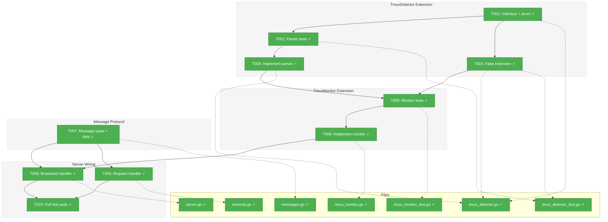
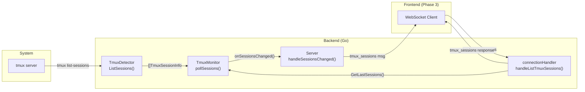
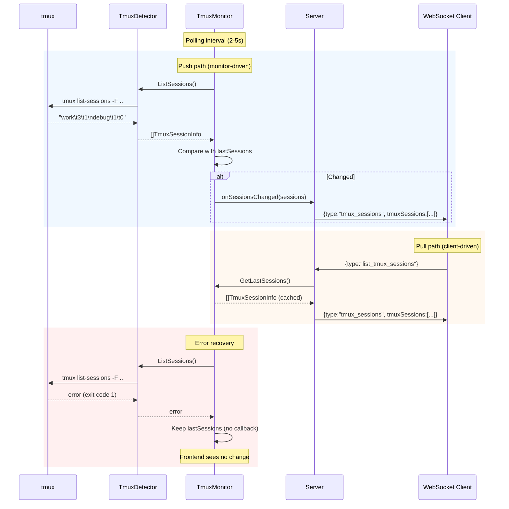

# Phase 1: Backend tmux Session Discovery – Tasks & Alignment Brief

**Spec**: [deep-tmux-integration-spec.md](../../deep-tmux-integration-spec.md)
**Plan**: [deep-tmux-integration-plan.md](../../deep-tmux-integration-plan.md)
**Date**: 2026-02-18
**Phase**: 1 of 6
**Testing Approach**: TDD (per plan)

---

## Executive Briefing

### Purpose
This phase extends the existing Plan 014 `TmuxDetector` and `TmuxMonitor` infrastructure with session discovery capabilities, enabling the backend to enumerate all tmux sessions on the system and broadcast changes to connected frontends via WebSocket.

### What We're Building
- `TmuxDetector.ListSessions()` — new interface method that parses `tmux list-sessions` output into structured `TmuxSessionInfo` data
- `TmuxMonitor` dual-callback architecture — a second polling path that detects tmux session additions/removals with error recovery (cached last-known state)
- WebSocket protocol extension — `tmux_sessions` broadcast on change + `list_tmux_sessions` client request for on-demand refresh
- `FakeTmuxDetector` session helpers — `AddSession()`/`RemoveSession()` for downstream phase testing

### User Value
This is the foundational backend work that enables the Phase 3 tmux sidebar. Without session discovery, the frontend has no way to know which tmux sessions exist on the system.

### Example
**Before**: Backend only tracks which trex sessions happen to be inside tmux (client attachment detection via Plan 014).
**After**: Backend actively discovers ALL tmux sessions on the system and pushes the list to frontends:
```
Server → Client: {"type":"tmux_sessions","tmuxSessions":[{"name":"work","windows":3,"attached":1},{"name":"debug","windows":1,"attached":0}]}
```

---

## Objectives & Scope

### Objective
Extend `TmuxDetector` with `ListSessions()` and wire session list broadcasting through `TmuxMonitor` and WebSocket, satisfying Phase 1 acceptance criteria from the plan.

### Goals

- ✅ Add `ListSessions() ([]TmuxSessionInfo, error)` to `TmuxDetector` interface
- ✅ Implement in `RealTmuxDetector` using `tmux list-sessions -F` with tab-delimited parsing
- ✅ Extend `FakeTmuxDetector` with `AddSession()`/`RemoveSession()`/`ListSessions()`
- ✅ Extend `TmuxMonitor` with `onSessionsChanged` callback and `lastSessions` error recovery
- ✅ Add `tmux_sessions` WebSocket message type (server→client broadcast)
- ✅ Add `list_tmux_sessions` WebSocket message type (client→server request)
- ✅ All existing Plan 014 tests pass (zero regressions)

### Non-Goals

- ❌ Frontend changes (Phase 3)
- ❌ tmux-attach session creation (Phase 2)
- ❌ `filterTmuxEnv()` or env var stripping (Phase 2)
- ❌ `ClientMessage` tmux target fields (Phase 2)
- ❌ Settings store tmux toggle/socket (Phase 6)
- ❌ Session death detection wiring (Phase 6 — though monitor infrastructure is laid here)

---

## Pre-Implementation Audit

### Summary
| File | Action | Origin | Modified By | Recommendation |
|------|--------|--------|-------------|----------------|
| `backend/internal/terminal/tmux_detector.go` | Modify | Plan 014 | — | reuse-existing (stale ADR-0001 comments need cleanup) |
| `backend/internal/terminal/tmux_detector_test.go` | Modify | Plan 014 | — | reuse-existing |
| `backend/internal/terminal/tmux_monitor.go` | Modify | Plan 014 | — | reuse-existing |
| `backend/internal/terminal/tmux_monitor_test.go` | Modify | Plan 014 | — | reuse-existing |
| `backend/internal/terminal/messages.go` | Modify | Plan 014 | — | reuse-existing |
| `backend/internal/server/server.go` | Modify | Plan 014 | — | reuse-existing |
| `backend/internal/server/terminal.go` | Modify | Plan 014 | — | reuse-existing |

### Compliance Check
| Severity | File | Rule/ADR | Violation | Suggested Fix |
|----------|------|----------|-----------|---------------|
| MEDIUM | `tmux_detector.go` | ADR-0001 (superseded) | Lines 11-12 and 25-26 reference "tmax library per ADR-0001" — ADR-0001 superseded by Constitution v1.4.0 | Update comments to: "Per Constitution v1.4.0, trex owns this integration directly" |

All other files: no violations. ADR-0004 (fakes only) compliant throughout. Architecture layer boundaries respected — all tmux code in `internal/terminal/`, server wiring in `internal/server/`.

---

## Requirements Traceability

### Coverage Matrix
| AC | Description | Flow Summary | Files in Flow | Tasks | Status |
|----|-------------|-------------|---------------|-------|--------|
| AC1 | ListSessions() returns accurate session list | Interface → RealTmuxDetector → parser | `tmux_detector.go`, `tmux_detector_test.go` | T001, T002, T003 | ✅ Complete |
| AC2 | FakeTmuxDetector supports session add/remove | Fake methods → copy semantics | `tmux_detector.go`, `tmux_detector_test.go` | T004 | ✅ Complete |
| AC3 | TmuxMonitor detects session additions/removals | pollSessions() → compare → callback | `tmux_monitor.go`, `tmux_monitor_test.go` | T005, T006 | ✅ Complete |
| AC4 | WebSocket clients receive tmux_sessions messages | Monitor callback → server broadcast → WS | `messages.go`, `server.go`, `terminal.go` | T007, T008, T009 | ✅ Complete |
| AC5 | All existing Plan 014 tests pass | Full test suite run | All backend test files | T010 | ✅ Complete |
| AC6 | Error recovery: no empty sidebar flash | lastSessions cache → skip callback on error | `tmux_monitor.go`, `tmux_monitor_test.go` | T005, T006 | ✅ Complete |

### Gaps Found
No gaps — all acceptance criteria have complete file coverage.

### Key Flow Note
Session list broadcast uses a **different pattern** than Plan 014's attachment change broadcast:
- **Attachment changes** (Plan 014): grouped by connection, each client gets only updates for ITS sessions
- **Session list changes** (Phase 1): broadcast to ALL connections — every client gets the same full session list

---

## Architecture Map

### Component Diagram
<!-- Status: grey=pending, orange=in-progress, green=completed, red=blocked -->
<!-- Updated by plan-6 during implementation -->



### Task-to-Component Mapping

<!-- Status: ⬜ Pending | 🟧 In Progress | ✅ Complete | 🔴 Blocked -->

| Task | Component(s) | Files | Status | Comment |
|------|-------------|-------|--------|---------|
| T001 | TmuxDetector interface | `tmux_detector.go` | ✅ Complete | Define struct + extend interface + clean stale comments |
| T002 | Parser tests | `tmux_detector_test.go` | ✅ Complete | TDD: write failing tests first |
| T003 | Parser implementation | `tmux_detector.go` | ✅ Complete | Make T002 tests pass |
| T004 | FakeTmuxDetector | `tmux_detector.go`, `tmux_detector_test.go` | ✅ Complete | Extend fake + write tests |
| T005 | Monitor tests | `tmux_monitor_test.go` | ✅ Complete | TDD: write failing tests first |
| T006 | Monitor implementation | `tmux_monitor.go` | ✅ Complete | Dual callback + error recovery + GetLastSessions() |
| T007 | Message protocol | `messages.go` | ✅ Complete | Constants + ServerMessage field |
| T008 | Server broadcast | `server.go` | ✅ Complete | Wire onSessionsChanged + broadcast to all clients |
| T009 | Request handler | `terminal.go` | ✅ Complete | list_tmux_sessions dispatch + handler |
| T010 | Verification | All backend | ✅ Complete | `go test ./...` — no regressions |

---

## Tasks

| Status | ID | Task | CS | Type | Dependencies | Absolute Path(s) | Validation | Subtasks | Notes |
|--------|------|------|-----|------|-------------|-------------------|------------|----------|-------|
| [x] | T001 | Define `TmuxSessionInfo` struct (Name, Windows, Attached fields with JSON tags). Add `ListSessions() ([]TmuxSessionInfo, error)` to `TmuxDetector` interface. Clean stale ADR-0001 comments to reference Constitution v1.4.0. | 1 | Setup | – | `/Users/vaughanknight/GitHub/trex/backend/internal/terminal/tmux_detector.go` | Interface compiles; existing implementations fail (forces T003+T004). Stale comments updated. | – | Plan task 1.1. Per ADR-0001 supersession. |
| [x] | T002 | Write tests for `parseTmuxSessions()` parser function. Test cases: empty output, single session, multiple sessions, sessions with special chars (dots, hyphens), tmux not running (empty), malformed lines. Include Test Doc block. | 1 | Test | T001 | `/Users/vaughanknight/GitHub/trex/backend/internal/terminal/tmux_detector_test.go` | Tests compile and FAIL (parser not yet implemented). 8+ test cases covering happy + edge paths. | – | Plan task 1.2. TDD red phase. Follow `TestParseTmuxClients` pattern. |
| [x] | T003 | Implement `parseTmuxSessions()` and `RealTmuxDetector.ListSessions()`. Parser uses tab-delimited format from `tmux list-sessions -F '#{session_name}\t#{session_windows}\t#{session_attached}'`. Exit code 1 → empty slice (not error). | 2 | Core | T002 | `/Users/vaughanknight/GitHub/trex/backend/internal/terminal/tmux_detector.go` | All T002 tests pass. Follows `ListClients()` pattern: context timeout, exit code handling. | – | Plan task 1.3. Per Critical Finding #04 + #10 (raw CLI). |
| [x] | T004 | Extend `FakeTmuxDetector` with `sessions []TmuxSessionInfo` field, `AddSession(name string, windows, attached int)`, `RemoveSession(name string)`, `ListSessions()`. Write tests for fake session methods (includes copy-not-reference test). | 1 | Core | T001 | `/Users/vaughanknight/GitHub/trex/backend/internal/terminal/tmux_detector.go`, `/Users/vaughanknight/GitHub/trex/backend/internal/terminal/tmux_detector_test.go` | Fake returns configured sessions. Existing fake tests still pass. Copy semantics verified. | – | Plan task 1.4. Per ADR-0004 (fakes only). |
| [x] | T005 | Write tests for `TmuxMonitor` session list change detection. Test cases: initial discovery (first poll finds sessions), session added (new session appears), session removed (session disappears), `ListSessions()` error recovery (reuse cached `lastSessions`), no change (idempotent — callback not called). Include Test Doc block. | 2 | Test | T003, T004 | `/Users/vaughanknight/GitHub/trex/backend/internal/terminal/tmux_monitor_test.go` | Tests compile and FAIL (monitor session polling not yet implemented). 5+ test cases. Error recovery test verifies callback NOT called on error. | – | Plan task 1.5. TDD red phase. Per Critical Finding #05. |
| [x] | T006 | Extend `TmuxMonitor` with: (a) `onSessionsChanged func([]TmuxSessionInfo)` callback field, (b) `lastSessions []TmuxSessionInfo` cache, (c) `pollSessions()` method (separate from existing `poll()` — keeps client tracking independent), (d) error recovery in `pollSessions()` (reuse `lastSessions` on error), (e) `GetLastSessions() []TmuxSessionInfo` getter for request handler, (f) update `NewTmuxMonitor` signature to accept `onSessionsChanged` callback, (g) call `pollSessions()` from `run()` on same ticker. | 2 | Core | T005 | `/Users/vaughanknight/GitHub/trex/backend/internal/terminal/tmux_monitor.go` | All T005 tests pass. Error recovery works. `GetLastSessions()` returns cached copy. Existing Plan 014 tests still pass. | – | Plan task 1.6. Per Critical Finding #05. Extraction-ready: no trex-specific imports. |
| [x] | T007 | Add message type constants: `MsgTypeTmuxSessions = "tmux_sessions"` (server→client), `MsgTypeListTmuxSessions = "list_tmux_sessions"` (client→server). Add `TmuxSessions []TmuxSessionInfo` field to `ServerMessage` with `json:"tmuxSessions,omitempty"` tag. | 1 | Core | – | `/Users/vaughanknight/GitHub/trex/backend/internal/terminal/messages.go` | Constants defined. Field added. Existing messages marshal/unmarshal correctly (omitempty preserves backward compat). | – | Plan task 1.7. Per Critical Finding #06 (additive protocol). |
| [x] | T008 | Wire `TmuxMonitor.onSessionsChanged` to WebSocket broadcast in `server.go`. Add `handleSessionsChanged(sessions []TmuxSessionInfo)` method. Pattern: iterate registry sessions, deduplicate by connection, send ONE `tmux_sessions` message per connection with full session list. Update `New()` to pass callback to monitor constructor. | 2 | Integration | T006, T007 | `/Users/vaughanknight/GitHub/trex/backend/internal/server/server.go` | When monitor detects session list change, all connected clients receive `tmux_sessions` message. Existing `handleTmuxChanges` unchanged. | – | Plan task 1.8 (broadcast part). Note: broadcasts to ALL clients (unlike attachment changes which are per-session). |
| [x] | T009 | Add `list_tmux_sessions` dispatch case in `handleMessage()` switch. Implement `handleListTmuxSessions()` handler: get cached sessions from `h.server.monitor.GetLastSessions()`, send `tmux_sessions` response to requesting client. | 2 | Integration | T006, T007 | `/Users/vaughanknight/GitHub/trex/backend/internal/server/terminal.go` | Client sending `list_tmux_sessions` receives `tmux_sessions` response with current session list. | – | Plan task 1.8 (request part). |
| [x] | T010 | Run full backend test suite: `cd backend && go test ./...`. Verify zero regressions from Plan 014 tests. | 1 | Verification | T008, T009 | `/Users/vaughanknight/GitHub/trex/backend/` | All tests pass. No regressions. | – | Plan task 1.9. |

---

## Alignment Brief

### Critical Findings Affecting This Phase

| # | Finding | What it Constrains | Addressed By |
|---|---------|-------------------|-------------|
| #04 | TmuxDetector Interface Extension Pattern | ListSessions() must follow existing pattern; extraction-ready, no trex-specific imports | T001, T003 |
| #05 | TmuxMonitor Needs Dual-Callback Architecture | Second callback for session list; error recovery with lastSessions cache | T005, T006 |
| #06 | WebSocket Protocol Extension Must Be Additive | New message types must be forward/backward compatible; omitempty on new fields | T007 |
| #10 | Raw CLI Approach Confirmed | Use raw `exec.Command("tmux", ...)` — no gotmux library | T003 |

### ADR Decision Constraints

- **ADR-0001** (Superseded): Clean up stale comments referencing tmax library. Addressed by T001.
- **ADR-0004** (Fakes Only): All test doubles must use `FakeTmuxDetector` pattern. No mock libraries. Addressed by T004.

### Invariants & Guardrails

- **Extraction-readiness**: All code in `backend/internal/terminal/` must have ZERO imports from `server`, `config`, or other trex-specific packages. The detector, monitor, and message types should be extractable to a standalone Go module.
- **Backward compatibility**: Existing `ListClients()`, `poll()`, `onChange` callback, and `tmux_status` messages MUST remain unchanged. All Plan 014 tests must pass without modification.
- **Error resilience**: `ListSessions()` failures must NOT crash the monitor or flash empty sidebar. Cache last-known state and retry next interval.

### Inputs to Read (Exact File Paths)

| File | Why |
|------|-----|
| `/Users/vaughanknight/GitHub/trex/backend/internal/terminal/tmux_detector.go` | Existing interface, RealTmuxDetector, FakeTmuxDetector, parseTmuxClients pattern |
| `/Users/vaughanknight/GitHub/trex/backend/internal/terminal/tmux_detector_test.go` | Existing test patterns (Test Doc blocks, parser table tests, fake tests) |
| `/Users/vaughanknight/GitHub/trex/backend/internal/terminal/tmux_monitor.go` | Existing monitor: polling loop, callback, error handling, backoff |
| `/Users/vaughanknight/GitHub/trex/backend/internal/terminal/tmux_monitor_test.go` | Existing monitor tests: `newTestSession()` helper, change detection patterns |
| `/Users/vaughanknight/GitHub/trex/backend/internal/terminal/messages.go` | Message types, ClientMessage/ServerMessage structs |
| `/Users/vaughanknight/GitHub/trex/backend/internal/server/server.go` | Monitor initialization in `New()`, `handleTmuxChanges()` broadcast pattern |
| `/Users/vaughanknight/GitHub/trex/backend/internal/server/terminal.go` | `handleMessage()` dispatch switch, `handleTmuxConfig()` handler pattern |

### Visual Alignment Aids

#### System State Flow



#### Interaction Sequence



### Test Plan (TDD)

| Test | Rationale | Fixture | Expected |
|------|-----------|---------|----------|
| `TestParseTmuxSessions_EmptyOutput` | tmux server not running | `""` | `nil` |
| `TestParseTmuxSessions_SingleSession` | Happy path | `"work\t3\t1"` | `[{Name:"work",Windows:3,Attached:1}]` |
| `TestParseTmuxSessions_MultipleSessions` | Multiple sessions | `"work\t3\t1\ndebug\t1\t0"` | Two items |
| `TestParseTmuxSessions_SpecialCharNames` | Dots, hyphens, underscores | `"my.session-1_test\t1\t0"` | Parsed as-is |
| `TestParseTmuxSessions_MalformedLine` | Bad tab count | `"work\t3"` | Skipped |
| `TestParseTmuxSessions_WhitespaceOnly` | Blank lines | `"  \n\n"` | `nil` |
| `TestFakeTmuxDetector_Sessions` | Fake session CRUD | AddSession/RemoveSession/ListSessions | Correct state |
| `TestFakeTmuxDetector_SessionsCopy` | Copy semantics | Mutate returned slice | Original unchanged |
| `TestTmuxMonitor_DetectSessionAdded` | New session appears | FakeDetector with session | Callback called with session |
| `TestTmuxMonitor_DetectSessionRemoved` | Session disappears | Remove from FakeDetector | Callback called with updated list |
| `TestTmuxMonitor_SessionListError` | ListSessions() fails | FakeDetector with error | Callback NOT called; lastSessions preserved |
| `TestTmuxMonitor_SessionListNoChange` | Idempotent | Same sessions as before | Callback NOT called |
| `TestTmuxMonitor_SessionListInitial` | First poll | Sessions exist at start | Callback called (first discovery) |

### Step-by-Step Implementation Outline

1. **T001** — Add `TmuxSessionInfo` struct above `FakeTmuxDetector`. Add `ListSessions()` to `TmuxDetector` interface. Update stale ADR-0001 comments. Build fails (implementations missing) — expected.
2. **T002** — Write `TestParseTmuxSessions` table-driven test (8+ cases) following `TestParseTmuxClients` pattern. Include Test Doc block. Tests fail — `parseTmuxSessions()` doesn't exist yet.
3. **T003** — Implement `parseTmuxSessions()` (tab-split, `strconv.Atoi` for numbers, skip malformed). Implement `RealTmuxDetector.ListSessions()` (context timeout, `tmux list-sessions -F`, exit code 1 → empty). All T002 tests pass.
4. **T004** — Add `sessions []TmuxSessionInfo` to `FakeTmuxDetector`. Implement `AddSession()`, `RemoveSession()`, `ListSessions()` (return copy). Write tests. Existing fake tests still pass.
5. **T005** — Write monitor session list tests: initial discovery, add, remove, error recovery, idempotent. Tests fail — `pollSessions()` doesn't exist yet.
6. **T006** — Add `onSessionsChanged` callback and `lastSessions` to monitor struct. Update `NewTmuxMonitor` constructor (add param). Add `pollSessions()` method. Add `GetLastSessions()` getter. Wire `pollSessions()` into `run()` loop. Update existing `NewTmuxMonitor` call in `server.go` (add `nil` for now). All T005 tests pass.
7. **T007** — Add `MsgTypeTmuxSessions` and `MsgTypeListTmuxSessions` constants. Add `TmuxSessions []TmuxSessionInfo` field to `ServerMessage`.
8. **T008** — Add `handleSessionsChanged()` to server (iterate registry, dedupe by conn, send tmux_sessions). Wire into `New()` as monitor's `onSessionsChanged` callback.
9. **T009** — Add `MsgTypeListTmuxSessions` case in `handleMessage()`. Implement `handleListTmuxSessions()`: call `monitor.GetLastSessions()`, send response.
10. **T010** — Run `cd backend && go test ./...`. All tests pass. Zero regressions.

### Commands to Run

```bash
# Run all backend tests
cd /Users/vaughanknight/GitHub/trex/backend && go test ./...

# Run only terminal package tests (faster iteration)
cd /Users/vaughanknight/GitHub/trex/backend && go test ./internal/terminal/ -v

# Run specific test
cd /Users/vaughanknight/GitHub/trex/backend && go test ./internal/terminal/ -run TestParseTmuxSessions -v

# Build check (compile only)
cd /Users/vaughanknight/GitHub/trex/backend && go build ./...
```

### Risks & Unknowns

| Risk | Severity | Mitigation |
|------|----------|------------|
| `NewTmuxMonitor` signature change breaks caller | Low | Only one caller (server.go `New()`); update in T006 |
| `pollSessions()` adds latency to existing `poll()` cycle | Low | Separate method called from same ticker; tmux CLI is <50ms |
| `TmuxSessionInfo` JSON tags don't match frontend expectations | Low | Phase 1 is backend-only; tags can be adjusted before Phase 3 |

### Ready Check

- [x] Plan 014 infrastructure reviewed and understood
- [x] Critical Findings #04, #05, #06, #10 mapped to tasks
- [x] ADR-0001 supersession captured in T001
- [x] ADR-0004 constraints mapped to T004
- [x] TDD ordering verified: T002 (test) before T003 (impl), T005 (test) before T006 (impl)
- [x] All acceptance criteria covered in task table
- [x] Extraction-readiness constraint noted for all `internal/terminal/` code
- [x] **GO / NO-GO**: APPROVED — all 10 tasks complete

---

## Phase Footnote Stubs

_Populated during implementation by plan-6._

| Footnote | Task | Description |
|----------|------|-------------|
| | | |

---

## Evidence Artifacts

Implementation will produce:
- `tasks/phase-1-backend-tmux-session-discovery/execution.log.md` — detailed implementation narrative
- Test output from `go test ./...` — captured in execution log

### Directory Layout

```
docs/plans/018-deep-tmux-integration/
  ├── deep-tmux-integration-spec.md
  ├── deep-tmux-integration-plan.md
  └── tasks/phase-1-backend-tmux-session-discovery/
      ├── tasks.md                 # This file
      ├── tasks.fltplan.md         # Generated by /plan-5b
      └── execution.log.md         # Created by /plan-6
```

---

## Discoveries & Learnings

_Populated during implementation by plan-6. Log anything of interest to your future self._

| Date | Task | Type | Discovery | Resolution | References |
|------|------|------|-----------|------------|------------|
| | | | | | |

**Types**: `gotcha` | `research-needed` | `unexpected-behavior` | `workaround` | `decision` | `debt` | `insight`

**What to log**:
- Things that didn't work as expected
- External research that was required
- Implementation troubles and how they were resolved
- Gotchas and edge cases discovered
- Decisions made during implementation
- Technical debt introduced (and why)
- Insights that future phases should know about

_See also: `execution.log.md` for detailed narrative._
