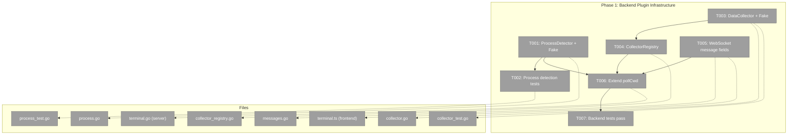

# Phase 1: Backend Plugin Infrastructure – Tasks & Alignment Brief

**Spec**: [../../visualisation-plugins-spec.md](../../visualisation-plugins-spec.md)
**Plan**: [../../visualisation-plugins-plan.md](../../visualisation-plugins-plan.md)
**Date**: 2026-02-26

---

## Executive Briefing

### Purpose
This phase builds the backend foundation for the visualisation plugin system — the plumbing that detects what tool is running in each terminal pane and sends plugin-specific data to the frontend via WebSocket. Without this, the frontend has no data to visualise.

### What We're Building
Three backend capabilities:
1. **Process tree detection** — walks child processes of each PTY shell to identify running tools (e.g., "copilot", "claude")
2. **DataCollector framework** — interface + registry for backend data collectors that gather plugin-specific data (e.g., read a SQLite DB)
3. **WebSocket plugin_data transport** — new message type carrying plugin-specific JSON from backend collectors to frontend stores

### User Value
Enables the platform to know *what* is running in each terminal and *push relevant data* to the frontend for inline visualisation. This is the invisible infrastructure that makes plugins possible.

### Example
```
Terminal pane runs: zsh → node → copilot
Backend detects: ["zsh", "node", "copilot"]
Copilot collector matches "copilot", reads session DB
Backend sends: { type: "plugin_data", sessionId: "s1", pluginId: "copilot-todos", data: {...} }
Frontend receives data and renders pills/rings (Phase 3-4)
```

---

## Objectives & Scope

### Objective
Implement backend plugin infrastructure: process detection, DataCollector interface + registry, WebSocket plugin_data message, and integrated polling.

### Goals

- ✅ `ProcessDetector` interface + platform implementation (macOS/Linux via `ps`/`pgrep`)
- ✅ `FakeProcessDetector` for testing (ADR-0004)
- ✅ `DataCollector` interface with `ID()`, `ProcessMatch()`, `Collect()`, `Interval()`
- ✅ `FakeDataCollector` for testing
- ✅ `CollectorRegistry` with thread-safe registration and lookup
- ✅ `ServerMessage` extended with `PluginId` + `PluginData` fields
- ✅ `MsgTypePluginData` constant added
- ✅ `pollCwd()` extended to detect processes, match collectors, invoke and send data
- ✅ Frontend `ServerMessageType` updated with `'plugin_data'`
- ✅ All backend tests pass

### Non-Goals

- ❌ Frontend WebSocket routing of plugin_data (Phase 2)
- ❌ Frontend plugin registry or stores (Phase 2)
- ❌ Rendering surfaces / widgets (Phase 3)
- ❌ Copilot SQLite reader (Phase 4)
- ❌ Plugin settings UI (Phase 2-3)
- ❌ Per-collector polling intervals (all share 5s ticker for now)

---

## Pre-Implementation Audit

### Summary Table

| File | Action | Origin | Recommendation |
|------|--------|--------|----------------|
| `backend/internal/terminal/process.go` | Exists (partial) | Plan 025 | ✅ Complete implementation |
| `backend/internal/terminal/process_test.go` | Create | New | ✅ TDD ready |
| `backend/internal/terminal/collector.go` | Create | New | ✅ New interface |
| `backend/internal/terminal/collector_test.go` | Create | New | ✅ TDD ready |
| `backend/internal/terminal/collector_registry.go` | Create | New | ✅ Follows SessionRegistry pattern |
| `backend/internal/terminal/messages.go` | Modify | Plan 016+ | 🔴 Add PluginId + PluginData fields |
| `backend/internal/server/terminal.go` | Modify | Plan 016+ | 🔴 Extend pollCwd + add processDetector field |
| `frontend/src/types/terminal.ts` | Modify | Plan 016+ | 🔴 Add plugin_data to ServerMessageType |

### Compliance Check
- ✅ ADR-0004: All new interfaces have Fake implementations
- ✅ Architecture: Follows existing CwdDetector/SessionRegistry patterns
- ✅ Rules: TDD approach with test files for all new code
- No violations found.

---

## Requirements Traceability

### Coverage Matrix

| AC | Description | Files in Flow | Tasks | Status |
|----|-------------|---------------|-------|--------|
| AC-02 | Backend process detection | process.go, terminal.go | T001, T002 | ✅ Complete |
| AC-04 | WebSocket plugin_data transport | messages.go, terminal.go, terminal.ts | T005, T006 | ✅ Complete |
| AC-10 | DataCollector interface | collector.go, collector_registry.go | T003, T004 | ✅ Complete |

### Gaps Found
None — all acceptance criteria have complete file coverage after task expansion.

---

## Architecture Map

### Component Diagram



### Task-to-Component Mapping

| Task | Component(s) | Files | Status | Comment |
|------|-------------|-------|--------|---------|
| T001 | Process Detection | process.go | ⬜ Pending | Complete ProcessDetector (partially exists) |
| T002 | Process Tests | process_test.go | ⬜ Pending | TDD tests for process tree detection |
| T003 | Collector Interface | collector.go, collector_test.go | ⬜ Pending | DataCollector + FakeDataCollector |
| T004 | Collector Registry | collector_registry.go | ⬜ Pending | Thread-safe registry with RWMutex |
| T005 | WebSocket Schema | messages.go, terminal.ts | ⬜ Pending | Add PluginId, PluginData, MsgTypePluginData |
| T006 | Polling Integration | terminal.go (server) | ⬜ Pending | Extend pollCwd with process detection + collector invocation |
| T007 | Test Verification | all test files | ⬜ Pending | go test ./... passes |

---

## Tasks

| Status | ID | Task | CS | Type | Dependencies | Absolute Path(s) | Validation | Subtasks | Notes |
|--------|------|------|-----|------|-------------|-------------------|------------|----------|-------|
| [ ] | T001 | Complete ProcessDetector interface + FakeProcessDetector + osProcessDetector | 2 | Core | – | `/Users/vaughanknight/GitHub/trex/backend/internal/terminal/process.go` | Interface defined; Fake returns configurable trees; OS impl uses ps/pgrep | – | Partially exists; finalize |
| [ ] | T002 | Write process detection tests | 2 | Test | T001 | `/Users/vaughanknight/GitHub/trex/backend/internal/terminal/process_test.go` | ≥4 tests: fake returns tree, OS detects current process, invalid PID returns nil, depth limit respected | – | Per ADR-0004 fakes only |
| [ ] | T003 | Create DataCollector interface + FakeDataCollector | 2 | Core | – | `/Users/vaughanknight/GitHub/trex/backend/internal/terminal/collector.go`, `/Users/vaughanknight/GitHub/trex/backend/internal/terminal/collector_test.go` | Interface: ID(), ProcessMatch([]string)bool, Collect()(json.RawMessage,error), Interval()time.Duration. Fake returns configurable JSON. | – | Per Critical Discovery 01 |
| [ ] | T004 | Create CollectorRegistry with thread-safe registration | 2 | Core | T003 | `/Users/vaughanknight/GitHub/trex/backend/internal/terminal/collector_registry.go` | Register(), All(), FindMatching(processes). RWMutex protected. Overwrites on duplicate ID. | – | Follows SessionRegistry pattern |
| [ ] | T005 | Add PluginId + PluginData to WebSocket messages | 1 | Core | – | `/Users/vaughanknight/GitHub/trex/backend/internal/terminal/messages.go`, `/Users/vaughanknight/GitHub/trex/frontend/src/types/terminal.ts` | ServerMessage has PluginId string + PluginData json.RawMessage. MsgTypePluginData constant. Frontend ServerMessageType includes 'plugin_data'. | – | Per Critical Discovery 02 |
| [ ] | T006 | Extend pollCwd to detect processes + invoke collectors | 3 | Integration | T001, T004, T005 | `/Users/vaughanknight/GitHub/trex/backend/internal/server/terminal.go` | pollCwd detects process tree per session, matches against registered collectors, invokes Collect(), sends plugin_data message on data change. Caches to avoid duplicate sends. | – | Core integration point |
| [ ] | T007 | Verify all backend tests pass | 1 | Test | T006 | all backend test files | `cd backend && go test ./... -v` passes with 0 failures | – | |

---

## Alignment Brief

### Critical Findings Affecting This Phase

1. **Critical Discovery 01: Process Detection Infrastructure Missing** — ProcessDetector must be created from scratch. Follows CwdDetector pattern (interface + OS impl + Fake). Addressed by T001, T002.
2. **Critical Discovery 02: WebSocket Message Needs plugin_data Type** — ServerMessage struct needs PluginId + PluginData fields. Both Go and TypeScript types must update. Addressed by T005.

### ADR Decision Constraints

- **ADR-0004**: Fakes only. Constrains: all interfaces. Addressed by: T001 (FakeProcessDetector), T003 (FakeDataCollector).

### Invariants & Guardrails

- Process tree walk depth limited to 10 levels (prevent infinite recursion)
- Collector errors logged at WARN level, never sent to frontend
- Plugin data cached per session+plugin — only send on change
- All polling shares existing 5s ticker (no additional goroutines)

### Test Plan (TDD, fakes only per ADR-0004)

| Test | File | Rationale |
|------|------|-----------|
| `TestFakeProcessDetector` | process_test.go | Fake returns configured tree |
| `TestOsProcessDetector_CurrentProcess` | process_test.go | Detects own process name |
| `TestOsProcessDetector_InvalidPid` | process_test.go | Graceful nil on bad PID |
| `TestFakeDataCollector` | collector_test.go | Fake returns configured JSON |
| `TestDataCollector_ProcessMatch` | collector_test.go | Match/no-match logic |
| `TestCollectorRegistry_Register` | collector_test.go | Register + retrieve |
| `TestCollectorRegistry_FindMatching` | collector_test.go | Process matching lookup |

### Implementation Outline

1. **T001**: Finalize process.go (already partially exists). Verify interface + fake + OS impl.
2. **T002**: Write process_test.go with 4+ test cases.
3. **T003**: Create collector.go with DataCollector interface + FakeDataCollector. Write tests.
4. **T004**: Create collector_registry.go with RWMutex pattern. Follow SessionRegistry.
5. **T005**: Add 2 fields to messages.go ServerMessage + 1 constant. Add to frontend terminal.ts.
6. **T006**: Extend pollCwd() — add processDetector + collectorRegistry fields to connectionHandler. Detect processes, match collectors, invoke, cache, send.
7. **T007**: Run `go test ./...` and verify 0 failures.

### Commands to Run

```bash
# Backend build
cd backend && go build ./...

# Backend tests
cd backend && go test ./internal/terminal/... -v
cd backend && go test ./internal/server/... -v
cd backend && go test ./... -v

# Frontend type check (for terminal.ts change)
cd frontend && npx tsc --noEmit
```

### Risks & Unknowns

| Risk | Severity | Mitigation |
|------|----------|------------|
| `pgrep` not available on some systems | Low | Fall back to empty tree |
| Process tree too deep (fork bombs) | Low | Depth limit of 10 |
| Collector Collect() blocks polling | Medium | Add timeout; log slow collectors |

### Ready Check

- [x] ADR constraints mapped to tasks (ADR-0004 → T001, T003)
- [x] Critical Findings mapped to tasks (CD-01 → T001/T002, CD-02 → T005)
- [x] Test plan defined with specific test names
- [x] Dependencies clear (T006 depends on T001, T004, T005)
- [x] Commands to run documented

**Awaiting GO to proceed with implementation.**

---

## Phase Footnote Stubs

_To be populated by plan-6 during implementation._

| Footnote | Task | Description |
|----------|------|-------------|
| | | |

---

## Evidence Artifacts

- **Execution Log**: `docs/plans/025-visualisation-plugins/tasks/phase-1-backend-plugin-infrastructure/execution.log.md`
- **Test Output**: Captured in execution log per task

---

## Discoveries & Learnings

_Populated during implementation by plan-6. Log anything of interest to your future self._

| Date | Task | Type | Discovery | Resolution | References |
|------|------|------|-----------|------------|------------|
| | | | | | |

**Types**: `gotcha` | `research-needed` | `unexpected-behavior` | `workaround` | `decision` | `debt` | `insight`

_See also: `execution.log.md` for detailed narrative._

---

## Directory Layout

```
docs/plans/025-visualisation-plugins/
  ├── visualisation-plugins-spec.md
  ├── visualisation-plugins-plan.md
  ├── research-dossier.md
  └── tasks/phase-1-backend-plugin-infrastructure/
      ├── tasks.md              ← this file
      └── execution.log.md      ← created by /plan-6
```
